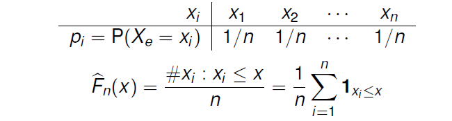
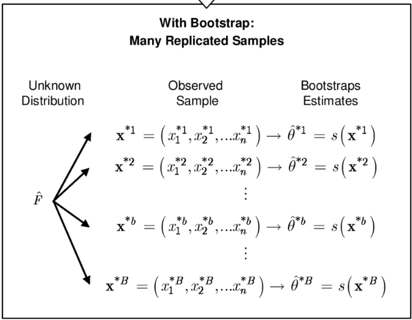
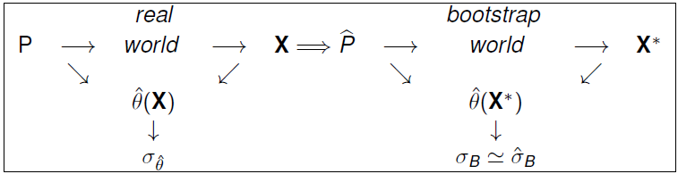

# Appendix I: The Bootstrap

These slides have been conserved as an appendix because they were originally added to this  chapter, when a section on resampling was not included in previous chapters.

They can be used as an introduction to the bootstrap, similar to the scond part of the Chapter on Cross-validation and resampling.

## The bootstrap

- *Bootstrap* methods were introduced by @Efron79 to estimate the standard error of a statistic.
- The success of the idea lied in that the procedure was presented as *automatic*, that is:
  - instead of having to do complex calculations,
  - it allowed to approximate them using computer simulation.

- Some called it *the end of mathematical statistics*.

## Bootstrap Applications 

- The bootstrap has been applied to almost any problem in Statistics.

  - Computing standard errors, Bias, Quantiles,
  - Building Confidence intervals,
  - Doing Significance tests, ...

- We illustrate it with the simplest case: *estimating the standard error of an estimator*.

## Empirical Distribution Function

:::{.font80}

- Let $X$ be a random variable with distribution function $F$,
- Let $\mathbf{X}=X_1,\ldots,X_n$ be an i.i.d random sample of $F$ and,
- let $x_1,\dots, x_n$ be a realization of $\mathbf{X}$.
- The *Empirical Cumulative Distribution Function (ECDF)*
$$
F_n(x) = \frac{1}{n} \#\{x_i\le x: i=1\dots n\} = \frac{1}{n}
\sum_{i=1}^n I_{(-\infty,x]}(x_i),
$$
is the function that assigns to each real number $x$ the proportion of observed values that are less or equal than $x$.
:::

## The ECDF in R
:::: {.columns}

::: {.column width='40%'}

```{r echo=TRUE}
x<- c(2,5,0,11,-1)
Fn <- ecdf(x)
knots(Fn)
cat("Fn(3) = ", Fn(3))
cat("Fn(-2) = ", Fn(-2))
```
:::

::: {.column width='60%'}
```{r echo=TRUE}
plot(Fn)
```
:::

::::


## ECDF has good properties

- $F_n (x)$ is a cumulative distribution function.

- $F_n()$ is an important DF because it comes to be *the best approximation that one can find for the theoretical (population) distribution function*, that is: 
$$
F_n(x) \longrightarrow F(x), \text { uniformly in } x \text{ as } n \rightarrow \infty.
$$

- This is stated in the Glivenko-Cantelli theorem also know as the *Central Theorem of Statistics*.


## The Sample distribution function

:::{.font80}
- Given a sample,  $\mathbf{X}$ from a certain distribution, $X$,
- Consider it a discrete random variable $X_e$ that sets mass $1/n$ to each of the observed $n$ points $x_i$:
:::

<center>

</center>

:::{.font80}

-  $F_n$ is the distribution (function) of $X_e$.

- From here, we notice that *generating samples from $F_n$ can be done by randomly taking values from $\mathbf{X}$ with probability $1/n$*
:::

## Plug-in estimators

- Assume we want to estimate some parameter $\theta$,
that can be expressed as $\theta (F)$, where $F$ is the distribution function of each $X_i$ in $(X_1,X_2,...,X_n)$. 
- For example, $\theta = E_F(X)=\theta (F)$.

- A *natural* way to estimate $\theta(F)$ may be to rely on *plug-in estimators*,  where $F$ in $\hat \theta (F)$ is substituted by some approximation (estimate) to $F$.

## Plug-in estimators

- A plug-in estimator is obtained by substituting $F$ by an approximation to $F$, call it $\hat F$ in $\theta(F)$:
$$
\widehat {\theta (F)}=\theta(\hat{F})
$$
- Given that $F_n$ is the best approximation to $F$ a reasonable plug-in estimator is $\theta(F_n)$.
- Common sample estimators are, indeed, plug-in estimators.

## Some plug-in estimators

-  Many estimators we usally work with are plug-in estimators.

\begin{eqnarray*}
\theta_1 &=& E_F(X)=\theta (F) \\
\hat{\theta_1}&=&\overline{X}=\int XdF_n(x)=\frac
1n\sum_{i=1}^nx_i=\theta (F_n)
\\
\theta_2 &=& Med(X)=\{m:P_F(X\leq m)=1/2\}=
\theta (F),
\\
\hat{\theta_2}&=&\widehat{Med}(X)=\{m:\frac{\#x_i\leq m}n=1/2\}=\theta (F_n)
\end{eqnarray*}

## Precision of an estimate

- A key point, when computing an estimator $\hat \theta$ of a parameter $\theta$, is how precise is $\hat \theta$ as an estimator of $\theta$?

  - With the sample mean, $\overline{X}$, the standard error estimation is immediate because the variance of the estimator is known:
$\sigma_{\overline{X}}=\frac{\sigma (X)}{\sqrt{n}}$

  - So, a natural estimator of the standard error of $\overline{X}$ is: $\hat\sigma_{\overline{X}}=\frac{\hat{\sigma}(X)}{\sqrt{n}}$

## Precision of an estimate (2) {.smaller}

-  If, as in this case, the variance of $X$ (and, here, that of $\overline{X}$) is a functional of $F$:

:::{.font90}
$$
\sigma _{\overline{X}}=\frac{\sigma (X)}{\sqrt{n}}=\frac{\sqrt{\int
[x-\int x\,dF(x)]^2 dF(x)}}{\sqrt{n}}=\sigma _{\overline{X}}(F)
$$
:::

then, the standard error estimator is the same functional applied on $F_n$, that is:

:::{.font90}
$$
\hat{\sigma}_{\overline{X}}=\frac{\hat{\sigma}(X)}{\sqrt{n}}=\frac{\sqrt{1/n\sum_{i=1}^n(x_i-\overline{x})^2}}{\sqrt{n}}=\sigma
_{\overline{X}}(F_n).
$$
:::

## Standard error estimation

- Thus, a way to obtain a standard error estimator $\widehat{\sigma}_{\widehat{\theta}}$  of an estimator $\widehat{\theta}$ consists on replacing  $F$ with $F_n$ in the ``population'' standard error expression  of $\hat \theta$, $\displaystyle{\sigma_{\hat
\theta}= \sigma_{\hat \theta}(F)}$, **whenever it is known**.
- In a schematic form:
$$
\sigma_{\hat \theta}= \sigma_{\hat \theta}(F) \Longrightarrow
\sigma_{\hat \theta}(F_n)= \widehat{\sigma}_{\hat \theta}.
$$
That is, *the process consists of "plugging-in" $F_n$ in the (known) functional form, $\sigma_{\hat \theta}(F)$ that defines $\sigma_{\hat \theta}$}*.

## The bootstrap (1)

- The previous approach, $F\simeq F_n \Longrightarrow \sigma_{\hat \theta}(F) \simeq \sigma_{\hat \theta}(F_n)$
presents the obvious drawback that, when the functional form $\sigma _{\hat{\theta}}(F)$ is
 unknown, it is not possible to carry out the substitution of $F$ by $F_n$.
- This is, for example, the case of standard error of the median or [that of the correlation coefficient](http://artent.net/2012/07/31/standard-deviation-of-sample-median/).


## The bootstrap (2)

- The  *bootstrap* method makes it possible to do the desired approximation:
$$\hat{\sigma}_{\hat\theta} \simeq \sigma _{\hat\theta}(F_n)$$
*without having to to know the form of* $\sigma_{\hat\theta}(F)$.

- To do this,*the bootstrap estimates, or directly approaches* $\sigma_{\hat{\theta}}(F_n)$ *over the sample*.


## Bootstrap sampling (*resampling*)

- The *bootstrap* allows to estimate the standard error from samples of  $F_n$

:::{.font80}

\begin{eqnarray*}
&&\mbox{Instead of: } \\
&& \quad F\stackrel{s.r.s}{\longrightarrow }{\bf X} =
(X_1,X_2,\dots, X_n) \, \quad (\hat \sigma_{\hat\theta} =\underbrace{\sigma_{\theta(F_n)}_{unknown})
\\
&& \mbox{It is done: } \\
&& \quad F_n\stackrel{s.r.s}{\longrightarrow }\quad {\bf X^{*}}=(X_1^{*},X_2^{*},
\dots ,X_n^{*}) \\
&& \quad (\hat \sigma_{\hat\theta}= \hat \sigma_{\hat \theta}^* \simeq \sigma_{\hat \theta}^*=\sigma_{\hat \theta}(F_n)).

\end{eqnarray*}
:::

::: {.notes}
- $\sigma_{\hat \theta}^*$ is the bootstrap standard error of $\hat \theta$ and
- $\hat \sigma_{\hat \theta}^*$ the bootstrap estimate of the standard error of $\hat \theta$.
:::

## The resampling process

:::{.font80}

- Resampling consists of *extracting samples of size $n$ of $F_n$*:
${\bf X_b^{*}}$ is a random sample of size $n$ obtained *with replacement* from the original sample ${\bf X}$.

- Samples ${\bf X^*_1, X^*_2, ..., X^*_B }$, obtained through this procedure are called *bootstrap*\ samples or *re-samples*.

- On each resample the statistic of interest $\hat \theta$ can be computed yielding a *bootstrap estimate* $\hat \theta^*_b= s(\mathbf{x^*_b})$.

- The collection of bootstrap estimates obtained form the resampled samples can be used to estimate distinct characteristics of $\hat \theta$ such as its standard error, its bias, etc.

:::

## Resampling illustrated

```{r, fig.align='center', out.width="100%"}

```


## The bootstrap distribution

- The distribution of a statistic computed from re-samples is called the *bootstrap distribution*,

:::{.font90}
\begin{eqnarray*}
\mathcal {L}(\hat \theta)&\simeq& P_F(\hat\theta \leq t): \mbox{Sampling distribution of } \hat \theta,\\
\mathcal {L}(\hat \theta^*)&\simeq& P_{F_n}(\hat\theta^* \leq t): \mbox{Bootstrap distribution of } \hat \theta,
\end{eqnarray*}
:::

- This distribution is usually not known.

- However the sampling process and the calculation of the statistics can be approximated using a Monte Carlo Algorithm.

## Boot. Monte Carlo Algorithm

:::{.font80}
1.  Draw a bootstrap sample, ${\bf x}_1^{*}$ from $F_n$ and compute $\hat{\theta}({\bf x}_1^{*})$.
2.  Repeat (1) $B$ times yielding $\hat{\theta}({\bf x}_2^{*})$, $\dots$, $\hat{\theta}({\bf x}_B^{*})$ estimates.
3. Compute:
\begin{equation*}
\hat{\sigma}_B (\hat\theta)= \sqrt{
	\frac{
		\sum_{b=1}^B\left( \hat{\theta}(%
		{\bf x^{*}_i})-\overline{\hat{\theta}^*}\right) ^2
		}{
		(B-1)
		}
	}, \quad \overline{\hat{\theta}^*}\equiv \frac 1B\sum_{b=1}^B\hat{\theta}\left( {\bf x}%
_b^{*}\right)
\end{equation*}
:::


## Bootstrap Estimates of SE

:::{.font90}
- Idea behind the bootstrap: the standard error  of $\hat\theta$, $\sigma(\hat\theta)$ can be *approximated* by the bootstrap estimator of the standard error, $\sigma_B (\hat\theta)$ which:
  - Coincides with $\sigma_{\hat\theta}(F_n)$, that cannot be evaluated, if the functional form of $\sigma_{\hat\theta}(F)$ is unkown.
  - Can be approximated by the Monte Carlo Estimator,  $\hat\sigma_{\hat\theta}(F_n)$, which is evaluated by resampling.

$$
\hat{\sigma}_B(\hat\theta)\left (\simeq \sigma_B(\hat\theta)=\sigma_{\hat\theta}(F_n)\right )\simeq\hat \sigma_{\hat\theta}(F_n).
$$
:::

## Summary

From real world to  *bootstrap* world:

```{r, fig.align='center', out.width="100%"}

```

::: {.notes}
Aquesta imatge no mostra el càlcul del error estandar.
Canviar-la  per una que si ho faci
:::

