## Outline {visibility="hidden"}

```{r packages, echo=FALSE}
if (!require(mlbench)) install.packages("mlbench", dep=TRUE)
```

1.  Introduction to decision trees
2.  Data cleaning and preprocessing
3.  Pruning and optimization
4.  Classification trees
5.  Regression trees
6.  Ensemble methods and advanced topics
7.  Practical examples and exercises
8.  Conclusion and future directions

# Introduction to Decision Trees

## Motivation

-   In many real-world applications, decisions need to be made based on
    complex, multi-dimensional data.
-   One goal of statistical analysis is to provide insights and guidance
    to support these decisions.
-   Decision trees provide a way to organize and summarize information
    in a way that is easy to understand and use in decision-making.

## Examples

-   A bank needs to have a way to decide if/when a customer can be
    granted a loan.

-   A doctor may need to decide if a patient has to undergo a surgery or
    a less aggressive treatment.

-   A company may need to decide about investing in new technologies or
    stay with the traditional ones.

In all those cases a decision tree may provide:

- A *structured approach to decision-making*, 
- **Based on data** 
- That can be **be easily explained and justified**.

## An intuitive approach

::::: columns
::: {.column width="40%"}
Decisions are often based on asking a sequence of yes/no questions -from more general to more specific- based on available
information, whose answers induce binary splits on data that end up with
some grouping or classification.
:::

::: {.column width="60%"}
```{r fig.align='center', out.width="80%", fig.cap='A doctor may classify patients at high or low cardiovascular risk using some type of decision tree'}
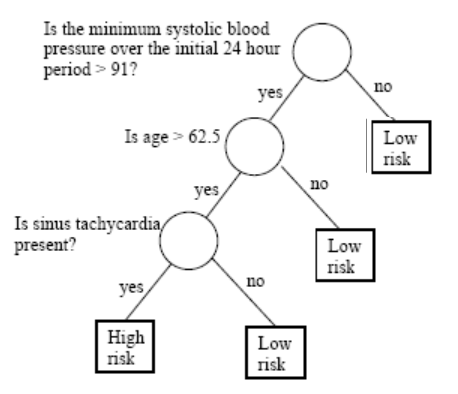
```
:::
:::::

This process can be more generically stated in the context of supervised learning.

## The Prediction Problem.

-   Let $(X, Y)$ be a r.v. with support
    $\mathcal{X} \times \mathcal{Y} \subseteq \mathbb{R}^{p} \times \mathbb{R}$.

-   General supervised learning or prediction problem:

    -   Training sample:
        $S=\left\{\left(\boldsymbol{x}_{1}, y_{1}\right), \ldots,\left(\boldsymbol{x}_{n}, y_{n}\right)\right\}$,
        i.i.d. from $(\boldsymbol{X}, Y)$.

    -   The goal is to define a function (possibly depending on the
        sample) $h_{S}: \mathcal{X} \mapsto \mathcal{Y}$ such that for a
        new independent observation $(\boldsymbol{x}_{n+1}, y_{n+1})$ ,
        from which we only know $\boldsymbol{x}_{n+1}$, it happens that:
        $$
        \hat{y}_{n+1}=h_{S}\left(x_{n+1}\right) \text { is close to } y_{n+1} \text { (in some sense). }
        $$

-   Function $h_{S}$ is generically called a *prediction function*, or depending on the
    case, *classification* or *regression* function.

## Classification and Regression

The prediction function $h_{S}$ is said to describe a *classification*
or a *regression* problem depending on the case.

-   If $\mathcal{Y} \subseteq \mathbb{R}$ (or $\mathcal{Y}$ an interval)
    we have a standard *regression problem*.

    -   Example: *Relating Salary and demographic variables*

-   If $\mathcal{Y}=\{0,1\}$ (or, also, $\mathcal{Y}=\{-1,1\}$ ) we have
    a problem of *binary classification* or discrimination.

    -   Example: *Predicting if a "cured" disease  will recidive (re-appear)*

-   If $\mathcal{Y}=\{1, \ldots, K\}$ (or
    $\left.\mathcal{Y}=\left\{\boldsymbol{y} \in\{0,1\}^{K}: \sum_{k=1}^{K} y_{k}=1\right\}\right)$
    we face a of $K$ classes classification problem.

    -   Example: *Classifying a tumor into one of many types*

## Supervised learning (1)

-   Probabilistic model for supervised learning

    -   Response variable $Y$.

    -   Explanatory variables (features)
        $\boldsymbol{X}=\left(X_{1}, \ldots, X_{p}\right)$.

    -   Data
        $\left(\boldsymbol{x}_{i}=\left(x_{i 1}, \ldots, x_{i p}\right), y_{i}\right), i=1, \ldots, n$
        i.i.d. from the random variable $$
        \left(\boldsymbol{X}=\left(X_{1}, \ldots, X_{p}\right), Y\right) \sim \operatorname{Pr}(\boldsymbol{X}, Y)
        $$

-   $\operatorname{Pr}(\boldsymbol{X}, \boldsymbol{Y})$ denotes the
    joint distribution of $\boldsymbol{X}$ and $Y$.

<!--     -   When this joint distribution is continuous, -->
<!--         $\operatorname{Pr}(\boldsymbol{X}, Y)$ is the joint probability -->
<!--         density function. -->

<!-- ------------------------------------------------------------------------ -->

-   Main interest is *predicting* $Y$ from $\boldsymbol{X}$.

## Supervised learning (2)

-   Given the probabilistic model it can be re-stated as *learning the
    conditional distribution*
    $\operatorname{Pr}(Y \mid \boldsymbol{X})$.

-   In practice we focus on *learning a conditional location parameter*:
    $$
    \mu(\boldsymbol{x})=\underset{\mu}{\operatorname{argmin}} \mathbb{E}(L(Y, \mu) \mid \boldsymbol{X}=\boldsymbol{x}),
    $$ where $L(y, \hat{y})$, loss function, measures the error of
    predicting $y$ with $\hat{y}$.

-   For quadratic loss, $L(y, \hat{y})=(y-\hat{y})^{2}, \mu(x)$ is the
    regression function: $$
    \mu(\boldsymbol{x})=\mathbb{E}(Y \mid \boldsymbol{X}=\boldsymbol{x})
    $$


## Introducing decision trees

-   A decision tree is a graphical representation of a series of
    decisions and their potential outcomes.

-   It is obtained by recursively *stratifying* or *segmenting* the
    *feature space* into a number of simple regions.

-   Each region (decision) corresponds to a *node* in the tree, and each
    potential outcome to a *branch*.

-   The tree structure can be used to guide decision-making based on
    data.

## Types of decision trees

-   Decision trees are simple yet reliable predictors that can be use
    for both classification or prediction

    -   **Classification Trees** are *classifiers*, used when the
        response variable is categorical

    -   **Regression Trees**, are *regression models* used to predict
        the values of a numerical response variable.


## Trees vs Decision Trees

:::::: columns
:::: {.column width="50%"}
::: font80
1.  A tree is a set of nodes and edges organized in a hierarchical
    fashion.<br> In contrast to a graph, in a tree there are no loops.
    <!-- Internal nodes are denoted with circles and terminal nodes with squares. -->

<br>

2.  A decision tree is a tree where *each split node stores a boolean
    test function* to be applied to the incoming data. <br> Each leaf
    stores the final answer (predictor)
:::
::::

::: {.column width="50%"}
```{r, fig.align='center', out.width="45%"}
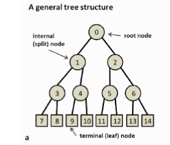

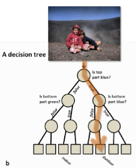
```
:::
::::::

## Notation used in trees (1)

```{r, fig.align='center', out.width="100%"}
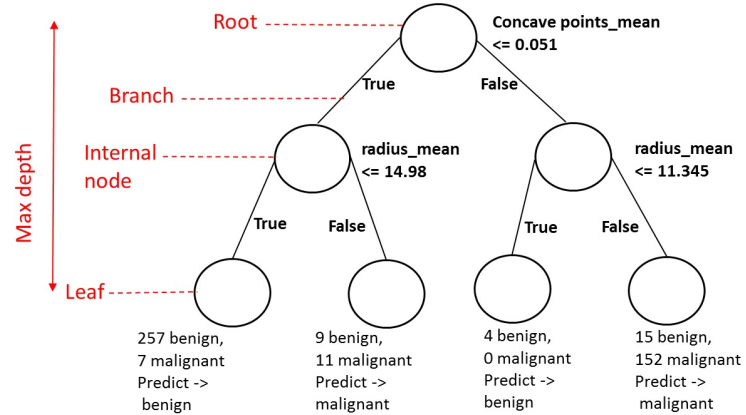

```

## Notation used in trees (2)

-   A node is denoted by $t$.

-   The left and right child nodes are denoted by $t_{L}$ and         $t_{R}$

-   The collection of all nodes in the tree is denoted $T$

-   The collection of all the leaf nodes is denoted $\tilde{T}$

-   A split will be denoted by $s$.

-   The set of all splits is denoted by $S$.


<!-- ## A first look at pros and cons   (CREC QUE NO CAL)(-->

<!-- -   Trees provide an simple approach to classification and prediction for both categorical or numerical outcomes. -->

<!-- -   The results are intuitive and easy to explain and interpret. -->

<!-- -   They are, however, not very accurate, but -->

<!-- -   Aggregation of multiple trees built on the same data can result on dramatic improvements in prediction accuracy, at the expense of some loss of interpretation. -->

<!-- ## What do we need to learn? -->

<!-- -   We need **context**:  -->

<!--     -   When is it appropriate to rely on decision trees? -->

<!--     -   When would other approaches be preferable? -->

<!--     -   What type of decision trees can be used? -->

<!-- -   We need to know how to **build good trees** -->

<!--     -   How do we *construct* a tree? -->

<!--     -   How do we *optimize* the tree? -->

<!--     -   How do we *evaluate* it? -->

<!-- ## More about context -->

<!-- -   Decision trees are non parametric, data guided predictors, well suited in many situations such as: -->

<!--     -   Non-linear relationships. -->

<!--     -   High-dimensional data. -->

<!--     -   Interaction between variables exist. -->

<!--     -   Mixed data types. -->

<!-- -   They are not so appropriate for complex datasets, or complex problems, that require expert knowledge. -->

<!-- - [See here some examples of each situation!](https://g.co/gemini/share/781b7d88e03a) -->

## Tree-based models in practice

::: font80
| Package | Language | Role | Notes |
|--------|----------|------|------|
| `rpart` | R | CART implementation | Standard tree fitting |
| `tree` | R | CART (simplified) | Mainly for teaching |
| `caret` | R | Modeling framework | Unified interface|
| `scikit-learn` | Python | CART-like trees | Standard in Python ecosystem |
:::

- Most implementations are based on **CART**
- Focus on **model fitting and prediction**
- Details of construction will be studied next

# Building Classification Trees

## Building the trees

-   As with any model, we aim not only at construting trees.

-   We wish to build good trees and, if possible, optimal trees in some
    sense we decide.

-   In order to **build good trees** we must decide

    -   How to *construct* a tree?

    -   How to *optimize* the tree?

    -   How to *evaluate* it?


## Building a tree

-   A binary decision tree is built by defining a series of (recursive)
    splits on the feature space.

-   The splits are decided in such a way that the associated learning
    task is attained

    -   by setting thresholds on the variables values,
    -   that induce paths in the tree,

-   The ultimate goal of the tree is to be able to use a combination of the splits to accomplish the learning task with as small an error as  possible.

## Trees partition the space

-   *A tree represents a recursive splitting of the space*.

    -   Every node of interest corresponds to one region in the original space.
    -   Two child nodes occupy two different regions.
    -   Together, they yield same region as that of the parent node.

-   In the end, every leaf node is assigned with a class (or value) and a test  point is assigned with the class (or value) of the leaf node it lands in.

## The tree represents the splitting

:::::: r-stack
::: {.fragment .fade-in .absolute top="100" left="150"}
```{r , fig.align ='center',  out.width="800", out.height="400"}
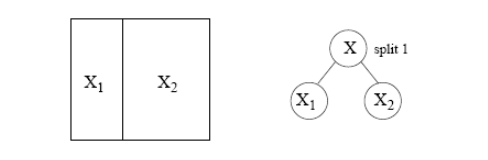
```
:::

::: {.fragment .fade-in .absolute top="100" left="150"}
```{r  , fig.align ='center', out.width="800", out.height="400"}
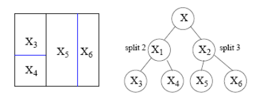
```
:::

::: {.fragment .fade-in .absolute top="100" left="150"}
```{r  , fig.align ='center', out.width="800", out.height="400"}
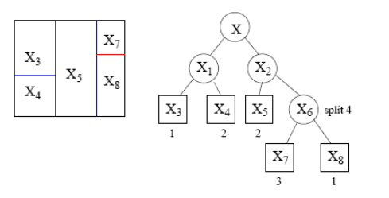
```
:::
::::::

<!-- -   [Animation](https://youtu.be/1ow2tF9Ezgs) -->

## Different splits are possible

-   It is always possible to split a space in distinct ways

```{r , fig.align ='center', out.width="400"}
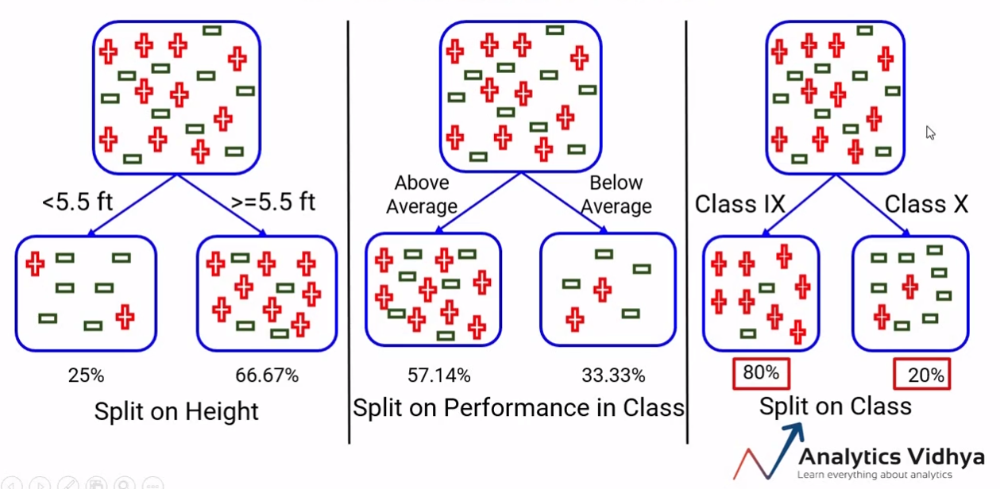
```

-   Some ways perform better than other for a given task, but rarely
    will they be perfect.

-   So we aim at combining splits to find a better rule.

## Building a decision tree

Tree building involves the following three elements:

1.  The selection of the splits, i.e., how do we decide which node (region) to split and how to split it?

  -   How to select from the pool of candidate splits?
  -   What are appropriate *goodness of split* criteria? 
  - When to declare a node terminal and *stop splitting*?

2. How to assign each terminal node to a class

3. How to ensure the tree is the _best possible_ we can build.


## Tree construction algorithm (CART)

The most popular algorithm for buildiong trees is CART which can be schemeatically described as follows:

1. Initialize: all data in root node

2. Repeat for each node, until stopping criterion is met

  2.1 Generate candidate splits
  
  2.2 Select best split (maximize impurity reduction)
  
  2.3 Split node into two children


CART is a greedy recursive partitioning algorithm.

## TB 1.1 - Split selection

::: font80
-   To build a Tree, questions have to be generated that induce splits
    based on the value of a single variable.

-   Ordered variable $X_j$:

    -   Is $X_j \leq c$? for all possible thresholds $c$.
    -   Split lines: parallel to the coordinates.

-   Categorical variables, $X_j \in \{1, 2, \ldots, M\}$:

    -   Is $X_j \in A$?, where $A \subseteq M$ .

-   The pool of _candidate splits_ for all $p$ variables is formed by
    combining all the generated questions.

- With the pool of candidate splits, next step is to decide _which one to use_ when constructing the decision tree.

:::

## TB 1.2.1 - Goodness of Split

-   Intuitively, when we split the points we want the region corresponding to each leaf node to be "pure".

- That is, we aim at regions where most points belong to the same class.

- With this goal in mind  we select splits by  measuring their "goodness of split" using some of the available *Impurity fuctions* introduced later.

## TB 1.2.2 - Measuring homogeneity

-   In order to measure homogeneity,or as called here, *purity*, of splits we rely on different *Impurity functions*
 
- These functions allow us to quantify   the extent of *homogeneity* for a region containing data  points from possibly different classes.

  - A region will be more pure or more homogeneous the less variable is the set of points it contains.

  - In the next image regions on the right of the image are homogeneous that is *purer* than the heterogeneous regions on the left.

## TB 1.2.3 - Good splits vs bad splits

::::::: columns
:::: fragment
::: {.column width="50%"}

```{r out.width="100%"}
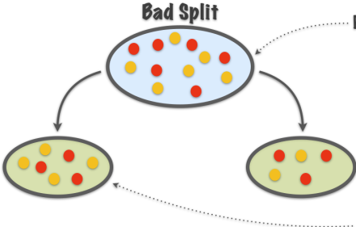
```

*Purity* not increased
:::
::::

:::: fragment
::: {.column width="50%"}

```{r out.width="100%"}
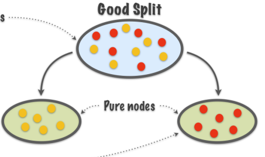
```

*Purity* increased
:::
::::
:::::::


  
## TB 1.2.4 - Impurity functions

::: font70
An **impurity function** is a function $\Phi$ defined on the set of all
$K$-tuples of numbers $\mathbf{p}= \left(p_{1}, \cdots, p_{K}\right)$
s.t. $p_{j} \geq 0, \,  \sum_{j=1}^K p_{j}=1$, $$
\Phi: \left(p_{1}, \cdots, p_{K}\right) \rightarrow [0,1]
$$

with the properties:

1.  $\Phi$ is maximum only for the uniform distribution, that is all the $p_{j}$ are equal.
2.  $\Phi$ is minimum only at points
    $(1,0, \ldots, 0)$,$(0,1,0, \ldots, 0)$,
    $\ldots,(0,0, \ldots, 0,1)$, i.e., when the probability of being in a certain class is 1 and 0 for all the other classes.
3.  $\Phi$ is a symmetric function of $p_{1}, \cdots, p_{K}$, i.e., if
    we permute $p_{j}$, $\Phi$ remains constant.
:::

## TB 1.2.5 - Some Impurity Functions

The functions below are commonly used to measure impurity.

<!-- - Let $t$ be a node and $p(k|t)$ the conditional probability of observing class $k$ at that node. The node information function $i(t)$ may be defined as: -->

::: font80

- **Entropy**: $\Phi_E (\mathbf{p}) = -\sum_{j=1}^K p_j\log (p_j)$ .

- **Gini Index**: $\Phi_G (\mathbf{p}) = 1-\sum_{j=1}^K p_j^2$. 

- **Misclassification rate**: $\Phi_M (\mathbf{p}) = \sum_{i=1}^K p_j(1-p_j)$.
  
:::

-   In practice, only the first two are recommended  because misclassification rate is not sensitive enough  to differences in class probabilies.

## TB 1.2.5 Impurity functions behavior


```{r out.width="66%", fig.align='center'}
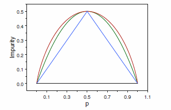
```
::: small
- Red curve: Entropy function (rescaled), 
- Green curve: Gini index 
- Blue curve: Resubstitution estimate of the misclassification rate.
:::

## TB 1.2.6 - Impurity measure of a split

-   Given an impurity function $\Phi$, a node $t$, and given $p(j \mid t)$, the estimated posterior probability of class $j$
    given node $t$, the *impurity measure of* $t$, $i(t)$, is:

$$
i(t)=\phi\left (p(1 \mid t), p(2 \mid t), \ldots, p(K \mid t)\right)
$$ 

- That is, the *impurity measure* of a split (or a node) is the impurity function computed on probabilities associated
(conditional) with a node.

## TB 1.2.7 - Goodness of a split

-   Once we have defined $i(t)$, we define the goodness of split $s$ for
    node $t$, denoted by $\Phi(s, t)$ :

$$
\Phi(s, t)=\Delta i(s, t)=i(t)-p_{R} i\left(t_{R}\right)-p_{L} i\left(t_{L}\right)
$$

-   The best split for the single variable $X_{j}$ is the one that has  the largest value of $\Phi(s, t)$ over all $s \in \mathcal{S}_{j}$, the set of possible distinct splits for $X_{j}$.
    
- We choose the split that maximizes impurity reduction, by using a *greedy strategy*: the best split is chosen locally at each step.


<!-- ## TB 1.2.8 - Impurity score for a node -->

<!-- -   The impurity, $i(t)$, of a node is based solely on the estimated -->
<!--     posterior probabilities of the classes -->

<!--     -   That is, *it doesn't account for the size of* $t$. -->

<!-- -   This is done by the *impurity score* of $t$, defined as -->
<!--     $I(t)=i(t)\cdot p(t)$, a *weighted impurity measure* of node $t$ -->
<!--     that takes into account: -->

<!--     -   The estimated posterior probabilities of the classes, -->

<!--     -   The estimated proportion of data that go to node $t$. -->

<!-- ## TB 1.2.9 - Applications of $I(t)$ -->

<!-- -   $I(t)$ can be used to: -->
<!--     -   Define the aggregated impurity of a tree, by adding the impurity -->
<!--         scores of all terminal leaves. -->
<!--     -   Provide a weighted measure of impurity decrease for a split: -->
<!--         $\Delta I(s, t)=p(t) \Delta i(s, t)$. -->
<!--     -   Define a criteria for stop splitting a tree (see below). -->

## TB 1.2.8 - Entropy as an impurity measure

-   The entropy of a node, $t$, that is split in $n$ child nodes $t_1$, $t_2$, ..., $t_n$, is:

$$
\Phi_E (\mathbf{p}) = H(\mathbf{t})=-\sum_{i=1}^{n} \underbrace{P\left(t_{i}\right)}_{p_i} \log _{2} P\left(t_{i}\right)
$$

-   From here, an information gain (that is impurity decrease) measure  can be introduced by comparing:

  -   the entropy of the parent node before the split to
  -   that of a weighted sum of the child nodes after the split where,
    - weights are proportional to the number of observations in each node.

## TB 1.2.9 - Information gain

-   For a split $s$ and a set of observations (a node) $t$, information
    gain is defined as:

$$
\begin{aligned}
& IG(t, s)=\text { (original entr.) }-(\text { entr. after split) } \\
& IG(t, s)=H(t)-\sum_{i=1}^{n} \frac{\left|t_{i}\right|}{t} H\left(x_{i}\right)
\end{aligned}
$$

## Example 1: Pears vs Apples {.smaller}

:::::: columns
::: {.column width="40%"}
Consider the problem of designing an algorithm to automatically
differentiate between apples and pears (class labels) given only their
width and height measurements (features).
:::

:::: {.column width="60%"}
::: font80
| **Width** | **Height** | **Fruit** |
|-----------|------------|-----------|
| 7.1       | 7.3        | Apple     |
| 7.9       | 7.5        | Apple     |
| 7.4       | 7.0        | Apple     |
| 8.2       | 7.3        | Apple     |
| 7.6       | 6.9        | Apple     |
| 7.8       | 8.0        | Apple     |
| 7.0       | 7.5        | Pear      |
| 7.1       | 7.9        | Pear      |
| 6.8       | 8.0        | Pear      |
| 6.6       | 7.7        | Pear      |
| 7.3       | 8.2        | Pear      |
| 7.2       | 7.9        | Pear      |
:::
::::
::::::

## Example 1. Entropy Calculation

```{r out.width="100%"}
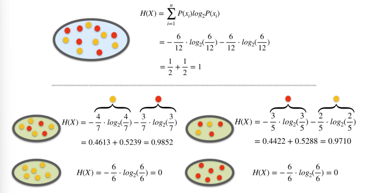
```

## Example 1. Information Gain

```{r out.width="100%"}
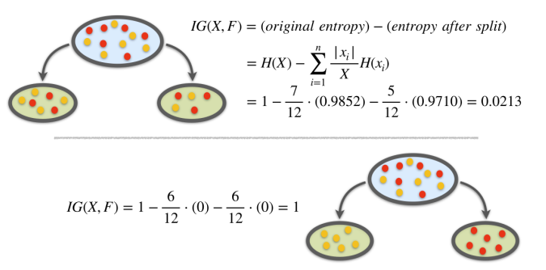
```

## TB. 1.3 Overfitting in trees

As trees grow deeper:

- They fit the training data increasingly well and 
- Regions become smaller and more specific

However, small regions may contain few observations causing predictions to become unstable and sensitive to noise

This results in_

- Low training error
- Poor generalization to new data

Altogether yields an idea: *It is probably better to not let the tree grow as much as it can but control its size*.


## TB. 1.3.1 - When to stop growing

-   Maximizing information gain is one possible criteria to choose among
    splits.

-   In order to avoid excessive complexity it is usually decided to stop
    splitting when *information gain does not compensate for increase in
    complexity*.

## TB 1.3.2 Stop splitting criteria

-   In practice, stop splitting is decided when: $$
     \max _{s \in S} \Delta I(s, t)<\beta,
    $$where:
    -   $\Delta I$ represents the information gain associated with an
        optimal split $s$ and a node $t$,
    -   and $\beta$ is a pre-determined threshold.


## TB 1. Summary

::: font80
- Decision trees are built by  iteratively partitioning data into smaller regions based on feature values.

- Splits are aimed at producing purer nodes, that contains mostly data from one class.

- Homogeneity is measured by impurity functions such as *Entropy*, *Gini Index* or *Misclassification rate*

- The best split is chosen from candidate splits as the one that maximizes impurity reduction for example through *Information Gain*

- Tree growth continues until impurity reduction is minimal, or a predefined depth or node size threshold is reached.

::: 

## Example 2. The PIMA database

-   The Pima Indian Diabetes dataset contains 768 individuals (female) and 9 clinical variables.


```{r}
data("PimaIndiansDiabetes2", package = "mlbench")
dplyr::glimpse(PimaIndiansDiabetes2)
```

## Why these variables? (medical interlude 1)

- Diabetes is a metabolic disorder related to:

  - Blood sugar regulation
  - Insulin function
  - Long-term physiological changes

- Some variables are known to be associated with diabetes risk:

  - Glucose (blood sugar levels)
  - Insulin (hormone regulating glucose)
  - Body mass (obesity)
  - Age (risk increases over time)

- These variables provide indirect evidence of metabolic health

## Interpreting key predictors

- **Glucose**:
  High values indicate impaired blood sugar control

- **Insulin**:
  Abnormal levels may reflect sugar is not being controlled (Insuline Resistance).

- **BMI (mass)**:
  Obesity is a major risk factor for diabetes

- **Age**:
  Risk increases with cumulative metabolic stress

- **Blood pressure**:
  Often associated with metabolic syndrome

The model combines these signals to predict diabetes risk


## Example 2. Looking at the data

```{r}
library(tidyverse)
library(mlbench)

data(PimaIndiansDiabetes2)

vars <- c("glucose", "insulin", "mass", "pressure", "age")

PimaIndiansDiabetes2 %>%
  select(all_of(vars), diabetes) %>%
  pivot_longer(-diabetes, names_to = "variable", values_to = "value") %>%
  ggplot(aes(x = diabetes, y = value)) +
  geom_boxplot(outlier.alpha = 0.3) +
  facet_wrap(~variable, scales = "free_y") +
  theme_minimal()
```


## Ex. 2. Building a classification tree

-   We wish to predict the probability of individuals in being diabete-positive or negative.

    -   We start building a tree with all the variables

```{r echo=TRUE}
library(rpart)
model1 <- rpart(diabetes ~., data = PimaIndiansDiabetes2)
```

<!-- ## Viewing the tree as text -->

<!-- ::: font40 -->
<!-- ```{r} -->
<!-- model1 -->
<!-- ``` -->
<!-- ::: -->

<!-- ::: small -->
<!-- -   This representation shows the variables and split values that have been selected by the algorithm. -->
<!-- -   It can be used to classify (new) individuals following the decisions (splits) from top to bottom. -->
<!-- ::: -->

## Ex.2. Plotting the tree (1)


```{r fig.cap="Even without domain expertise the model seems *reasonable*", out.height = "10cm"}
plot(model1)
text(model1, digits = 3, cex=0.7)
```

## Ex. 2. Plotting the tree (Nicer)

```{r fig.cap="The tree plotted with the `rpart.plot` package."}
require(rpart.plot)
rpart.plot(model1, cex=.7)
```

::: small
Each node shows: (1) the predicted class ('neg' or 'pos'), (2) the predicted probability, (3) the percentage of observations in the node.
:::

# Prediction with Trees

## TB 2 - Class Assignment

- A decision tree classifies new data points as follows.

  - We let a data point pass down the tree and see which leaf node it lands in.

  - Each leaf node defines a region where all observations share the same class.

  - The class of the leaf node is assigned to the new data point: all the points that land in the same leaf node will be given the same class.

- Trees produce *piecewise constant* predictions.
    
## TB 2.1 - Class Assignment Rules

-   A class assignment rule assigns a class $j=1, \cdots, K$ to every
    terminal (leaf) node $t \in \tilde{T}$.
-   The class assigned to node $t$ is denoted by $\kappa(t)$,
    -   E.g., if $\kappa(t)=2$, all  points in node $t$ aree assigned to class 2.
- Within each node, we estimate class probabilities from the data.

-   If we use 0-1 loss, the class assignment rule picks the class with  maximum posterior probability:
$$
\kappa(t)=\arg \max _{j} p(j \mid t)
$$
- This rule corresponds to minimizing the 0–1 loss within each node.


## TB 2.2. Estimating the error rate (1)

-   Let's assume we have built a tree and have the classes assigned for
    the leaf nodes.

-   Goal: estimate *the classification error rate* for this tree.

-   We use the *resubstitution estimate* $r(t)$ for the probability of
    misclassification, given that a case falls into node $t$. This is:

$$
r(t)=1-\max _{j} p(j \mid t)=1-p(\kappa(t) \mid t)
$$

## TB 2.3. Estimating the error rate (2)

-   Denote $R(t)=r(t) p(t)$, that is the miscclassification error rate
    weighted by the probability of the node.

-   The resubstitution estimation for the overall misclassification rate   $R(T)$ of the tree classifier $T$ is:
$$
R(T)=\sum_{t \in \tilde{T}} R(t)
$$

- Notice that this estimate is based on training data and may underestimate the true error!

## Example 2: Individual prediction

Consider individuals 521 and 562

```{r}
(aSample<- PimaIndiansDiabetes2[c(521,562),])
```

```{r}
predict(model1, aSample, "class")
```

-   If we follow individuals 521 and 562 along the tree, we reach the
    same prediction.

-   The tree provides not only a classification but also an explanation.

## Example 2: How accurate is the model?

-   It is straightforward to obtain a simple performance measure.

```{r echo=TRUE}
predicted.classes<- predict(model1, PimaIndiansDiabetes2, "class")
mean(predicted.classes == PimaIndiansDiabetes2$diabetes)
```
## Example 2: Is the Tree optimal?

-   The question becomes harder when we go back and ask if *we obtained
    the best possible tree*.

-   In order to answer this question we must study tree construction in more detail.


# Obtaining best trees

## TB 3. Controlling tree growth

Trees obtained by looking for optimal splits tend to overfit: 

  - good for the data in the tree, but
  - bad for generalization: tend to fail more  in predictions.

Assuming we wish to control tree growth there are distinct possible approaches:

- Stop early (*pre-pruning*)
- Grow fully and prune later (*post-pruning*)

## TB 3.1 Optimizing the Tree

- Stopping early may prevent overfitting, but can miss important structure.

- In order to reduce complexity and overfitting, while keeping the tree as good as possible, tree *pruning* may be applied.

- Pruning works *removing branches that are unlikely to improve the accuracy* of the model on new data.

CART follows the second approach


## TB 3.2 CART strategy for pruning

CART uses the followin strategy to build optimal trees

1. Grow a large tree (overfit)
2. Prune it using a penalty
3. Select optimal tree size

This is known as *Post-pruning* approach.

## TB 3.3 Pruning methods

- There are different pruning methods, but the most common one is to use the   *cost-complexity pruning* algorithm, also known as the *weakest link pruning*.

- The algorithm works by adding a penalty term to the misclassification rate of the terminal nodes:

$$
R_\alpha(T) =R(T)+\alpha|T|
$$ 

- $\alpha$ is the hyper-parameter that controls the trade-off between tree complexity and accuracy.

## TB 3.3 Cost-complexity pruning

- First, grow a large tree that overfits the data

- Then, generate a sequence of subtrees by pruning: for increasing values of $\alpha$, smaller trees are obtained

- Each subtree balances:
  - fit to the data
  - tree complexity

- Finally, use cross-validation to select the optimal $\alpha$

$\rightarrow$ This determines the final tree size

## TB 3.4 CV to Select $\alpha$

- Each sub-tree can by evaluated with cross-validation as follows:

  - Split the data into K folds
  - Compute prediction error for each $\alpha$,  on validation folds
  - Average the error across folds

- Select the value of $\alpha$ with lowest validation error.

## Ex. 3 Optimizing the tree (1)

```{r, fig.align='center', out.width="80%"}
#printcp(model1)
round(model1$cptable, 6)
plotcp(model1)
```


## Ex 3. Building the optimal tree

```{r}
cp_opt <- model1$cptable[which.min(model1$cptable[, "xerror"]), "CP"]
cp_opt
model_pruned <- prune(model1, cp = cp_opt)
rpart.plot::rpart.plot(model_pruned)
```


# Regression Trees

## Regression modelling with trees

- When the response variable is numeric, decision trees are *regression trees*.

-   Option of choice for distinct reasons

    -   The relation between response and potential explanatory
        variables is not linear.
    -   Perform automatic variable selection.
    -   Easy to interpret, visualize, explain.
    -   Robust to outliers and can handle missing data

## Classification vs Regression Trees

::: font50
| **Aspect** | **Regression Trees** | **Classification Trees** |
|:-----------------|:--------------------------|:--------------------------|
| Outcome var. type | Continuous | Categorical |
| Goal | To predict a numerical value | To predict a class label |
| Splitting criteria | Mean Squared Error, Mean Abs. Error | Gini Impurity, Entropy, etc. |
| Leaf node prediction | Mean or median of the target variable in that region | Mode or majority class of the target variable ... |
| Examples of use cases | Predicting housing prices, predicting stock prices | Predicting customer churn, predicting high/low risk in diease |
| Evaluation metric | Mean Squared Error, Mean Absolute Error, R-square | Accuracy, Precision, Recall, F1-score, etc. |
:::

## Regression tree example

-   The `airquality` dataset from the `datasets` package contains daily
    air quality measurements in New York from May through September of
    1973 (153 days).
-   The main variables include:
    -   Ozone: the mean ozone (in parts per billion) ...
    -   Solar.R: the solar radiation (in Langleys) ...
    -   Wind: the average wind speed (in mph) ...
    -   Temp: the maximum daily temperature (ºF) ...
-   Main goal : Predict ozone concentration.

## Non linear relationships! {.smaller}

```{r eval=FALSE, echo=TRUE}
aq <- datasets::airquality
color <- adjustcolor("forestgreen", alpha.f = 0.5)
ps <- function(x, y, ...) {  # custom panel function
  panel.smooth(x, y, col = color, col.smooth = "black", cex = 0.7, lwd = 2)
}
pairs(aq, cex = 0.7, upper.panel = ps, col = color)
```

```{r echo=FALSE, fig.align='center'}
aq <- datasets::airquality
color <- adjustcolor("forestgreen", alpha.f = 0.5)
ps <- function(x, y, ...) {  # custom panel function
  panel.smooth(x, y, col = color, col.smooth = "black", 
               cex = 0.7, lwd = 2)
}
pairs(aq, cex = 0.7, upper.panel = ps, col = color)

```

## Building the tree (1): Splitting

::: font80
-   Consider:
    -   all predictors $X_1, \dots, X_n$, and
    -   all values of cutpoint $s$ for each predictor and
-   For each predictor find boxes $R_1, \ldots, R_J$ that minimize the
    RSS, given by:

$$
\sum_{j=1}^J \sum_{i \in R_j}\left(y_i-\hat{y}_{R_j}\right)^2
$$

where $\hat{y}_{R_j}$ is the mean response for the training observations
within the $j$ th box.
:::

## Building the tree (2): Splitting

::: font80
-   To do this, define the pair of half-planes

$$
R_1(j, s)=\left\{X \mid X_j<s\right\} \text { and } R_2(j, s)=\left\{X \mid X_j \geq s\right\}
$$

and seek the value of $j$ and $s$ that minimize the equation:

$$
\sum_{i: x_i \in R_1(j, s)}\left(y_i-\hat{y}_{R_1}\right)^2+\sum_{i: x_i \in R_2(j, s)}\left(y_i-\hat{y}_{R_2}\right)^2.
$$
:::

## Building the tree (3): Prediction {.smaller}

::::: columns
::: {.column width="40%"}
-   Once the regions have been created we predict the response using the
    mean of the trainig observations *in the region to which that
    observation belongs*.

-   In the example, for an observation belonging to the shaded region,
    the prediction would be:

$$
\hat{y} =\frac{1}{4}(y_2+y_3+y_5+y_9)
$$
:::

::: {.column width="60%"}
```{r fig.align='center', out.width="100%"}
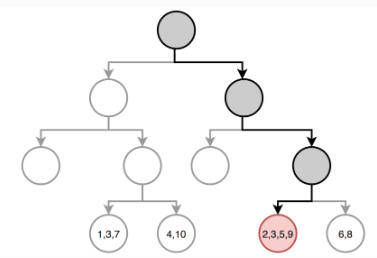
```
:::
:::::

## Example: A regression tree

```{r echo=TRUE}
set.seed(123)
train <- sample(1:nrow(aq), size = nrow(aq)*0.7)
aq_train <- aq[train,]
aq_test  <- aq[-train,]
aq_regresion <- tree::tree(formula = Ozone ~ ., 
                           data = aq_train, split = "deviance")
summary(aq_regresion)
```

## Example: Plot the tree

```{r}
par(mar = c(1,1,1,1))
plot(x = aq_regresion, type = "proportional")
text(x = aq_regresion, splits = TRUE, pretty = 0, cex = 0.8, col = "firebrick")
```

# Error estimation and optimization for regression trees

## Prunning the tree (1)

-   As before, *cost-complexity prunning* can be applied
-   We consider a sequence of trees indexed by a nonnegative tuning
    parameter $\alpha$.
-   For each value of $\alpha$ there corresponds a subtree
    $T \subset T_0$ such that:

::: font80
$$
\sum_{m=1}^{|T|} \sum_{y_i \in R_m}
\left(y_i -\hat{y}_{R_m}\right)^2+
\alpha|T|\quad (*)
\label{prunning}
$$
:::

is as small as possible.

## Tuning parameter $\alpha$

-   $\alpha$ controls a trade-off between the subtree’s complexity and
    its fit to the training data.
-   When $\alpha=0$, then the subtree $T$ will simply equal $T_0$.
-   As $\alpha$ increases, there is a price to pay for having a tree
    with many terminal nodes, and so (\*) will tend to be minimized for
    a smaller subtree.
-   Equation (\*1) is reminiscent of the lasso.
-   $\alpha$ can be chosen by cross-validation .

## Optimizing the tree ($\alpha$) {.smaller}

1.  Use recursive binary splitting to grow a large tree on the training
    data, stopping only when each terminal node has fewer than some
    minimum number of observations.

2.  Apply cost complexity pruning to the large tree in order to obtain a
    sequence of best subtrees, as a function of $\alpha$.

3.  Use K-fold cross-validation to choose $\alpha$. That is, divide the
    training observations into $K$ folds. For each $k=1, \ldots, K$ :

    1.  Repeat Steps 1 and 2 on all but the $k$ th fold of the training
        data.
    2.  Evaluate the mean squared prediction error on the data in the
        left-out $k$ th fold, as a function of $\alpha$.

Average the results for each value of $\alpha$. Pick $\alpha$ to
minimize the average error.

4.  Return the subtree from Step 2 that corresponds to the chosen value
    of $\alpha$.

## Example: Prune the tree

```{r echo=TRUE, warning=TRUE}
cv_aq <- tree::cv.tree(aq_regresion, K = 5)
optimal_size <-  rev(cv_aq$size)[which.min(rev(cv_aq$dev))]
aq_final_tree <- tree::prune.tree(
                 tree = aq_regresion,
                 best = optimal_size
               )
summary(aq_final_tree)
```

In this example pruning does not improve the tree.

# Advantages and disadvantages of trees

## Trees have many advantages

-   Trees are very easy to explain to people.

-   Decision trees may be seen as good mirrors of human decision-making.

-   Trees can be displayed graphically, and are easily interpreted even
    by a non-expert.

-   Trees can easily handle qualitative predictors without the need to
    create dummy variables.

## But they come at a price

-   Trees generally do not have the same level of predictive accuracy as
    sorne of the other regression and classification approaches.

-   Additionally, trees can be very non-robust: a small change in the
    data can cause a large change in the final estimated tree.

# References and Resources

## References {.smaller}

-   [A. Criminisi, J. Shotton and E. Konukoglu (2011) Decision Forests
    for Classifcation, Regression ... Microsoft Research technical
    report
    TR-2011-114](https://www.microsoft.com/en-us/research/wp-content/uploads/2016/02/decisionForests_MSR_TR_2011_114.pdf)

-   Efron, B., Hastie T. (2016) Computer Age Statistical Inference.
    Cambridge University Press. [Web
    site](https://hastie.su.domains/CASI/index.html)

-   Hastie, T., Tibshirani, R., & Friedman, J. (2009). The elements of
    statistical learning: Data mining, inference, and prediction.
    Springer.

-   James, G., Witten, D., Hastie, T., & Tibshirani, R. (2013). An
    introduction to statistical learning (Vol. 112). Springer. [Web
    site](https://www.statlearning.com/)

## Complementary references

-   Breiman, L., Friedman, J., Stone, C. J., & Olshen, R. A. (1984).
    Classification and regression trees. CRC press.

-   Brandon M. Greenwell (202) Tree-Based Methods for Statistical
    Learning in R. 1st Edition. Chapman and Hall/CRC DOI:
    https://doi.org/10.1201/9781003089032

-   Genuer R., Poggi, J.M. (2020) Random Forests with R. Springer ed.
    (UseR!)

## Resources

-   [Applied Data Mining and Statistical Learning (Penn
    Statte-University)](https://online.stat.psu.edu/stat508/)

-   [R for statistical learning](https://daviddalpiaz.github.io/r4sl/)

-   [CART Model: Decision Tree
    Essentials](http://www.sthda.com/english/articles/35-statistical-machine-learning-essentials/141-cart-model-decision-tree-essentials/#example-of-data-set)

-   [An Introduction to Recursive Partitioning Using the RPART
    Routines](https://cran.r-project.org/web/packages/rpart/vignettes/longintro.pdf)

