## Outline

- Introduction to Ensembles

- Bagging and the Bootstrap

- Random Forests

- Boosting and its variants


# Introduction to Ensembles

## Weak learners

:::font80

- Models that perform only slightly better than random guessing are called *weak learners* [@Bishop2007].

- Weak learners low predictive accuracy may be due, to the predictor having high bias or high variance.

:::


::: {.cell layout-align="center"}
::: {.cell-output-display}
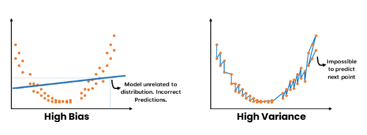{fig-align='center' width=80%}
:::
:::


## Trees may be weak learners

- Trees use to be sensitive to small changes in training data which lead to very different tree structure.
- This implies predictions are highly variable
- This may be explained because they are *greedy  algorithms* making locally optimal decisions at each node without considering the global optimal solution. 
  - This can lead to suboptimal splits and ultimately a weaker predictive performance.
  
## There's room for improvement

- In many situations  trees may be a good option (e.g. for simplicity and interpretability)

- But there are issues that, if solved, may improve performance.

- It is to be noted, too, that these problems are not unique to trees. 

  - Other simple models such as linear regression may be considered as weakl learners in may situations.


## The bias-variance trade-off

- When we try to improve weak learners we need to deal with the bias-variance trade-off.


::: {.cell layout-align="center"}
::: {.cell-output-display}
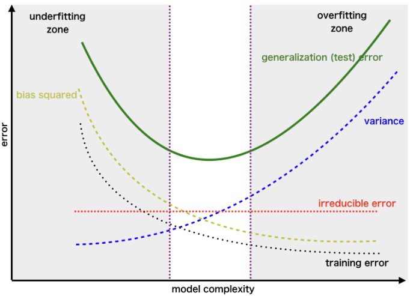{fig-align='center' width=2.31in}
:::
:::


## How to deal with such trade-off 

- How can a model be made less variable or less biased without this increasing its bias or variance?

- There are distinct appraches to deal with this problem
  - Regularization, 
  - Feature engineering,
  - Model selection
  - Ensemble learning

## Ensemble learners

- Ensemble learning takes a distinct based on "*the wisdom of crowds*".

- Predictors, also called, **ensembles** are built by fitting repeated (weak learners) models on the same data and combining them to form a single result.

- As a general rule, ensemble learners tend to improve the results obtained with the weak learners they are made of.


## Ensemble methods

- If we rely on how they deal with the bias-variance trade-off we can consider distinct groups of ensemble methods:

  - Bagging
  
  - Boosting
  
  - Hybrid learners
  
[Emnsemble methods cheatsheet](https://sites.google.com/view/datascience-cheat-sheets#h.t1jchxvxlgr2)
  
## Aggregating Trees

Bagging, Random Forests, and Random Patches reduce variance compared to individual decision trees by constructing multiple trees using different types of subsets:

(1) Subsets of observations (Bagging)

(2) Subsets of features (Random Forests)

(3) Subsets of both observations and features (Random Patches)

## Boosting & Stacking

- **Boosting** or **Stacking** combine distinct predictors to yield a model with an increasingly smaller error, and so reduce the bias. 

- They differ on if do the combination

  - sequentially (1) or 
  
  - using a meta-model (2) .

## Hybrid Techniques 

- **Hybrid techniques** combine approaches in order to deal with both variance and bias. 

- The approach should be clear from their name:

  - *Gradient Boosted Trees with Bagging* 
  
  - *Stacked bagging* 

  
# Bagging: Aggregating predictors

## Bagging: bootstrap aggregation

- Decision trees suffer from high variance when compared with other methods such as linear regression, especially when $n/p$ is moderately large.

- Given that this is intrinsic to trees,  @Breiman1996 sugested to build multiple trees derived from the same dataset and, somehow, average them.

## Averaging decreases variance

- Bagging relies, informally, on the idea that:

  - given $X\sim F()$, s.t. $Var_F(X)=\sigma^2$, 
  - given a s.r.s. $X_1, ..., X_n$ from $F$ then 
  - if $\overline{X}=\frac{1}{N}\sum_{i=1}^n X_i$ then $var_F(\overline{X})=\sigma^2/n$.

- That is, *relying on the sample mean instead of on simple observations, decreases variance by a factor of $n$*.

- BTW this idea is still (approximately) valid for more general statistics where the CLT applies.

## What means *averaging trees*?

Two questions arise here:

1. How to go from $X$ to $X_1, ..., X_n$?
  - This will be done using *bootstrap resampling*.

2. What means "averaging" in this context.
  - Depending on the type of tree:
    - Average predictions for regression trees.
    - Majority voting for classification trees.


## *BAGG*ING: Bootstrap Aggregation

- @Breiman1996 combined the ideas of:
  - Averaging provides decreased variance estimates,
  - Bootstrap provides multiple (re)samples.
- He suggested: **b**ootstrap **agg**regat**ing** :
  - Take resamples  from the original training dataset
  - Learn the model on each bootstrapped training set to get a prediction $\hat f^{*b}(x)$.
  - Average $\hat f^{*b}(x)$ to obtain improved prediction/classification.

## Bagging prediction/classifier

- For regression (trees) the **bagged estimate** is the average prediction at $x$ from these $B$ trees.
$$
\hat f_{bag}(x)=\frac 1B \sum_{b=1}^B \hat f^{*b}(x) 
$$

- For classification (trees) the 
**bagged classifier** selects the class with the most “votes” from the $B$ trees:
$$
\hat G_{bag}(x) = \arg \max_k \hat f_{bag}(x).
$$

## Resampling *based* estimators

- The bootstrap was introduced as a way to provide standard error estimators.
- When used to compute $\hat f_{bag}(x)$ or $\hat G_{bag}(x)$, as described above, it provides direct estimators of a characteristic, not of their standard errors.
- However, the bagging process *can also provide resampling based estimates of the precision of these estimators*.

## Out-Of-Bag observations

- Every time a resample is taken *with replacement*, some observations are omitted, due to the multiple occurring of others.


::: {.cell layout-align="center"}
::: {.cell-output-display}
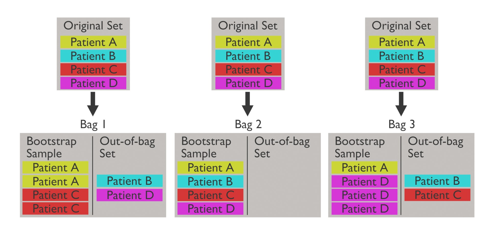{fig-align='center' width=100%}
:::
:::


- These *out-of-bag* (OOB) observations can be used to build an estimate of prediction error.


## Out-Of-Bag error estimates

Since each out-of-bag set is not used to train the model, it can be used to evaluate performance.

1. Find all trees that are not trained by the OOB instance.
2. Take the majority vote of these trees for the OOB instance, compared to the true value of the OOB instance.
3. Compile OOB error for all instances in the OOB dataset.

<!-- - For every observation $i=1, ...n$ response can be predicted using each of the trees in which that observation was OOB.  -->
<!-- - This a variable number (around B/3) of predictions for the ith observation which can be averaged. -->
<!-- - If $B$ is large this is essentially the LOO cross-validation error. -->

## Illustration of OOB EE


::: {.cell layout-align="center"}
::: {.cell-output-display}
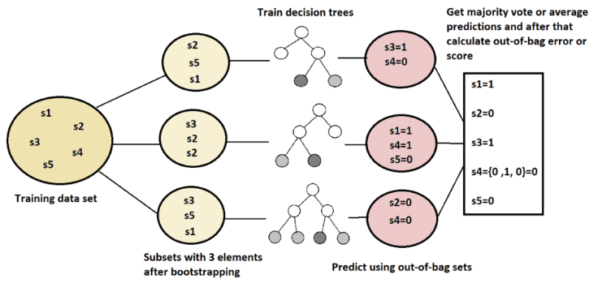{fig-align='center' width=100%}
:::
:::


[Source: https://www.baeldung.com/cs/random-forests-out-of-bag-error](https://www.baeldung.com/cs/random-forests-out-of-bag-error)


## Bagging in R

- We use the `AmesHousing` dataset on house prices in Ames, IA, to predict the "Sales price" of houses.

1. Start by splitting the dataset in test/train subsets
2. Build a bagged tree on the train subset and evaluate it on the test subset.
3. Interpret the results using "Variable importance"

- Bagging is equivalent to RandomForest if  each tree in a Random Forest considers all  features at every split.
- So we use `randomForest` package setting `mtry` to total number of features.


## Bagging - Prepare data


::: {.cell}

```{.r .cell-code}
# Prepare "clean" dataset from raw data
ames <- AmesHousing::make_ames()
# Scale response variable to improve readability
ames$Sale_Price <- ames$Sale_Price/1000
# Split in test/training
set.seed(123)
train <- sample(1:nrow(ames), nrow(ames)/2)
# split <- rsample::initial_split(ames, prop = 0.7, 
#                        strata = "Sale_Price")
ames_train  <- ames[train,]
ames_test   <- ames[-train,]
```
:::


## Bagging - Build bag of trees


::: {.cell}

```{.r .cell-code}
library(randomForest)
set.seed(12543)
bag.Ames <- randomForest(Sale_Price ~ ., 
                         data = ames_train, 
                         mtry = ncol(ames_train-1), 
                         ntree = 100,
                         importance = TRUE)
```
:::


## Bagging - Results


::: {.cell}

```{.r .cell-code}
show(bag.Ames )

Call:
 randomForest(formula = Sale_Price ~ ., data = ames_train, mtry = ncol(ames_train -      1), ntree = 100, importance = TRUE) 
               Type of random forest: regression
                     Number of trees: 100
No. of variables tried at each split: 80

          Mean of squared residuals: 771498315
                    % Var explained: 87.89
```
:::


## Bagging - Prediction and accuracy


::: {.cell}

```{.r .cell-code}
yhat.bag <- predict(bag.Ames, newdata = ames_test)
MSE= mean((yhat.bag -ames_test$Sale_Price)^2)
plot(yhat.bag, ames_test$Sale_Price, main=c("MSE= ", MSE))
abline(0, 1)
```
:::


## Bagging - Prediction and accuracy


::: {.cell layout-align="center"}
::: {.cell-output-display}
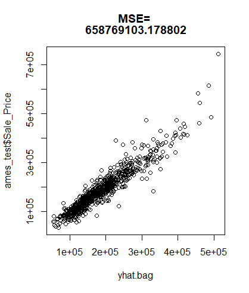{fig-align='center' width=100%}
:::
:::


## Interpetability: The "achiles heel"


- Trees may have a straightforward interpretation,
  - Plotting the tree provides information about
    - which variables are important
    - how they act on the prediction
    
- Ensembles are less intuitive because 
  - there is no consensus tree.
  - not clear which variables are most important.


## Feature importance from Trees

- To measure feature importance, the reduction in the loss function (e.g., SSE) attributed to each variable at each split is tabulated.

- The total reduction in the loss function across all splits by a variable are summed up and used as the total feature importance.


## Feature importance for Ensembles

- Variable importance measures can be extended to an ensemble simply by adding up variable importance over all trees built.


::: {.cell layout-align="center"}

:::

::: {.cell layout-align="center"}
::: {.cell-output-display}
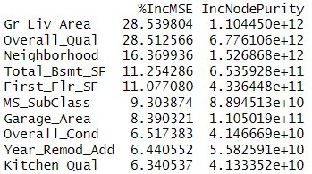{fig-align='center' width=80%}
:::
:::


# Random Forests

## Random forests: decorrelating predictors

- Bagged trees, based on re-samples (of the same sample) tend to be highly correlated. 
- Leo Breimann, again, introduced a modification to bagging, he called *Random forests*, that aims at decorrelating trees as follows:
  - When growing a tree from one bootstrap sample, 
  - At each split use only a randomly selected *subset of predictors*.
  
## Split variable randomization

- While growing a decision tree, during the bagging process, 

- Random forests perform *split-variable randomization*:
  - each time a split is to be performed, 
  - the search for the split variable is limited to a random subset of $m_{try}$  of the original $p$ features. 
  

## Random forests


::: {.cell}
::: {.cell-output-display}
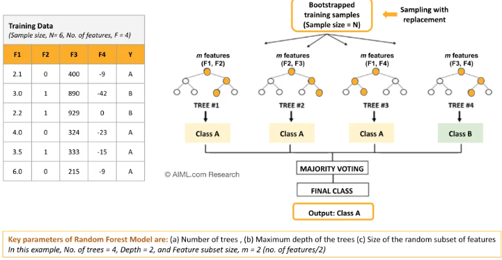{width=100%}
:::
:::


Source: [AIML.com research](https://aiml.com/what-is-random-forest-2/)

## How many variables per split?

- $m$ can be chosen using cross-validation, but
- The usual recommendation for random selection of variables at each split has been studied by simulation:
  - For regression default value is $m=p/3$
  - For classification default value is $m=\sqrt{p}$.
- If $m=p$, we have bagging instead of RF.


## Random forest algorithm (1)


::: {.cell}
::: {.cell-output-display}
![RF Algorithm, from ch. 11 in [@Boehmke2020]](images/RandomForestsAlgorithm1.png){width=80%}
:::
:::


## Random forest algorithm (2) 


::: {.cell}
::: {.cell-output-display}
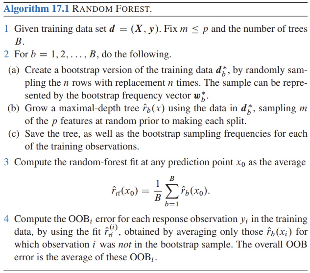{width=80%}
:::
:::


## Out-of-the box performance

- Random forests tend to provide very good out-of-the-box performance, that is:
  - Although several hyperparameters can be tuned, 
  - Default values tend to produce good results. 
- Moreover, among the more popular machine learning algorithms, RFs have the least variability in their prediction accuracy when tuning [@Probst2019].

## Out of the box performance

- A random forest trained with all hyperparameters set to their default values can yield an OOB RMSE that is better than many other classifiers, with or without tuning.
- This combined with good stability and ease-of-use has made it the option of choice for many problems.

## Out of the box performance example


::: {.cell}

```{.r .cell-code}
# number of features
n_features <- length(setdiff(names(ames_train), "Sale_Price"))

# train a default random forest model
ames_rf1 <- ranger(
  Sale_Price ~ ., 
  data = ames_train,
  mtry = floor(n_features / 3),
  respect.unordered.factors = "order",
  seed = 123
)

# get OOB RMSE
(default_rmse <- sqrt(ames_rf1$prediction.error))
## [1] 24859.27
```
:::


## Tuning hyperparameters

There are several parameters that, appropriately tuned, can improve RF performance.

:::{.font90}

1. Number of trees in the forest.
2. Number of features to consider at any given split ($m_{try}$).
3. Complexity of each tree.
4. Sampling scheme.
5. Splitting rule to use during tree construction.
:::

1 & 2 usually have largest impact on predictive accuracy.

## 1. Number of trees


::: {.cell}
::: {.cell-output-display}
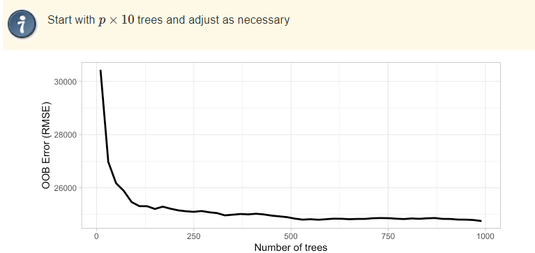{width=100%}
:::
:::


:::{.small}
- The number of trees needs to be sufficiently large to stabilize the error rate.
-  More trees provide more robust and stable error estimates
- But impact on computation time increases linearly with $n_tree$
:::

## 2. Number of features ($m_{try}$).


::: {.cell}
::: {.cell-output-display}
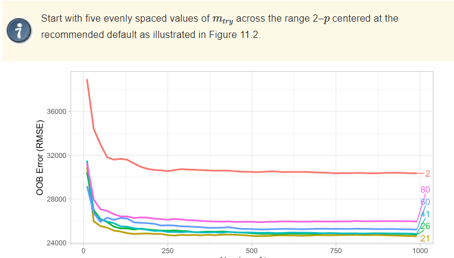{width=100%}
:::
:::


:::{.small}
- $m_{try}$ helps to balance low tree correlation with reasonable predictive strength.
- Sensitive to total number of variables. If high /low, better increase/decrease it.
:::

## 3. Complexity of each tree.


::: {.cell}
::: {.cell-output-display}
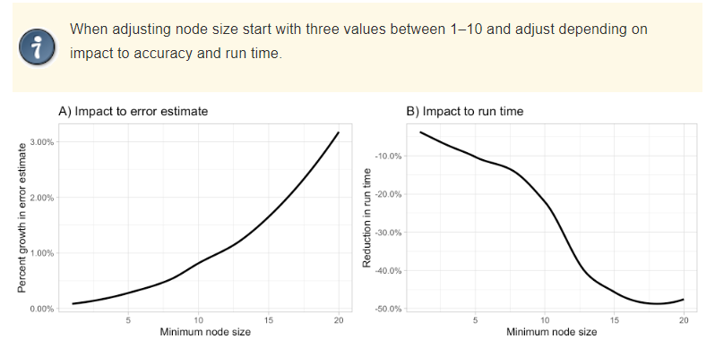{width=100%}
:::
:::


:::{.small}
- The complexity of underlying trees influences RF performance. 
- Node size has strong influence on error and time.
:::

## 4. Sampling scheme.


::: {.cell}
::: {.cell-output-display}
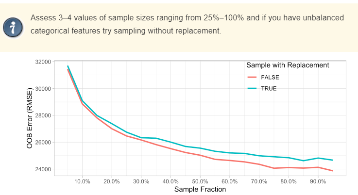{width=100%}
:::
:::


:::{.small}
- Default: Bootstrap sampling with replacement on 100% observations. - Sampling size and replacement or not can affect diversity and reduce bias.
- Node size has strong influence on error and time.
:::

## 5. Splitting rule 

- *Default splitting rules* favor features with many splits, potentially biasing towards certain variable types.
- *Conditional inference trees* offer an alternative to reduce bias, but may not always improve predictive accuracy and have longer training times.
- *Randomized splitting rules*, like *extremely randomized trees* (which draw split points completely randomly), improve computational efficiency but may not enhance predictive accuracy and can even reduce it.

## Tuning hyperparameters

- RF are a good example of a common situachion in ML: 
  - As the number of parameter increases, 
  - finding their optimal values requires more effort 
  - and can even become computationally unfeasible.
  
- As more complex algorithms with greater number of hyperparameters are introduced tuning strategies should also be considered.

## Tuning strategies

::: {.font80}
- **Grid Search**: Systematically searches through (*all possible combinations*) a predefined grid of hyperparameter values to find the combination that maximizes performance.
  
- **Random Search**: Randomly samples hyperparameter values from predefined distributions. Faster than Grid Search, but less prone to find optimum.
  
- **Model-Based Optimization** leverages probabilistic models, often Gaussian processes, to model the objective function and iteratively guide the search for optimal hyperparameters.
:::


## Random forests in bioinformatics

- Random forests have been thoroughly used in Bioinformatics  [@Boulesteix2012].
- Bioinformatics data are often high dimensional with 
  - dozens or (less often) hundreds of samples/individuals
  - thousands (or hundreds of thousands) of variables.

## Application of Random forests

- Random forests provide robust classifiers for:
  - Distinguishing cancer from non cancer,
  - Predicting tumor type in cancer of unknown origin,
  - Selecting variables (SNPs) in Genome Wide Association Studies...
  
- Some variation of Random forests are used only for variable selection

# Boosting

## Improving predictors iteratively

- The idea of *improving weak learners by aggregation* has moved historically along two distinct lines:

  1. Build similar learners on resamples from the original sample and average the predictions.
  
    - This entails *Bagging* and *Random Forests*
  
  2. Build a learner progressively, improving it at every step using weak learners, until the desired possible quality is obtained.
  
    - This is what *Boosting* is about.
    


## Bagging vs Boosting

:::: {.columns}

::: {.column width='45%'}


::: {.cell}
::: {.cell-output-display}
{width=90%}
:::
:::


:::

::: {.column width='45%'}


::: {.cell}
::: {.cell-output-display}
{width=90%}
:::
:::


:::

::::

Source: [Ensemble Learning: Bagging & Boosting](https://resources.experfy.com/ai-ml/ensemble-learning-bagging-boosting/)

## So what is Boosting

<!-- - Boosting is an ensemble learning technique used in ML for improving the accuracy of *weak learners*. -->

- Idea: create a model that is better than any of its individual components by combining their strengths and compensating for their weaknesses.

  - Multiple weak models are *trained sequentially*.
  
  - Each new model is trained to improve the errors made by the previous model. 

- The final model is a *weighted combination* of all the models where the *weights are determined by the accuracy of each model*. 

<!-- - Boosting can be applied to various machine learning algorithms, including decision trees, neural networks, and support vector machines. -->

## Historical background

- The *boosting technique* was proposed by Robert Schapire [@Schapire89] and Yoav Freund in the 1990s. 

- They introduced *AdaBoost*, the first widely-used Boosting algorithm.

  - It achieved significant success in various applications, including *face detection* and *handwriting recognition*.
  
- Other Boosting algorithms have become popular: *Gradient Boosting*, *XGBoost*, and *LightGBM*. 

## Adaboost

- AdaBoost (*Adaptive Boosting*) is a direct implementation of the "boosting" idea.

- It trains models sequentially, new models *focusing on correcting the errors of the previous ones*.
  
- Final Decision is made by *combining models*, giving more influence to the most reliable ones through

  - A weighted majority vote (classification) or 
  
  - Weighted sum (regression).
  

## Running Adaboost
 
- Adaboost proceeds iteratively by, at each iteration:

  - Fit the weak learner using initial weights.
  
  - Predict and identify misclassified observations.
  
  - Update *observation weights*: 
  
    - decrease for correctly classified
    
    - increase for misclassified.
    
  - Assign a *learner weight* to the weak learner based on its accuracy.
  
- The final prediction is a *weighted combination* of all weak learners.

::: {.notes}
- AdaBoost implements a vector of weights to penalize those samples that were incorrectly inferred (by increasing the weight) and reward those that were correctly inferred (by decreasing the weight). 
  - Updating this weight vector will generate a distribution where it will be more likely to extract those samples with higher weight (that is, *those that were incorrectly inferred*), 
  - This sample will be introduced to the next base learner in the sequence and 
  - This will be repeated until a stop criterion is met. 
  - Likewise, each base learner in the sequence will have assigned a weight, the higher the performance, the higher the weight and the greater the impact of this base learner for the final decision. 
  - Finally, to make a prediction, 
      - each base learner in the sequence will be fed with the test data, 
      - each of the predictions of each model will be voted (for the classification case) or averaged (for the regression case)
:::

## Adaboost Architecture


::: {.cell layout-align="center"}
::: {.cell-output-display}
{fig-align='center' width=90%}
:::
:::


<small>
Source: [Ensemble Learning: Bagging & Boosting](https://resources.experfy.com/ai-ml/ensemble-learning-bagging-boosting/)
</small>

## Adaboost pseudo-code

<small>

1. Initialize sample weights: $w_i = 1/N$, where $N$ = # of training samples.

2. For each iteration $t=1,2,\dots,T$ do:

    a. Train weak classifier $h_t(x)$ on  training set weighted by $w_i$.
  
    b. Compute the weighted error rate: 
  $${\small \left. \epsilon_t = \sum_{i=1}^N w_i I(y_i \neq h_t(x_i)) \right/ \left. \sum_{i=1}^N w_i\right. }$$
      c. Compute the classifier weight: $\alpha_t = \frac{1}{2}\log\frac{1-\epsilon_t}{\epsilon_t}$.
      
    d. Update the sample weights: $w_i \leftarrow w_i^{-\alpha_t I(y_i \neq h_t(x_i))}$.
    
    e. Normalize the sample weights: $w_i \leftarrow \frac{w_i}{\sum_{j=1}^N w_j}$.
  
3. Output the final classifier: $H(x) = \text{sign}\left(\sum_{t=1}^T \alpha_t h_t(x)\right)$.

</small>

## Adaboost applications


::: {.cell layout-align="center"}
::: {.cell-output-display}
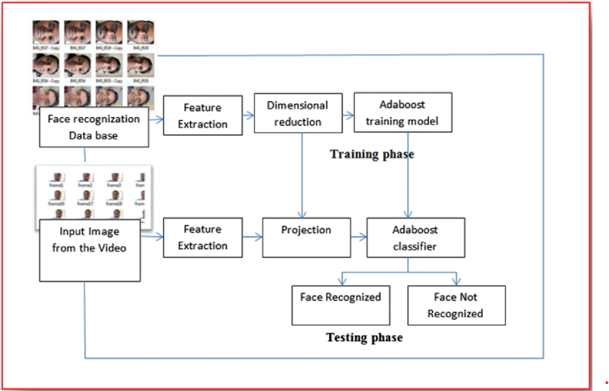{fig-align='center' width=90%}
:::
:::


<small>
source: [Evaluating the AdaBoost Algorithm for Biometric-Based Face Recognition](https://doi.org/10.1007/978-981-16-0081-4_67)
</small>


<!-- - Task: to identify whether an image contains a face.  -->
<!-- - Classifiers were trained on a set of face images and a set of non-face images.  -->
<!--   - Weak classifiers: decision stump that checks whether a specific feature is present in the image or not.  -->
<!-- - AdaBoost iteratively trains weak classifiers and assigns higher weights to misclassified samples, leading to a stronger ensemble classifier.  -->
<!-- - The resulting classifier can then be used to detect faces in new images with high accuracy. -->

## Adaboost has limitations

- Adaboost was a breakthrough algorithm that significantly improved the accuracy of ML models. 

- However, Adaboost has its limitations. 

  - It does not handle continuous variables very well. 

  - Can be sensitive to noisy data and outliers,

  - May not perform well with complex datasets. 

  - Its performance can reach a "plateau": it will no longer improve after a certain number of iterations.

- In  order to deal with some of these drawbacks different variants of boosting have been proposed.

## Gradient Boosting

- Developed to overcome the limitations of Adaboost.

- Takes a different approach that can be linked with Optimization by Gradient Descent.

- Several advantages over Adaboost

  - Can handle continuous variables much better,

  - It is more robust to noisy data and outliers.

  - Can handle complex datasets and 

  - Can continue to improve its accuracy even after Adaboost's performance has "plateaued".
  
<!-- ## Gradient boosting generalizes Adaboost -->

<!-- - It is a generalization of the AdaBoost algorithm that allows the use of *any cost function*, as long as it is differentiable.  -->

<!-- - The flexibility of this algorithm has made it possible to apply boosting to a multitude of problems (regression, multiple classification, etc.), making it one of the most successful machine learning methods.  -->

<!-- - While there are various adaptations, the general idea behind all of them is the same: train models sequentially, with each model adjusting the residuals (errors) of the previous models. -->


## Gradient Boosting Algorithm  {.smaller}

- Train a first weak learner $f_1$, which predicts the response variable $y$, and calculate the residuals $y - f_1(x)$.

- Next, train a new model $f_2$, to predict the residuals of the previous model, that is, to correct the errors made by model $f_1$.
  
  - $f_1(x) \approx y$
  
  - $f_2(x) \approx y - f_1(x)$

- Iterate calculating residuals of the two models together $y - f_1(x) - f_2(x)$ and train a third model $f_3$ to  correct them.
  
  - $f_3(x) \approx y - f_1(x) - f_2(x)$

- Repeat the process $M$ times, so that each new model minimizes the residuals (errors) of the previous one.

## Gradient Boosting may overfit {.smaller}

- Since the goal of Gradient Boosting is to minimize the residuals iteration by iteration, it is susceptible to overfitting. 

- One way to avoid this problem is by using a regularization value, also known as the learning rate ($\lambda$), which limits the influence of each model on the ensemble. 

- As a result of this regularization, more models are needed to form the ensemble, but better results are achieved.

  - $f_1(x) \approx y$
  
  - $f_2(x) \approx y - \lambda f_1(x)$
  
  - $f_3(x) \approx y - \lambda f_1(x) - \lambda f_2(x)$
  
  - $y \approx \lambda f_1(x) + \lambda f_2(x) + \lambda f_3(x) + \ldots + \lambda f_m(x)$


## Gradient boosting architechture


::: {.cell}
::: {.cell-output-display}
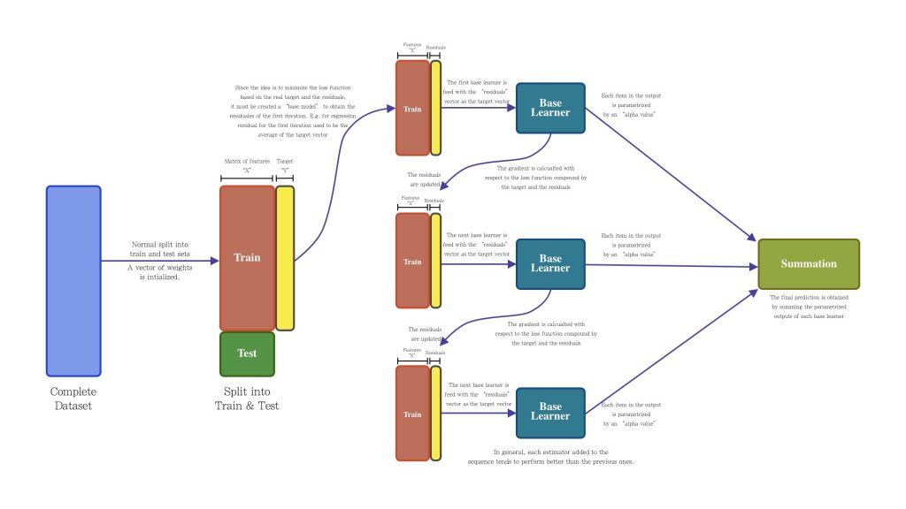{width=100%}
:::
:::


<small>
Source: [Ensemble Learning: Bagging & Boosting](https://resources.experfy.com/ai-ml/ensemble-learning-bagging-boosting/)
</small>
  
## Gradient Boosting pseudo-code{.smaller}

1. Initialize the model with a constant value:
    $f_0(x) = \frac{1}{n} \sum\limits_{i=1}^{n} y_i$
2. For $t = 1$ to $T$:
    a. Compute the negative gradient of the loss function at the current fit:
        $r_{ti} = -\frac{\partial L(y_i, f_{t-1}(x_i))}{\partial f_{t-1}(x_i)}$
    b. Train a new model to predict the negative gradient values:
        $h(x; \theta_t) = \arg\min\limits_{h} \sum\limits_{i=1}^{n} (r_{ti} - h(x_i; \theta))^2$
    c. Compute the optimal step size:
        $\gamma_t = \arg\min\limits_{\gamma} \sum\limits_{i=1}^{n} L(y_i, f_{t-1}(x_i) + \gamma h(x_i; \theta_t))$
    d. Update the model:
        $f_t(x) = f_{t-1}(x) + \gamma_t h(x; \theta_t)$
3. Output the final model:
    $F(x) = f_T(x)$
    
## Relation with *Gradient Descent*

- Gradient Boosting can be seen as an extension of Gradient Descent, a popular optimization algorithm used to find the minimum of a function. 

  - In Gradient Descent, the weights of the model are updated in the opposite direction of the gradient of the cost function. 
  
  - In Gradient Boosting, the new model is trained on the negative gradient of the loss function, which is equivalent to minimizing the loss function in the direction of steepest descent.

## Gradient Boosting Variations

- Multiple extensions from Gradient Boosting.

- **XGBoost**

  - Optimized implementation that uses regularization to control overfitting and provide better accuracy.
  - Won many competitions.

- **LightGBM**

  - Relies on a technique to reduce the number of samples used in each iteration.
  - Faster training, good for large datasets.

## Boosting applications

- Fraud Detection

- Image and Speech Recognition

- Anomaly Detection

- Medical Diagnosis

- Amazon's recommendation engine

- Models that predict protein structures from amino acid sequences

- Pattern identification in fMRI brain scans. 

## Advantages of Boosting

- Boosting, like other Ensemble methods, improves the accuracy of weak learners and achieve better predictive performance than individual models.

- Boosting also reduces overfitting by improving the generalization ability of models. 

- Available in many flavors, 

- Can be parallelized

- Strong experience in Real world applications and industry.

## Limitations of Boosting

- Can be computationally expensive, especially when dealing with large datasets and complex models. 

- Can be sensitive to noisy data and outliers, 

- May not work well with certain types of data distributions. 

- Not so good as "out-of-the-box": Requires careful tuning of hyperparameters to achieve optimal performance, which can be time-consuming and challenging.


## Boosting application with R and Python

- Many R packages implement the many variations of boosting:

  - [ada](https://cran.r-project.org/web/packages/ada),
  - [adabag](https://cran.r-project.org/web/packages/ada),
  - [mboost](https://cran.r-project.org/web/packages/mboost),
  - [gbm](https://cran.r-project.org/web/packages/gbm),
  - [xgboost](https://github.com/dmlc/xgboost/tree/master/R-package)

  - An interesting option is to rely on the   [caret](https://cran.r-project.org/web/packages/caret/index.html) package which allows to run the distinct methods with a common interface.

- Inpython we usually rely on scikit-learn libraries although there are many alternative implementations

  - [Scikit-learn ensemble](https://scikit-learn.org/stable/modules/ensemble.html)
  - [https://python-course.eu/machine-learning/boosting-algorithm-in-python.php](https://python-course.eu/machine-learning/boosting-algorithm-in-python.php)
  

## References {.smaller}

