# From Artificial Neural Networks to Artifial Intelligence

## Historical Background (1)

-   In the post-pandemic world, a lightning rise of AI, with a mess of realities and promises is impacting society.

-   Since the emergence -and rapid growth-  of Large Language Models and Generative AI everybody has an experience, an opinion, or a fear on the topic.

{fig-align="center" width="100%"}

## Is it just machine learning?

- Many tasks performed by AI can be described as **Predictive** as seen in *Recommendation systems, Image recognition or Natural language processing*.

- However, AI is broader than just prediction systems
- **Generative AI** is also able to generate new content.

- Both, predictive and generative capabilities of AI have far-reaching implications beyond technologies, including ethical or social aspects.

## AI, ANNs and Deep learning

- In many contexts, talking about AI means talking about 
*Deep Learning (DL)*.

- DL is the dominant paradigm in modern (2026) AI and is behind applications such as *self-driving cars, voice assistants, and medical diagnosis systems*.

- DL originates in the field of *Artificial Neural Networks*

- DL extends the basic principles of ANNs by:
    -   Adding complex architectures and algorithms and
    -   Enabling scalable learning from large data

## The early history of AI (1)


```{r, out.width="90%", fig.cap= "[A Quick History of AI, ML and DL](https://nerdyelectronics.com/a-quick-history-of-ai-ml-and-dl/)"}
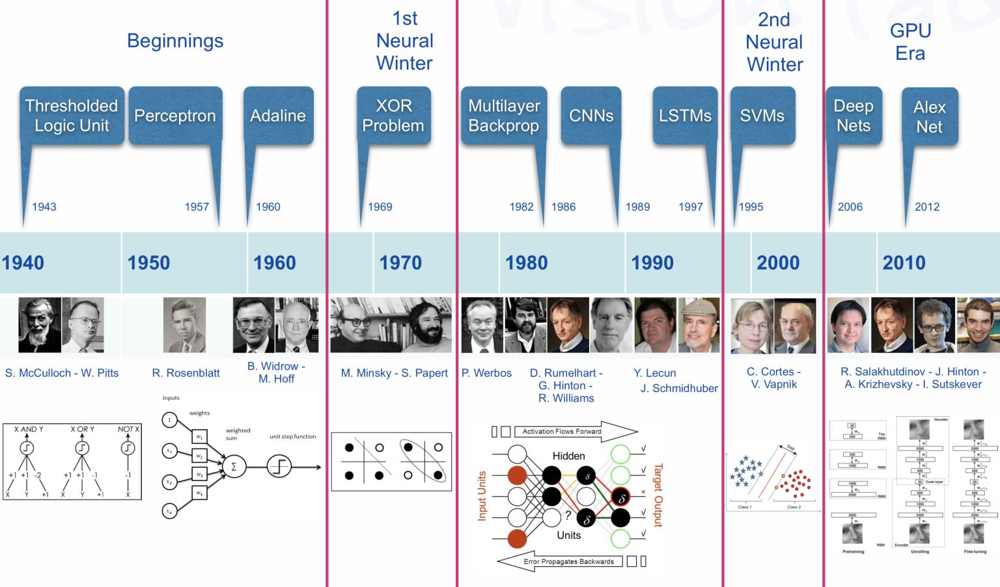
```


<!-- ## Milestones in the history of DL -->

<!-- We can see several hints worth to account for: -->

<!-- -   The **Perceptron** and the first **Artificial Neural Network**: the basic building blocks. -->

<!-- -   The **Multilayered perceptron** and back-propagation: complex architectures to improve the capabilities. -->

<!-- -   **Deep Neural Networks**, with many hidden layers, and auto-tunability capabilities. -->

## From ANN to Deep learning

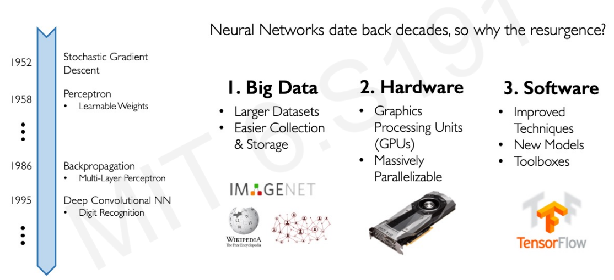{fig-align="center" width="100%"} 

:::{.font90}
Source: [Alex Amini's MIT Introduction to Deep Learning' course](introtodeeplearning.com)
:::

<!-- ## Success stories -->

<!-- Success stories such as -->

<!-- - the development of self-driving cars, -->

<!-- - the use of AI in medical diagnosis, and -->

<!-- - online shopping personalized recommendations -->

<!-- have also contributed to the widespread adoption of AI. -->

<!-- ## Not to talk abou the fears -->

<!-- :::: {.columns} -->

<!-- ::: {.column width='60%'} -->
<!-- - AI also comes with fears from multiple sources from science fiction to religion -->

<!--   - Mass unemployment -->

<!--   - Loss of privacity -->

<!--   - AI bias -->

<!--   - AI fakes -->

<!--   - Or, simply, AI takeover -->

<!-- ::: -->

<!-- ::: {.column width='40%'} -->

<!-- <br> -->
<!-- ```{r, fig.align='center'} -->
<!--  -->
<!-- ``` -->


<!-- ::: -->

<!-- :::: -->


## How does it all fit?


```{r, fig.align='center', out.width="100%"}
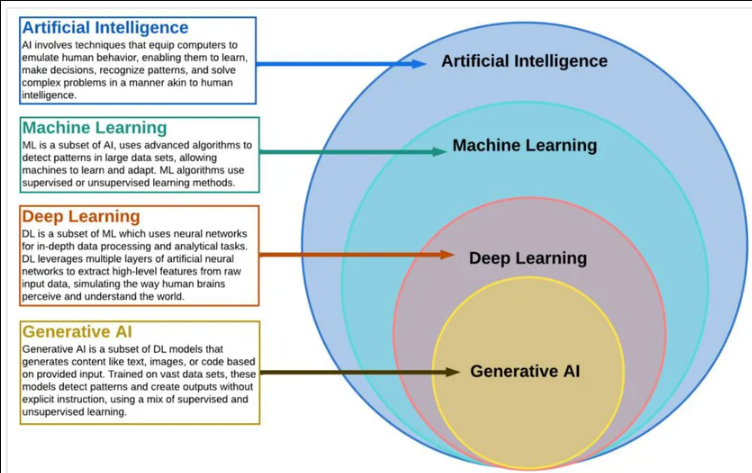
```

## Size does matter!

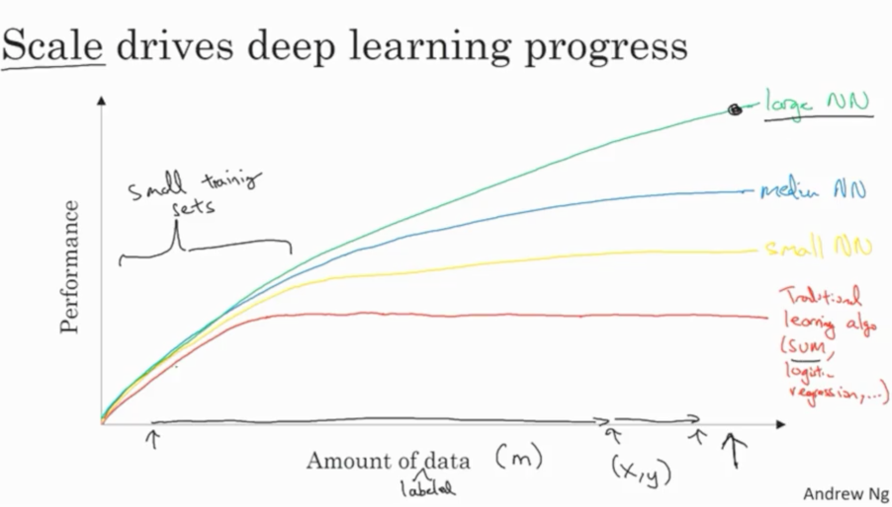{fig-align="center" width="100%"}


<!-- ## The impact of Deep learning {.smaller} -->

<!-- -   Near-human-level image classification -->

<!-- -   Near-human-level speech transcription -->

<!-- -   Near-human-level handwriting transcription -->

<!-- -   Dramatically improved machine translation -->

<!-- -   Dramatically improved text-to-speech conversion -->

<!-- -   Digital assistants such as Google Assistant and Amazon Alexa -->

<!-- -   Near-human-level autonomous driving -->

<!-- -   Improved ad targeting, as used by Google, Baidu, or Bing -->

<!-- -   Improved search results on the web -->

<!-- -   Ability to answer natural language questions -->

<!-- -   Superhuman Go playing -->

<!-- ## Not all that glitters is gold ... -->

<!-- -   According to F. Chollet, the developer of Keras, -->

<!--     -   "*we shouldn't believe the short-term hype, but should believe in the long-term vision*. -->
<!--     -   *It may take a while for AI to be deployed to its true potential---a potential the full extent of which no one has yet dared to dream* -->
<!--     -   *but AI is coming, and it will transform our world in a fantastic way*". -->

# The **A**rtificial **N**eurone


## Emulating biological neurons


:::: {.columns}

::: {.column width='50%'}

```{r, fig.align='center', out.width="100%", fig.cap="[A biological Neuron]()"}
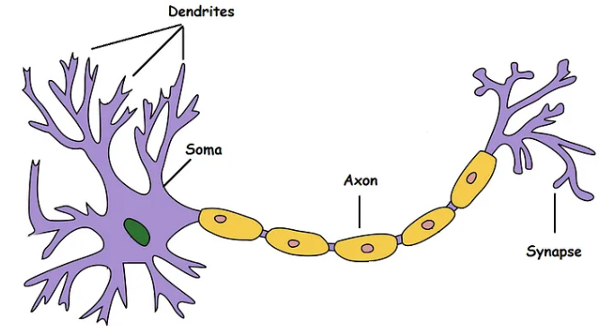
```

:::

::: {.column width='50%'}

```{r, fig.align='center', out.width="100%", fig.cap="[MuCulloch & Pitts proposal]()"}
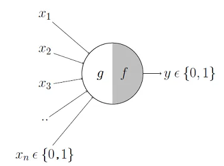
```

:::

::::
:::{.font70}
- First model of an artifial neurone proposed by Mc Cullough & Pitts in 1943
- They aimed at building a mathematical model of a neurone.
:::


## Mc Cullough's neuron

- The neuron can be divided into two parts:

  - $g$: combines the input signals,
  - $f$: yields final output from the aggregated value.

- The neuron computes:
$$
y = f(g(x_1,\dots,x_n)).
$$

:::{.font80}
  - The neuron first aggregates, $g()$, the inputs, $\mathbb(x)$, and then
  - Applies decision rule $f()$ to produce a binary output $y \in \{0,1\}$.
:::

## From the AN to the perceptron

Mc Cullogh's neuron has important limitations:

- Inputs are binary: $x_i \in \{0,1\}$
- All inputs are treated in a fixed way
- The decision rule is rigid (fixed threshold)

To build more flexible the perceptron was introduced.


## The Perceptron

-   To overcome Mc Cullogh's neuron limitations Rosenblatt, proposed the perceptron model, or  *artificial neuron*, in 1958.

- It generalizes previous one in that *weights and thresholds can be learnt over time*.

  - It takes a weighted sum of the inputs and
  - It sets the output to 1 if the weighted sum exceeds a threshold $\theta$, and to 0 otherwise.
    
## Rosenblatt's perceptron

[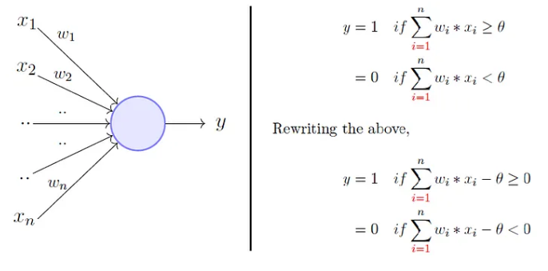{width="100%"}](https://towardsdatascience.com/perceptron-the-artificial-neuron-4d8c70d5cc8d)

## Rosenblatt's perceptron

:::{.font80}
-   Instead of hand coding the thresholding parameter $\theta$,
-   It is added as one of the inputs, with the weight $w_0=-\theta$.
:::

[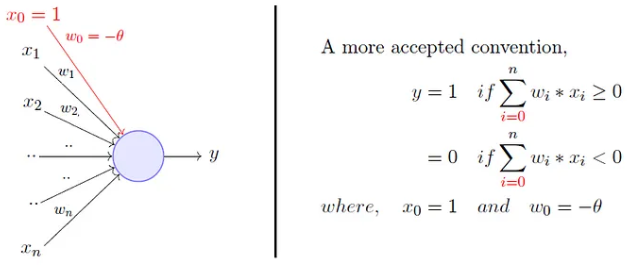{width="100%"}](https://towardsdatascience.com/perceptron-the-artificial-neuron-4d8c70d5cc8d)


## Limitations of the perceptron

The perceptron represents an improvement:

- It admits real-valued inputs.
- Both weights and the bias can be learned.

However, it still has important limitations:

- It defines a **linear decision boundary**.
- Therefore, it can only classify **linearly separable data**.


## ANs and Activation Functions

- The Perceptron can be generalized by *Artificial Neurones* which use functions, called *Activation Functions (AFs)* to produce their output.

- AFs are built in a way that they allow neurons to produce *continuous* and *non-linear outputs*.
  
- It must be noted however that a single AN, even with a different AF, still cannot model non-linear separable problems: *Non-linearity is in the output, no in the input*


## Biological vs Artificial Neurons

- Biological neurons are specialized cells that transmit signals to communicate with each other.
- Neuron's activation is based on releasing *neuro-transmitters*, chemicals that flow between nerve cells.
    - When the signal reaching the neuron exceeds a certain threshold, it releases neurotransmitters to continue the communication process.
- Artificial Neurons rely on Activation Functions to emulate the activation process of biological neurons


## Activation function

```{r, fig.align='center', out.width="100%"}
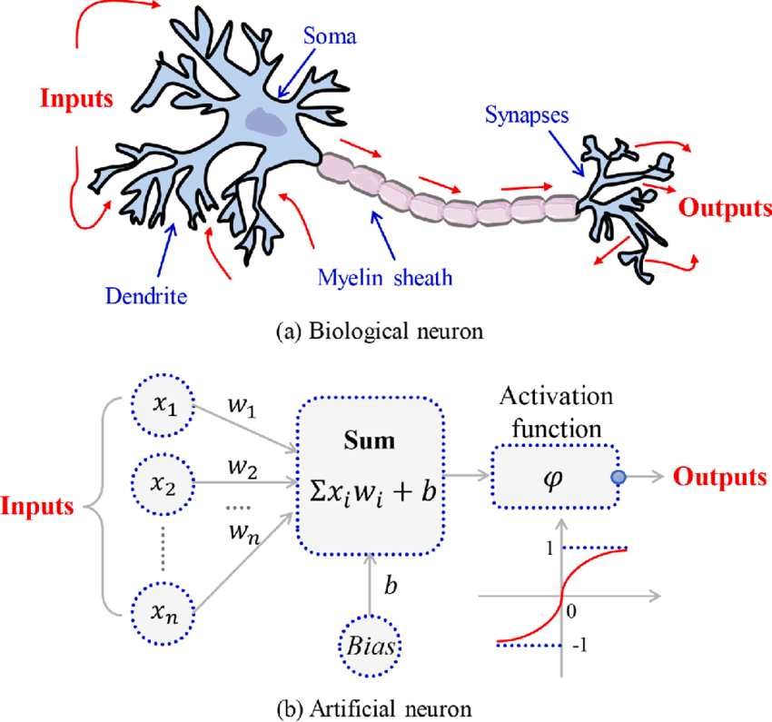
```

## Artificial Neuron

With all these ideas in mind we can now define an Artificial Neuron as a *computational unit* that :

-   takes as input $x=(x_0,x_1,x_2,x_3),\ (x_0 = +1 \equiv bias)$,

-   outputs $h_{\theta}(x) = f(\theta^\intercal x) = f(\sum_i \theta_ix_i)$,

-   where $f:\mathbb{R}\mapsto \mathbb{R}$ is called the **activation function**.

## Activation functions

:::{.font90}

-   Goal of activation function is to provide the neuron with *the capability of producing the required outputs*.

-   Flexible enough to produce

    -   Either linear or non-linear transformations.
    -   Output in the desired range (\[0,1\], {-1,1}, $\mathbb{R}^+$...)

-   Usually chosen from a (small) set of possibilities.

    -   Sigmoid function
    -   Hyperbolic tangent, or `tanh`, function
    -   ReLU

:::

## The sigmoid function {.smaller}

::: columns
::: {.column width="50%"}

$$
f(z)=\frac{1}{1+e^{-z}}
$$

-   Output real values $\in (0,1)$.

-   Natural interpretations as *probability*


```{r, fig.align='center', out.width="100%"}
knitr::include_graphics("images/sigmoidFunction.png")
```

:::

::: {.column width="50%"}

```{r, fig.align='center', out.width="100%"}
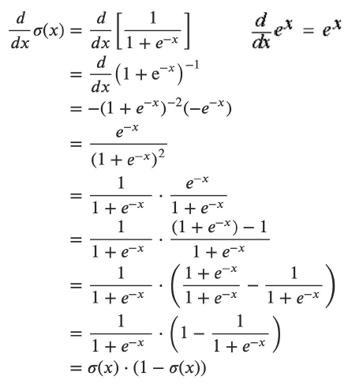
```


:::
:::

## the hyperbolic tangent {.smaller}

::: columns
::: {.column width="50%"}
Also called `tanh`, function:

$$
f(z)=\frac{e^{z}-e^{-z}}{e^{z}+e^{-z}}
$$

-   outputs are zero-centered and bounded in −1,1

-   scaled and shifted Sigmoid

-   stronger gradient but still has vanishing gradient problem

-   Its derivative is $f'(z)=1-(f(z))^2$.
:::

::: {.column width="50%"}
```{r, fig.align='center', out.width="100%"}
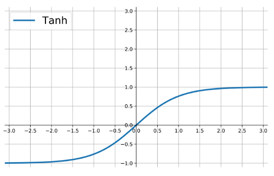
```
:::
:::

## The ReLU {.smaller}

::: columns
::: {.column width="55%"}
-   *rectified linear unit*: $f(z)=\max\{0,z\}$.

-   Close to a linear: piece-wise *linear* function with two linear pieces.

-   Outputs are in $(0,\infty)$ , thus not bounded

-   Half rectified: activation threshold at 0

-   No vanishing gradient problem
:::

::: {.column width="45%"}
```{r, fig.align='center', out.width="100%"}
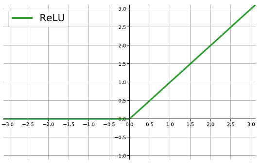
```
:::
:::

## More activation functions

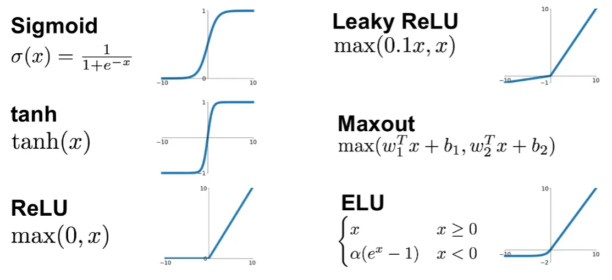{width="100%"}.

## Softmax Activation Function {.smaller}

- **Softmax** is an activation function used in the **output layer** of classification models, especially for **multi-class problems**.

- It converts raw scores (logits) into **probabilities**, ensuring that $\sum_{i=1}^{N} P(y_i) = 1$
  where $P(y_i)$ is the predicted probability for class $i$.

- Given an input vector $z$, *Softmax* transforms it as:
  $$
  \sigma(z_i) = \frac{e^{z_i}}{\sum_{j=1}^{N} e^{z_j}}
  $$
  - The exponentiation **amplifies differences**, making the highest value more dominant.
  - The normalization **ensures that probabilities sum to 1**.

<!-- - It is thoroughfully used in classification problems because -->
<!--   - It allows interpreting outputs as **class probabilities**. -->
<!--   - It ensures a **clear decision boundary** between classes. -->
<!--   - It works well for **multi-class classification** problems. -->


## The Artificial Neuron in Short

```{r, fig.align='center', out.width="100%"}
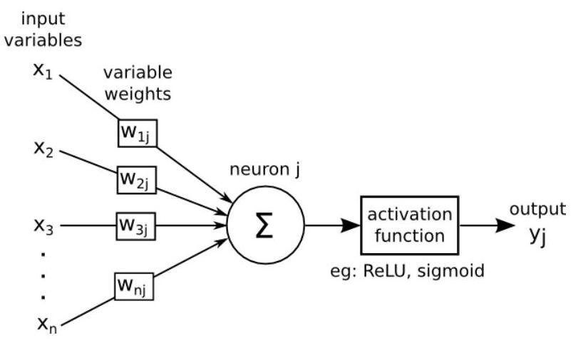
```

## The Artificial Neuron in Short {.smaller}

- An AN takes a vector of input values $x_{1}, \ldots, x_{d}$ and combines it with some weights that are local to the neuron $\left(w_{0}, w_{1}, . ., w_{d}\right)$ to compute a net input $w_{0}+\sum_{i=1}^{d} w_{i} \cdot x_{i}$. 

- To compute its output, it then passes the net input through a possibly non-linear univariate activation function $g(\cdot)$, usually chosen from a set of options such as *Sigmoid*, *Tanh* or *ReLU* functions

- To deal with the  *bias*, we create an extra input variable $x_{0}$ with value always equal to 1 , and so the function computed by a single artificial neuron (parameterized by its weights $\mathbf{w}$ ) is:

$$
y(\mathbf{x})=g\left(w_{0}+\sum_{i=1}^{d} w_{i} x_{i}\right)=g\left(\sum_{i=0}^{d} w_{i} x_{i}\right)=g\left(\mathbf{w}^{\mathbf{T}} \mathbf{x}\right)
$$

# From neurons to neural networks

## The basic neural network

::: font90

- Continuing with the brain analogy one can combine (artificial) neurons to create better learners.

- A simple artificial neural network is created by two types of modifications to the basic Artificial Neuron.

  - *Stacking several neurons* insteads of just one.
  
  - Adding an additional layer of neurons, which is call a *hidden* layer, 

- This yields a system where *the output of a neuron can be the input of another* in many different ways.

:::
## An Artificial Neural network

```{r, fig.align='center', out.width="90%"}
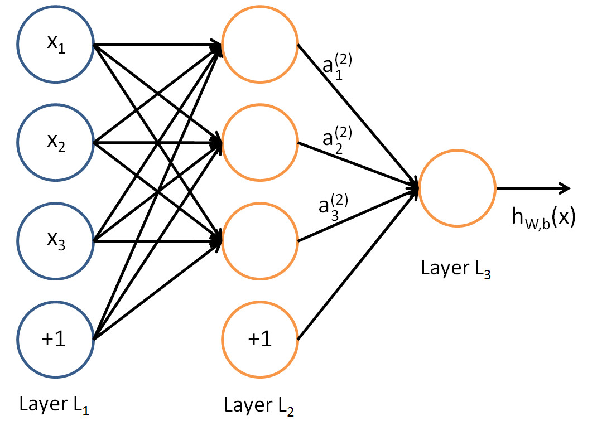
```

## The architecture of ANN {.smaller}

In this figure, we have used circles to also denote the inputs to the
network. 

- Circles labeled +1 are *bias units*, and correspond to the intercept term. 

- The leftmost layer of the network is called the *input layer*.

- The rightmost layer of the network is called the *output* layer.

- The middle layer of nodes is called the *hidden layer*, because its values are not observed in the training set.


Bias nodes are not counted when stating the neuron size. 

With all this in mind our example neural network has three layers with:

 - 3 input units (not counting the bias unit), 
 - 3 hidden units,  
 - 1 output unit.


## How an ANN works 

::: font90

An ANN is a predictive model (a *learner*) whose properties and behaviour  can be well characterized.

<!-- In practice this means: -->

- It operates through a process known as *forward propagation*, which encompasses the  information flow from the input layer to the output layer.

- Forward propagation is performed by composing a series of linear and non-linear (activation) functions.

- These are characterized (parametrized) by their *weights* and *biases*, that need to be *learned from data*. 
  - This is done by *training the ANN*.

:::

<!-- ## Training the ANN -->

<!-- ::: font80 -->

<!-- - The training process aims at finding *the best possible parameter values* for the learning task defined by the fnctions. This is done by -->

<!--   - Selecting an appropriate (convex) loss function, -->
<!--   - Finding weights that minimize the total *cost* function (avg. loss). -->

<!-- - This is usually done using some iterative optimization procedure such as *gradient descent*. -->
<!--   - This requires evaluating derivatives in a huge number of points. -->
<!--   - Such high number may be reduced by *Stochastic Gradient Descent*. -->
<!--   - The evaluation of derivatives is simplified thanks to *Backpropagation*. -->

<!-- ::: -->


## Forward propagation (1) {.smaller}

The process that encompasses the computations required to go from the input values to the final output is known as *forward propagation*.

For the ANN with 3 input values and 3 neurons in the hidden layer we have:

1. Each node $a_i^{(2)}$ of the hidden layer operates on all input values:

::: font90  
\begin{eqnarray}
a_1^{(2)}&=&f(\theta_{10}^{(1)}+\theta_{11}^{(1)}x_1+\theta_{12}^{(1)}x_2+\theta_{13}^{(1)}x_3)\\
a_2^{(2)}&=&f(\theta_{20}^{(1)}+\theta_{21}^{(1)}x_1+\theta_{22}^{(1)}x_2+\theta_{23}^{(1)}x_3)\\
a_3^{(2)}&=&f(\theta_{30}^{(1)}+\theta_{31}^{(1)}x_1+\theta_{32}^{(1)}x_2+\theta_{33}^{(1)}x_3)
\end{eqnarray}
:::

2. Output layer:
$$
h_{\Theta}(x)=a_1^{(3)}=f(\theta_{10}^{(2)}+\theta_{11}^{(2)}a_1^{(2)}+\theta_{12}^{(2)}a_2^{(2)}+\theta_{13}^{(2)}a_3^{(2)})
$$
The terms $\theta_{i0}^{(l)}$ act as bias parameters.


## Forward Propagation (2) {.smaller}

Forward propagation can be written compactly as:

$$
z^{(l+1)} = W^{(l)} a^{(l)} + b^{(l)}
$$

$$
a^{(l+1)} = f(z^{(l+1)})
$$

where:

- $W^{(l)}$ contains the weights,
- $b^{(l)}$ contains the bias terms,
- $f(\cdot)$ is applied elementwise.

- This form is used in most implementations.


## Forward Propagation (3) {.smaller}

An alternative compact notation incorporates the bias into the weight matrix.

:::: columns

::: {.column width="50%"}
**Standard form (explicit bias)**

$$
z^{(l+1)} = W^{(l)} a^{(l)} + b^{(l)}
$$

$$
a^{(l+1)} = f(z^{(l+1)})
$$

- $W^{(l)}$: weights  
- $b^{(l)}$: bias  
- $f(\cdot)$: elementwise  


:::

::: {.column width="50%"}
**Augmented form (bias included)**

$$
z^{(l+1)} = \Theta^{(l)} \tilde{a}^{(l)}
$$

$$
\tilde{a}^{(l)} =
\begin{bmatrix}
1 \\
a^{(l)}
\end{bmatrix}
$$

$$
a^{(l+1)} = f(z^{(l+1)})
$$

- $\Theta^{(l)} = [\, b^{(l)} \;\; W^{(l)} \,]$

:::

::::

## ANNs as Compositions {.smaller}

In short, a neural network defines a parametric function:

$$
\hat{y} = f(x; \theta)
$$

where $f(\cdot)$ is obtained by *composing a sequence of transformations*:

$$
f(x) = f^{(L)} \circ f^{(L-1)} \circ \cdots \circ f^{(1)}(x)
$$

Each layer defines a transformation of the form:

$$
f^{(l)}(a) = f\big(W^{(l)} a + b^{(l)}\big)
$$

so that the activations propagate as:

$$
a^{(l+1)} = f^{(l)}(a^{(l)})
$$

with: $a^{(1)} = x$ (input layer) and $a^{(L)} = \hat{y}$ (output layer).

<!-- - The parameters of the model are:$ -->
<!-- \theta = \{W^{(l)}, b^{(l)}\}_{l=1}^{L} -->
<!-- $ -->

## A simple Neural Network

```{r, fig.cap="[Example from youtube: A simple Neural network in 3 minutes](https://www.youtube.com/watch?v=iyrmwErURJs)", out.width="90%", fig.align='center'}
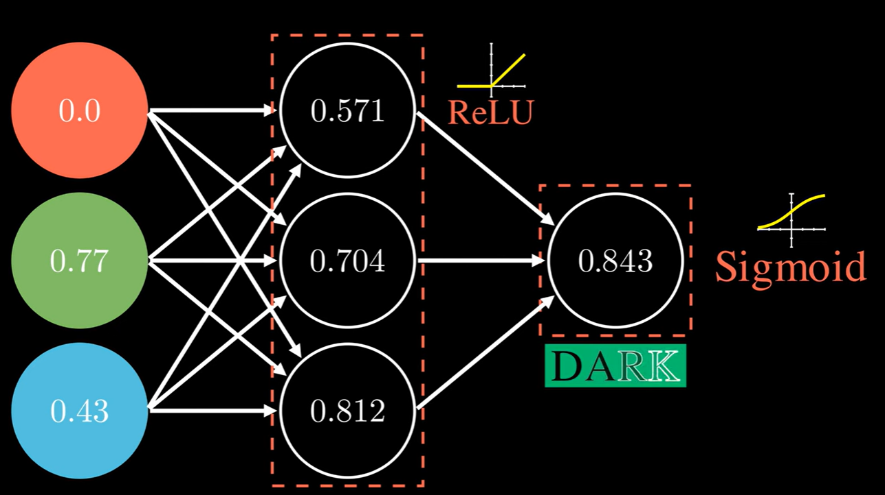
```

## Feed Forward NNs

-   The type of NN described is called feed-forward *neural network (FFNN)*, since
    -   All computations are done by Forward propagation
    -   The connectivity graph does not have any directed loops or cycles.


## Eficient Forward propagation

- The way input data is transformed, through a series of weightings and transformations, until the ouput layer is called   *forward propagation*.

- By organizing parameters in matrices, and using matrix-vector operations, fast linear algebra routines can be used to perform the required calculations in a fast efficent way.

## Multiple architectures for ANN

-   We have so far focused on a single hidden layer neural network of the example. 

- One can. however build neural networks with many distinct   architectures (meaning patterns of connectivity between neurons),
    including ones with multiple hidden layers.

-   See [here the Neural Network
    Zoo](https://www.asimovinstitute.org/neural-network-zoo/).


# Training Neural Networks


## Training an ANN 

An ANN is a predictive model whose properties and behaviour can be mathematically characterized.

- The ANN acts by composing a series of linear and non-linear (activation) functions.

- These transformations are characterized by their weights and biases, which need to be learned from data.

*Training the network* consists in adjusting these parameters so that predictions match -as best as possible- the observed outputs.


## Training an ANN

```{r, fig.align='center'}
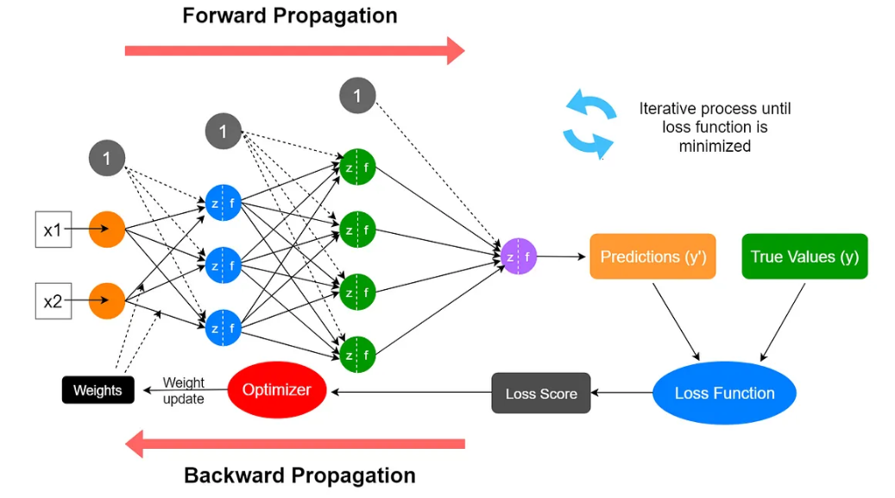
```

::: font80
Source: [Overview of a Neural Network’s Learning Process](https://medium.com/data-science-365/overview-of-a-neural-networks-learning-process-61690a502fa)
:::


## Measuring Prediction Error {.smaller}

- To learn the parameters, we need to measure how good the predictions are.

- For a given observation $(x, y)$, we use a loss function, $\ell(y, \hat{y})$  to compare:

  - the true output $y$
  - the predicted output $\hat{y} = f(x;\theta)$

- Given a dataset $\{(x_i,y_i)\}_{i=1}^n$, we define the average loss:

$$
J(\theta) = \frac{1}{n} \sum_{i=1}^n \ell(y_i, \hat{y}_i)
$$

- This quantity measures *how well the network fits the data*.
- $J(\theta)$ is called the **cost (or objective)** function.

## Typical Loss Functions {.smaller}

- The choice of loss function depends on the type of problem.

  - For *regression problems* a common choice is the **squared error**:
$$
\ell(y, \hat{y}) = (y - \hat{y})^2
$$

  - For *classification problems*, we often use loss functions based on probabilities. In particular:
  
    - For binary classification:   **cross-entropy**
    - multiclass classification:  **softmax + cross-entropy**

The loss function should reflect how we measure prediction quality.


## Cross-entropy loss function {.smaller}

- A common loss function to use with ANNs is Cross-entropy defined as:

::: font80
$$
    l(h_\theta(x),y)=\big{\{}\begin{array}{ll}
    -\log h_\theta(x) & \textrm{if }y=1\\
    -\log(1-h_\theta(x))& \textrm{if }y=0
    \end{array}
$$

:::

- This function can also be written as:

$$
l(h_\theta(x),y)=-y\log h_\theta(x) - (1-y)\log(1-h_\theta(x))
$$

- Using cross-entropy loss, the cost function is of the form:

::: font80

$$
  J(\theta)=-\frac{1}{n}\left[\sum_{i=1}^n (y^{(i)}\log h_\theta(x^{(i)})+ (1-y^{(i)})\log(1-h_\theta(x^{(i)}))\right]
$$

:::

- Now, this is a convex optimization problem.


## A probabilistic interpretation {.smaller}

- In binary classification, the network output can be interpreted as a probability:

$$
\hat{y} \approx P(y = 1 \mid x)
$$

- Under this interpretation, we associate the model:

$$
P(y \mid x) = \hat{y}^y (1 - \hat{y})^{1-y}
$$

  - If $y = 1$, the model assigns probability $\hat{y}$  
  - If $y = 0$, the model assigns probability $1 - \hat{y}$  

This probabilistic view is not required, but provides a useful way to motivate the choice of loss function.

## A probabilistic interpretation {.smaller}

- Given a dataset $\{(x_i, y_i)\}_{i=1}^n$, we can measure how well the model fits the data (*how likely is the model given the data*) through the likelihood:
$$
L(\theta) = \prod_{i=1}^n \hat{y}_i^{y_i} (1 - \hat{y}_i)^{1-y_i}
$$

- Maximizing this likelihood is equivalent to minimizing $- \log  L(\theta)$, which leads to the cross-entropy loss:
$$
\ell(y, \hat{y}) = -y \log(\hat{y}) - (1 - y)\log(1 - \hat{y})
$$
Which should provide a better intuition for this loss function.

<!-- ## Regularized cross entropy -->

<!-- In practice we often work with a *regularized version* of the cost function (we don't regularize the bias units) -->

<!-- ```{=tex} -->
<!-- \begin{eqnarray*} -->
<!-- J(\Theta)&=&-\frac{1}{n}\big[\sum_{i=1}^n \sum_{k=1}^K y_k^{(i)}\log( h_\theta(x^{(i)}))_k\\ -->
<!-- &+&(1-y_k^{(i)})\log(1-(h_\theta(x^{(i)}))_k)\big]\\ -->
<!-- &+&\lambda\sum_{l=1}^{L-1}\sum_{i=1}^{s_l}\sum_{j=1}^{s_{l+1}} -->
<!-- (\theta_{ji}^{(l)})^2 -->
<!-- \end{eqnarray*} -->
<!-- ``` -->


## From Cost to Optimization {.smaller}

- We have defined a cost function:

$$
J(\theta) = \frac{1}{n} \sum_{i=1}^n \ell(y_i, \hat{y}_i)
$$

which measures how well the network fits the data.

- The parameters of the model are:

$$
\theta = \{W^{(l)}, b^{(l)}\}_{l=1}^{L}
$$


- The key question is: *How should we adjust $\theta$ to reduce $J(\theta)$?*

- *Training a network* consists in finding the parameters (weights and biases) that minimize the cost function $J(\theta)$.


## Gradient of the Cost Function {.smaller}

- The cost function, $J(\theta)$,  depends on all model parameters.

- To reduce it, we need to understand how it changes when we modify $\theta$.
  - This is reflected by the derivative or gradient of the function.

- The **gradient** of $J$ is a vector of partial  derivatives defined as:

$$
\nabla J(\theta) =
\left(
\frac{\partial J}{\partial \theta_1}, \dots, \frac{\partial J}{\partial \theta_p}
\right)
$$

- It  indicates how $J(\theta)$ changes with each parameter.

- The gradient vector points in the direction of *steepest increase* so:

- To reduce the cost, we move in the direction of steepest decrease, given by $$-\nabla J(\theta)$$


## Gradient Descent Algorithm {.smaller}

To minimize a cost function $J(\theta)$, we proceeds as follows:

1. **Initialize** $\theta_0$ randomly or with some predetermined values
2. **Repeat until convergence:**
    $$
    \theta_{t+1} = \theta_{t} - \eta \nabla J(\theta_{t})
    $$
3. **Stop when:** $|J(\theta_{t+1}) - J(\theta_{t})| < \epsilon$

  - $\theta_0$ is the initial parameter vector,
  - $\theta_t$ is the parameter vector at iteration $t$,
  - $\eta$ is the learning rate, a step size controlling how large each update is.
  - $\nabla J(\theta_{t})$ is the gradient of the loss function with respect to $\theta$ at iteration $t$,
  - $\epsilon$ is a small positive value indicating the desired level of convergence.

## Gradient descent Illustration

<!-- ```{r } -->
<!-- if(!require(animation)) install.packages('animation') -->
<!-- library(animation) -->
<!-- ani.options(interval = 0.5, nmax = 10) -->
<!-- xx = grad.desc() -->
<!-- ``` -->


- Gradient descent is an intuitive approach that has been thoroughly illustrated in many different ways:


{fig-align="center" width="100%"} 

## Computing Gradients:  {.smaller}

- To apply gradient descent, we need to compute $\nabla J(\theta)$.

- The cost depends on the parameters through multiple layers:
$$
x \rightarrow a^{(2)} \rightarrow a^{(3)} \rightarrow \cdots \rightarrow \hat{y}
$$

- Therefore, we must compute derivatives through a composition of functions

- Backpropagation, an algorithm introduced in the 1970s in an MSc thesis applies the chain rule to compute these derivatives efficiently

  - In 1986, [Rumelhart, Hinton, and Williams](https://www.nature.com/articles/323533a0) demonstrated that backpropagation significantly improves learning speed. 

- This **enabled neural networks to solve previously intractable problems**.

## Backpropagation intuition {.smaller}

- The term originates from error backpropagation.
- An artificial neural network computes outputs through forward propagation:
  - Input values pass through linear and non-linear transformations.
  - The network produces a prediction.
- The error (difference between predicted and true value) is:
  - Propagated backward to compute the error contribution of each neuron.
  - Used to adjust weights iteratively.


## Backpropagation Notation {.smaller}

- For each layer, define:

$$
z^{(l)} = W^{(l-1)} a^{(l-1)} + b^{(l-1)}
$$

$$
a^{(l)} = f(z^{(l)})
$$

- Define:

$$
\delta^{(l)} = \frac{\partial J}{\partial z^{(l)}}
$$

- $\delta^{(l)}$ measures how the cost changes with respect to the pre-activation  


## Output Layer {.smaller}

- Recall: $\delta^{(L)} = \frac{\partial J}{\partial z^{(L)}}$

- The cost depends on $z^{(L)}$ through the activation $a^{(L)}$

- Applying the chain rule:

$$
\delta^{(L)} =
\frac{\partial J}{\partial a^{(L)}} \odot f'(z^{(L)})
$$

- This term depends on:
  - the loss function  
  - the activation function  
  
## Hidden Layers {.smaller}

- The effect of $z^{(l)}$ on the cost is transmitted through the subsequent layers:

$$
z^{(l)} \rightarrow a^{(l)} \rightarrow z^{(l+1)} \rightarrow J
$$

- Applying the chain rule:

$$
\delta^{(l)} =
(W^{(l)})^T \delta^{(l+1)} \odot f'(z^{(l)})
$$

- The term $(W^{(l)})^T \delta^{(l+1)}$ propagates the effect of the cost backwards  

- The term $f'(z^{(l)})$ accounts for the activation function  


## Forward vs Backward {.smaller}

- Forward propagation:
  - computes values  
  - propagates activations layer by layer  

$$
x \rightarrow a^{(2)} \rightarrow a^{(3)} \rightarrow \cdots \rightarrow \hat{y}
$$


- Backward propagation:
  - computes derivatives  
  - propagates sensitivities (errors) backwards  

$$
J \rightarrow \delta^{(L)} \rightarrow \delta^{(L-1)} \rightarrow \cdots \rightarrow \delta^{(1)}
$$

- Forward: how the network produces predictions  

- Backward: how each parameter affects the cost  

<!-- - Backpropagation applies the chain rule in a structured way -->

## Gradients {.smaller}

- After propagating the derivatives backwards, we can compute the gradients with respect to the model parameters

- Using the chain rule:

$$
\frac{\partial J}{\partial W^{(l)}} =
\delta^{(l+1)} (a^{(l)})^T
$$

$$
\frac{\partial J}{\partial b^{(l)}} =
\delta^{(l+1)}
$$

- These expressions follow directly from the definition of $\delta^{(l)}$

## Backpropagation Summary {.smaller}

- Forward pass:
  - compute activations layer by layer  

- Backward pass:
  - propagate derivatives using the chain rule  

- Gradient computation:
  - obtain derivatives with respect to all parameters  

- Parameter update:
  - apply gradient descent  

- Backpropagation efficiently computes the gradient $\nabla J(\theta)$


## A Key Result (1) {.smaller}

- Consider binary classification with:
  - sigmoid activation  
  - cross-entropy loss  

  - Output layer: $a^{(L)} = \hat{y} = \sigma(z^{(L)})
$

  - Loss: $\ell(y,\hat{y}) = -y \log(\hat{y}) - (1-y)\log(1-\hat{y})
$

- Using the chain rule:

$$
\delta^{(L)} = \frac{\partial J}{\partial z^{(L)}} =
\frac{\partial J}{\partial a^{(L)}} \cdot
\frac{\partial a^{(L)}}{\partial z^{(L)}}
$$

## A Key Result (2) {.smaller}

- Computing the derivatives:

$$
\frac{\partial J}{\partial a^{(L)}} =
-\frac{y}{\hat{y}} + \frac{1-y}{1-\hat{y}}
$$

$$
\frac{\partial a^{(L)}}{\partial z^{(L)}} =
\hat{y}(1-\hat{y})
$$

- Combining terms:

$$
\delta^{(L)} = \hat{y} - y
$$

- This simple expression greatly simplifies backpropagation

<!-- ## Key takeaways {.smaller} -->

<!-- - $\delta_j$ measures the contribution of each neuron to the total error.   -->
<!-- - $\Delta W$ updates weights using $\delta_j$ and the learning rate.   -->
<!-- - Backpropagation propagates $\delta$ backward to update all layers.   -->

<!-- ## Chain rule in backpropagation {.smaller} -->

<!-- - In multi-layer networks, the error signal must be **propagated backward** through multiple layers. -->

<!-- - The weight update in hidden layers depends not only on the local error but also on how errors propagate from the output layer. -->

<!-- - This is achieved using the **chain rule of calculus**, which decomposes derivatives into simpler components. -->

<!-- - That is, the **gradient descent update rule** for the weight is: -->

<!-- $$ -->
<!-- \Delta w_i^j = -\eta \frac{\partial J}{\partial w_{i}^{j}} = \eta \delta_j x_i^j -->
<!-- $$ -->
<!-- where the derivative will be computed applying the chain rule. -->

<!-- ## Applying the chain rule {.smaller} -->

<!-- - To compute the gradient of the loss function $J$ with respect to a weight $w_{i}^{j}$ connecting neuron $i$ to neuron $j$, we use the chain rule: -->

<!-- $$ -->
<!-- \frac{\partial J}{\partial w_{i}^{j}} = -->
<!-- \frac{\partial J}{\partial y_j} \cdot -->
<!-- \frac{\partial y_j}{\partial z_j} \cdot -->
<!-- \frac{\partial z_j}{\partial w_{i}^{j}} -->
<!-- $$ -->

<!--   - $\frac{\partial J}{\partial y_j}$ measures how the loss changes with respect to the output of neuron $j$. -->
<!--   - $\frac{\partial y_j}{\partial z_j} = \sigma^{\prime}(z_j)$ is the derivative of the activation function. -->
<!--   - $\frac{\partial z_j}{\partial w_{i}^{j}} = x_i^{j}$ represents the input to the neuron. -->

## Automatic differentiation {.smaller}

- Modern deep learning frameworks do not compute gradients manually.
- Instead, they use **automatic differentiation** and **computational graphs** to simplify and speed up backpropagation.


- A **computational graph** represents the sequence of operations in a neural network as a directed graph.
  - Each node corresponds to an operation (e.g., addition, multiplication, activation function).
  - This structure allows efficient **backpropagation** by applying the **chain rule automatically**.

- **Automatic differentiation (AD)** relies the computational graph to apply the chain rule and compute gradients automatically in the Backwards pass.

- Frameworks like **TensorFlow, PyTorch, and JAX** use **reverse-mode differentiation**, which is particularly efficient for functions with many parameters (like neural networks).


## Tuning a Neural Network

```{r echo=FALSE}
Top = 100
Left = 50
Width =800
Height = 400
```


::: {.r-stack}

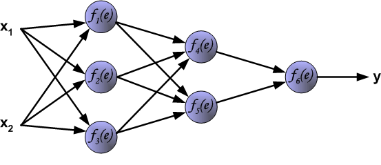{.fragment .absolute top=100 left=50 width="800" height="400" }

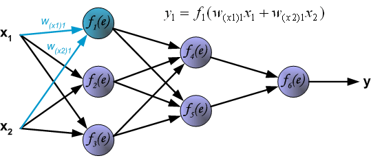{.fragment .absolute top=100 left=50 width="800" height="400" }

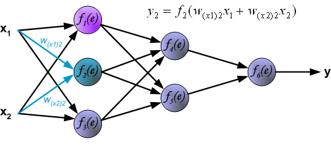{.fragment .absolute top=100 left=50 width="800" height="400" }

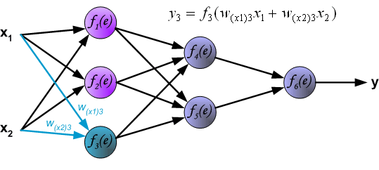{.fragment .absolute top=100 left=50 width="800" height="400" }

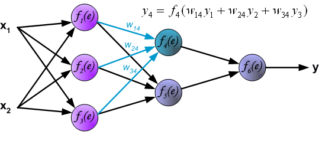{.fragment .absolute top=100 left=50 width="800" height="400" }

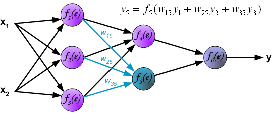{.fragment .absolute top=100 left=50 width="800" height="400"}

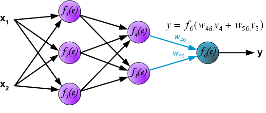{.fragment .absolute top=100 left=50 width="800" height="400" }

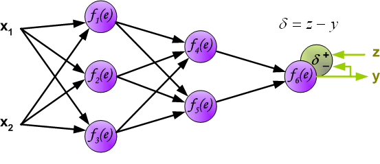{.fragment .absolute top=100 left=50 width="800" height="400" }
<!-- ::: -->


<!-- ## Backpropagation illustrated -->

<!-- {.fragment .absolute top=100 left=50 width="800" height="400"} -->

<!-- ::: {.r-stack} -->

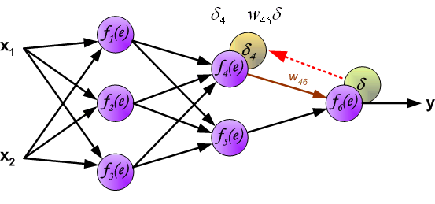{.fragment .absolute top=100 left=50 width="800" height="400"}

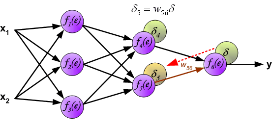{.fragment .absolute top=100 left=50 width="800" height="400"}

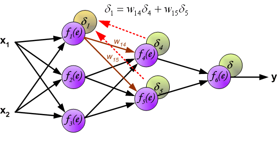{.fragment .absolute top=100 left=50 width="800" height="400"}

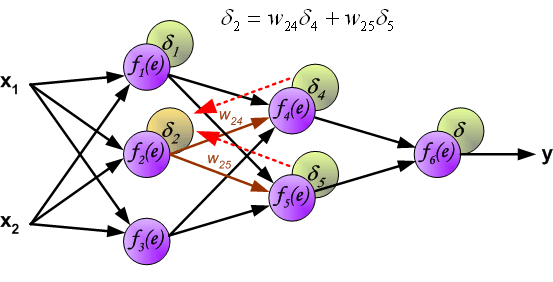{.fragment .absolute top=100 left=50 width="800" height="400"}

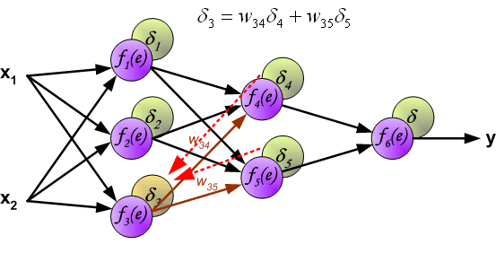{.fragment .absolute top=100 left=50 width="800" height="400"}

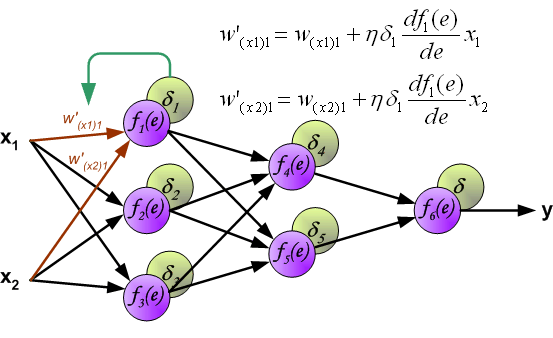{.fragment .absolute top=100 left=50 width="800" height="400"}

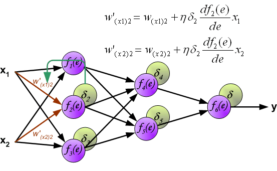{.fragment .absolute top=100 left=50 width="800" height="400"}

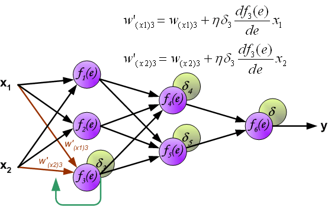{.fragment .absolute top=100 left=50 width="800" height="400"}

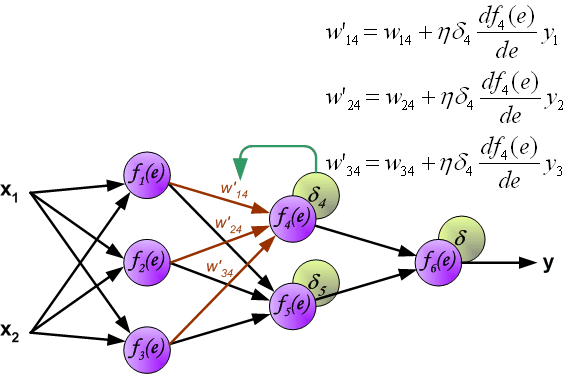{.fragment .absolute top=100 left=50 width="900" height="500"}

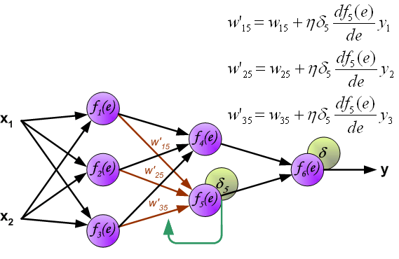{.fragment .absolute top=100 left=50 width="900" height="500"}

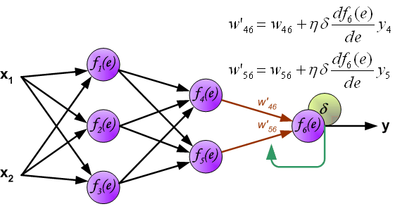{.fragment .absolute top=100 left=50 width="900" height="500"}

:::


# Improving the learning process

## Learning optimization

- The learning porocess such as it has been derived may be improved in different ways.
  
  - Predictions can be be bad and require improvement.
  - Computations may be inefficent or slow.
  - The network may overfit and lack generalizability.

- This can be partially soved applying distinct approaches.

## Network architechture

- Network performance is affected by many hyperparameters

  - Network topology
  - Number of layers
  - Number of neurons per layer
  - Activation function(s)
  - Weights initialization procedure
  - etc.
  

## Hyperparameter tuning

- Hyperparameters selection and tuning may be hard, due simply to dimensionality.
- Standard approaches to search for best parameters combinations are used.

```{r fig.align='center'}
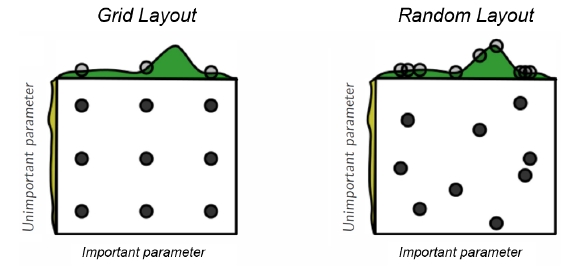
```

## How many (hidden) layers

- Traditionally considered that one layer may be enough

  - *Shallow Networks*
  
- Posterior research showed that adding more layers increases efficency
  - Number of neurons per layer decreases exponentially
- Although there is also risk of overfitting


## Epochs and iterations

- It has been shown that using the whole training set only once may not be enough for training an ANN.

- One iteration of the training set is known as an *epoch*.

- The number of epochs $N_E$, defines how many times we iterate along the whole training set.

- $N_E$ can be fixed, determined by cross-validation or left open and stop the training when it does not improve anymore.


## Iterations and batches

- A complementary strategy to increasing the number of epochs is decreasing the number of instances in each iteration.

- That is, the training set is broken in a number of *batches* that are trained separately.

  - Batch learning allows weights to be updated more frequently per epoch.
  
  - The advantage of batch learning is related to the gradient descent approach used.
  
## Training in batches

```{r out.width="150%", fig.align='center'}
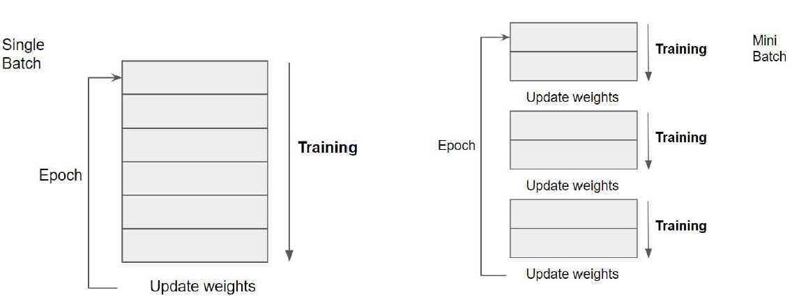
```


## Improving Gradient Descent {.smaller}

- Training deep neural networks involves **millions of parameters** and **large datasets**.
- **Computing the full gradient** in every iteration is computationally expensive because:
  - It requires **summing over all training points**.
  - The cost grows **linearly with dataset size**.
- For **large-scale machine learning**, standard gradient descent becomes impractical.
- To address this, we use **alternative optimization strategies**:
  - **Gradient Descent Variants**: Control how much data is used per update.
  - **Gradient Descent Optimizers**: Improve convergence and stability.
  
## Improving Gradient Descent

```{r}
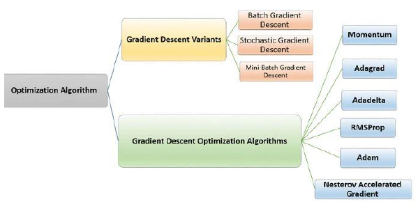
```

::: font80

[An overview of gradient descent optimization algorithms](https://arxiv.org/abs/1609.04747?ref=ruder.io)

:::

<!-- ## Stochastic Gradient {.smaller} -->

<!-- -   A much cheaper alternative is to replace the mean of the individual gradients over all training points *by the gradient at a single, randomly chosen, point*. -->

<!-- -   This leads to the simplest form of the *stochastic gradient method*: -->
<!--   -   Choose an integer $i$ uniformly at random from $\{1,...,n\}$ and update \begin{equation}\label{g4} -->
<!--     \theta_j=\theta_j-\eta\frac{\partial}{\partial\theta_j}J(\theta;x^{(i)}) -->
<!--     \end{equation} -->

<!-- -   $x^{(i)}$ incuded in the notation of $J(\theta;x^{(i)})$ to remark the dependence. -->

<!-- ## Rationale for SGD  {.smaller} -->

<!-- - At each step, the SGD method uses one randomly chosen training point to represent the full training set. -->
<!-- -   As the iteration proceeds, the method sees more training points. -->
<!-- -   So *there is some hope* that this dramatic reduction in cost-per-iteration will be worthwhile overall. -->
<!-- -   Note that, even for very small $\eta$, the update is not guaranteed to reduce the overall cost function because we traded the mean for a single sample. -->
<!--   -  Hence, although the phrase stochastic gradient descent is widely used, we prefer to use **stochastic gradient**. -->

<!-- ## Batch Gradient Descent -->

<!-- ::: font90 -->

<!-- - BGD, like GD, computes the error for each  example in the training dataset, *but the model is updated only after evaluating all examples*. -->

<!-- - As a **benefits** there is computational efficiency, which produces a stable error gradient and a stable convergence.  -->

<!-- - As **drawbacks**, the stable error gradient can sometimes result in a state of convergence that isn’t the best the model can achieve.  -->
<!--   - It also requires the entire training dataset to be in memory and available to the algorithm. -->

<!-- ::: -->

<!-- ## Mini-Batch GD -->

<!-- ::: font90 -->

<!-- - Mini-batch Gradient Descent (MBGD) divides the training dataset into small batches to compute error and update model coefficients. -->

<!-- - MBGD balances the robustness of stochastic gradient descent with the efficiency of batch gradient descent, making it a prevalent implementation in deep learning. -->

<!-- - A common batch size for MBGD is 32, although it can vary based on the specific problem and data. -->

<!-- ::: -->


## Gradient Descent Variants {.smaller}

- Define **how much data is used per update**.
- Control the **trade-off between computational cost and stability**.
- Three common approaches:
  - **Batch Gradient Descent**:
    - Computes the gradient using the **entire dataset**.
    - Stable but **slow for large datasets**.
  - **Stochastic Gradient Descent (SGD)**:
    - Computes the gradient using **a single training example**.
    - Faster updates but **high variance**, leading to noisy convergence.
  - **Mini-Batch Gradient Descent**:
    - Uses a **subset (mini-batch) of training data** per update.
    - Balances **speed and stability**.

## Gradient Descent Variants

```{r out.width="150%", fig.align='center'}
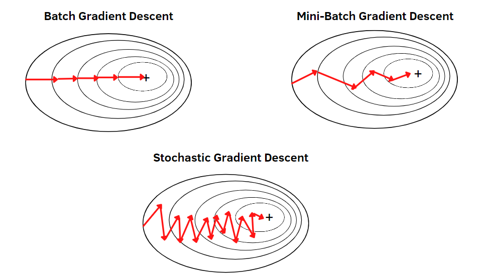
```
[Source: Gradient Descent and its Types](https://www.analyticsvidhya.com/blog/2022/07/gradient-descent-and-its-types/)

<!-- ## Alternative optimizers -->

<!-- - Gradient descent can be improved adopting different strategies -->

<!-- - Other optimizers exist that may make the training faster with strategies such as accumulating velocity in relevant directions or adjusting learning rates based on parameter frequency. -->

<!-- -  Overall these optimizers enable quicker convergence and better handling of various data characteristics, making them favorable choices over traditional gradient descent. -->

<!-- ## Momentum -->

<!--   - Accelerates SGD by accumulating momentum in relevant directions, akin to a rolling ball gaining speed downhill. -->
<!--   - Increases acceleration for dimensions with consistent gradients, reducing updates for changing gradients, leading to faster convergence and reduced oscillation. -->

<!-- ## Adagrad -->

<!--   - Adapts learning rate based on parameter frequency, making smaller updates for frequent features and larger updates for rare ones, suitable for sparse data. -->
<!--   - Efficient for handling sparse data due to its adaptive learning rates. -->

<!-- ## Adadelta -->

<!--   - An extension of Adagrad aiming to mitigate its aggressive, monotonically decreasing learning rate. -->
<!--   - Restricts accumulated past gradients to a fixed-size window, avoiding over-accumulation. -->

<!-- ## Adam -->

<!--   - Combines momentum optimization with adaptive learning rates, tracking both past gradients' exponential decay and a moving average of gradients. -->
<!--   - Recent studies suggest caution with adaptive optimization methods like Adam due to potential generalization issues, prompting exploration of alternatives such as Momentum optimization. -->

## Gradient Descent Optimizers {.smaller}

- Improve **learning dynamics** by modifying **how gradients are applied**.
- Help avoid **local minima, vanishing gradients, and slow convergence**.
- Common optimizers:
  - **Momentum**: Uses past gradients to accelerate convergence.
  - **Adagrad**: Adapts the learning rate per parameter.
  - **Adadelta & RMSProp**: Improve Adagrad by reducing aggressive decay.
  - **Adam**: Combines momentum and adaptive learning rates (widely used).
  - **Nesterov Accelerated Gradient**: Improves Momentum with lookahead updates.


## Optimizing Training Speed {.smaller}

- Training speed can be improved by adjusting key factors that influence convergence.

  - **Weight Initialization**: Properly initializing weights helps prevent vanishing or exploding gradients, leading to faster convergence.
  
  - **Adjusting Learning Rate**: A well-tuned learning rate accelerates training while avoiding instability or slow convergence.
  
  - **Using Efficient Cost Functions**: Choosing an appropriate loss function (e.g., cross-entropy for classification) speeds up gradient updates.

  
## Optimizing to Avoid Overfitting {.smaller}

- Overfitting occurs when a model learns noise instead of general patterns. Common strategies to prevent it include:

  - **L2 Regularization**: Penalizes large weights to reduce model complexity and improve generalization.

  - **Early Stopping**: Stops training when validation loss starts increasing, preventing unnecessary overfitting.

  - **Dropout**: Randomly disables neurons during training to make the model more robust.

  - **Data Augmentation**: Expands the training set by applying transformations (e.g., rotations, scaling) to improve generalization.


## Techniques to Improve Training 

::: font50

| Techniques                        | Performance Improvement | Learning Speed | Overfitting | Description |
|:---------------------------------:|:----------------------:|:-------------:|:----------:|:-----------------------------------------|
| Network Architecture              |          X           |       X       |      X     | Adjust layers, neurons andconnections|
| Epochs, Iterations, and Batch Size |                      |       X       |            | Controls updates per epoch to improve efficiency. |
| Softmax                           |          X           |               |            | Turns outputs into probabilities|
| Training Algorithms               |          X           |       X       |            | GD Improvements            |                      |       X       |            | Reduces vanishing/exploding gradient issues. |
| Learning Rate                     |          X           |       X       |            | Step size in gradient updates. |
| Cross-Entropy Loss       |                      |       X       |            | Optimized for classification|
| L2 Regularization                 |                      |       X       |      X     | Penalizes large weights to prevent overfitting. |
| Early Stopping                    |                      |       X       |            | Stops training when validation loss worsens. |
| Dropout                            |          X           |               |      X     | Randomly disables neurons to enhance generalization. |
| Data Augmentation                  |                      |               |      X     | Expands training data by applying transformations. |

:::

## Python ANN example

- Lab [Lab-C3.1-IrisANN-Modular](labs/Lab-C3.1b-IrisANN-Modular.html) contains a detailed example and a Python notebook on building a NN from scratch.

- Lab [Lab-C3.1-Dividend Prediction](labs/Lab-C3.2-DividendPrediction_ANN.html) shows how to use R to build and use a Neural network.


# References and Resources


