## Neural Networks

- ANNs may have distinct levels of *complexity*.

```{r echo=FALSE, fig.cap="Source: 'Deep Learning' course, by Andrew Ng in Coursera & deeplearning.ai"}
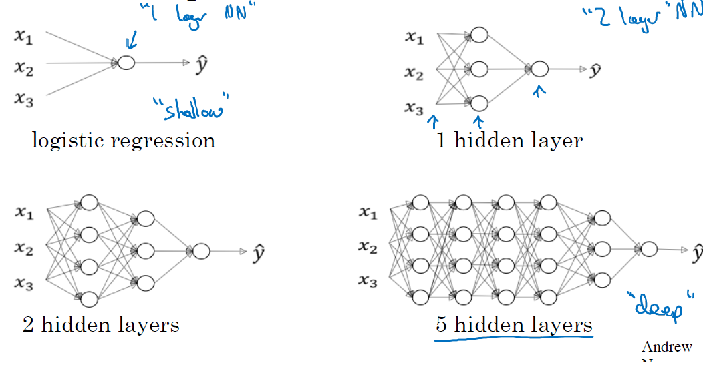
```

::: {.notes}
Show several ANNs, from a logistic regression (perceptron), to 1, 2 and 5 multilayer NNs
:::

## Shallow NNs limitations

::: font80

- Shallow Networks are successful at solving many problems

- But they are not free from limitations:

  - Limited ability to model complex patterns.
  
  - Struggle to capture non-linear relationships
  
  - Limited expressiveness for tasks like image recognition and natural language processing.
  
  - Prone to overfiting with small datasets
  
  - Inability to learn hierarchichal features

:::


## From ANN to Deep learning

{fig-align="center" width="100%"} 

:::{.font90}
Source: [Alex Amini's MIT Introduction to Deep Learning' course](introtodeeplearning.com)
:::

::: {.notes}
3 changes that impulsed the rise of Deep Learning: 1.Big Data, 2-GPUs (Hardware) 3-Software (Optimizers, TensorFlow, ...)
:::

## From Shallow to Deep NNs

::: font80

- "Deep Neural networks" are NNs with several hidden layers.

- Real shift from Shallow to DNNs did not (only) come arrive from noticing that newtorks with more layers were able to perform better, in spite of their huge number of parameters.

- It mainly arrived by realizing that

  - While some tasks, such as digit recognition, could be solved decently well using a "brute force" approach,

  - Other, more complex, such as distinguishing a human face in an image, are hard to solve witht that "brute" force approach.
  
  - But can be solved using Deep Neural Networks

:::

## Structured-Unstructured data

- Problems that can be better solved using DNNs are often associated with non-structured data.

```{r echo=FALSE, fig.cap="'Source: Generative Deep Learning. David Foster (Fig. 2.1)'"}
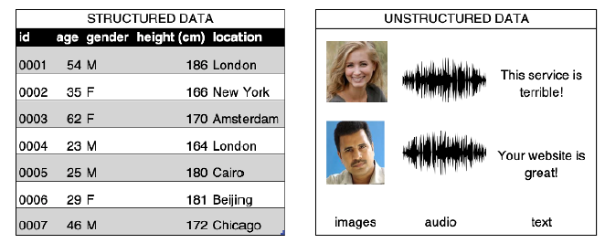
```

::: {.notes}
Shows Tabular Data vs Images/Sound/Video as non structured
:::


## Images are unstructured data

*Task: Distinguish human from non-human in an image*

```{r echo=FALSE, fig.cap="Source: 'Neural Networkls and Deep Learning' course, by Michael Nielsen" }
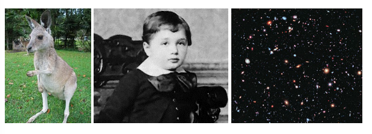
```

::: {.notes}
Shows three image, a kanguro, a child a starry sky
:::

## Example: Face recognition

- Can be attacked similarly to the digit identification, 

- Cost of training would be *much higher*.

- Alternatively: try to solve the problem *hierarchically*.

  - We start by *trying to find edges* in the figure
  - In the parts with edges *look around* to find face pieces, a nose, an eye, an eyebrow ...
  - As pieces are located, look for their *optimal combination*.

## A hierarchy of complexity

```{r echo=FALSE, fig.cap="Source: 'Deep Learning' course, by Andrew Ng in Coursera & deeplearning.ai"}
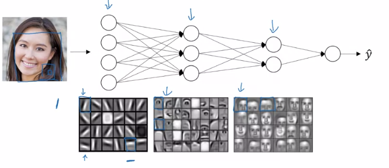
```

::: {.notes}
A hierarchy of image fragments to approach image recognition: (1) We start by *trying to find edges* in the figure (2) In the parts with edges *look around* to find face pieces, a nose, an eye, an eyebrow etc. (3) As pices are located, look for their *optimal combination* in faces.
:::

## A hierarchy of complexity 

- Each layer has a more complex task, but it receives better information.

  - If we can solve the sub-problems using ANNs, 

  - We may be able *to combine those NNs into a bigger network* to solve the problem, here face-detection. 


## Deep Neural Networks

- Neural Networks with such structure are called *Deep Neural Networks* and are characterized by 
  - *building progressively*, from simple to complex structures, 
  - *learning increasingly abstract representations at each layer* and 
  - *capturing higher-level concepts beyond individual features*.


::: {.notes}
- If we are able to break the questions down, further and further through multiple layers we end-up working with sub-networks that answer questions so simple they can easily be answered at the level of single pixels.

- This is done through a series of many layers, with early layers answering very simple and specific questions about the input, and later layers building up a hierarchy of ever more complex and abstract concepts.
:::

## Automatic tuning 

::: font80

- The success of Deep Neural Networks (DNNs) is largely due to their *ability to automatically learn and adjust the complex hierarchy of representations*, without requiring handcrafted feature extraction or manual tuning of weights and biases.

-  Shift from manual feature engineering to automatic tuning enabled by new or improved techniques such as:

    - **Stochastic Gradient Descent (SGD) and Backpropagation**: Allow learning optimal parameters through iterative updates.
    
    - **Better Weight Initialization** (e.g., 
   *Xavier/He initialization*): Improve convergence and training stability.
   
    - **Regularization techniques** (*Dropout, Batch Normalization, L2 penalties*): Prevent overfitting and stabilized learning.

:::


::: {.notes}

(2) Explicación de "Handcrafted Features" vs. "Automatic Tuning"
En los modelos tradicionales de Machine Learning, el éxito dependía en gran medida del diseño manual de características relevantes (features). Este proceso, conocido como Feature Engineering, requería expertos en el dominio del problema que diseñaban y seleccionaban manualmente qué información del conjunto de datos debía ser usada.

Ejemplos:

En visión por computador, antes de Deep Learning, se usaban métodos como SIFT (Scale-Invariant Feature Transform) o HOG (Histogram of Oriented Gradients) para detectar bordes y texturas en imágenes antes de pasarlas a un clasificador como SVM o Random Forest.
En procesamiento de lenguaje natural (NLP), se usaban métodos como TF-IDF o Bag of Words, donde se contaban palabras en un texto sin capturar relaciones sintácticas complejas.
Con el Deep Learning:

En lugar de diseñar manualmente estas características, las redes neuronales profundas aprenden a extraer automáticamente patrones jerárquicos de los datos mediante su arquitectura en capas.
En visión por computador, redes convolucionales (CNNs) aprenden automáticamente desde bordes simples hasta estructuras de alto nivel como caras o objetos enteros.
En NLP, Word Embeddings y Transformers han reemplazado los métodos tradicionales, permitiendo que los modelos aprendan el significado de palabras y frases en contexto.
:::

## Shallow vs Deep NNs

```{r echo=FALSE, fig.cap="Source: 'Deep Learning' course, by Andrew Ng in Coursera & deeplearning.ai"}
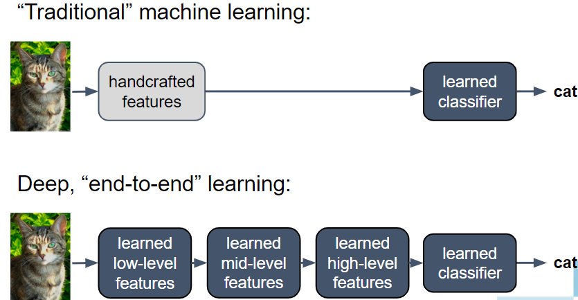
```

::: {.notes}
The image depicts two figures:
- Above (Traditional ML): A cat image -> Handcrafted features --> Learned Classifier--> "Cat"
- Below (Deep End-to-End Learning): A cat image -> Learned low-level features --> 
Learned mid-level features -->
Learned high-level features -->Learned Classifier--> "Cat"
:::

## Deep Learning Architectures

::: font80

The hierarchical approach to solve complex problems -especially with unstructured data- leads to the development of diverse deep learning architectures, each designed to tackle specific challenges.  

- **Convolutional Neural Networks (CNNs)** for image and spatial data processing.  
- **Recurrent Neural Networks (RNNs) & Transformers** for sequential data: time series, natural language processing.  
- **Autoencoders & Variational Autoencoders (VAEs)**: for unsupervised learning, anomaly detection, and data compression.  
- **Generative Adversarial Networks (GANs)** For generating realistic synthetic data including: images, text, and audio.  
- **Graph Neural Networks (GNNs)**: to process relational and structured data, such as social networks and molecular structures.  

:::

## Convolutional Neural Networks

- CNNs are specialized for processing grid-like data, such as images.

- They use convolutional layers to detect spatial hierarchies in data.

- Primary use: **Computer vision** (image classification, object detection, segmentation, etc.).


## CNNs Architecture

<br>


_Source: Wikipedia_

## CNN Models & Applications

- **Models:** LeNet-5, AlexNet, VGG, ResNet, EfficientNet.

- **Applications:**

  - Medical image analysis (tumor detection, X-ray analysis).

  - Facial recognition.

  - Autonomous vehicles (object detection & tracking).

  - Real-time video processing.


## Recurrent NNs (RNNs)

- RNNs contain a hidden state, which allows them to retain information from previous time steps.

- RNNs are able to handle *sequential data* by incorporating information from previous inputs. 

- RNNs are effective in capturing short-term dependencies in sequences.

- Long term dependencies aren't managed weel due to vanishing gradient problem.

<!-- - Vanishing gradient problem, where the influence of earlier inputs diminishes exponentially as the sequence progresses, makes it difficult to capture long-term dependencies. -->


## RNN Architectures

<br>

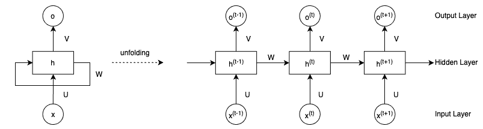

_Source: [From RNNs to Transformers](https://www.baeldung.com/cs/rnns-transformers-nlp)_

## Models & Applications

- **Models:** Vanilla RNNs, Elman Networks, Jordan Networks.

- **Applications:**
  
  - Speech recognition.
  
  - Handwriting recognition.
  
  - Predictive maintenance in industrial applications.
  
  - Time series forecasting (financial data, weather prediction).


## Long Short-Term Memory (LSTM)

- LSTM Networks improve over traditional RNNs by solving the **vanishing gradient problem**.

- They introduce memory cells that selectively retain important information over long sequences.

- Primary use: **Long-term dependency learning in sequential data.**


## LSTM Architecture

<br>

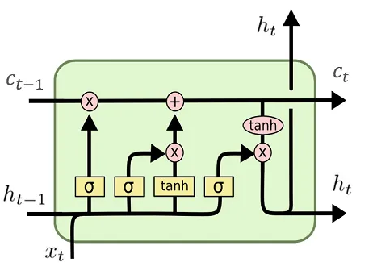
_Source: [From RNNs to Transformers](https://www.baeldung.com/cs/rnns-transformers-nlp)_

## LSTM Models & Applications

- **Models:** Vanilla LSTMs, Bidirectional LSTMs, Attention-based LSTMs.

- **Applications:**

  - Machine translation.
  - Speech synthesis.
  - Music generation.
  - Sentiment analysis.

## Transformers

- Transformers revolutionized deep learning by replacing sequential processing with **self-attention mechanisms**.

- Self-attention allows the model to weigh the importance of different input tokens when making predictions.

- It can capture long-range dependencies without the need for sequential processing. 

- Primary use: **Natural Language Processing (NLP) & Large-scale sequence modeling.**


## Transformer Architecture

:::: {.columns}

::: {.column width='50%'}

```{r, out.width="100%", fig.align='center'}
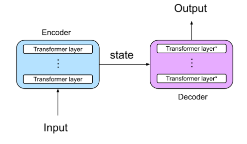
```

:::

::: {.column width='50%'}

```{r, out.width="75%", fig.align='center'}
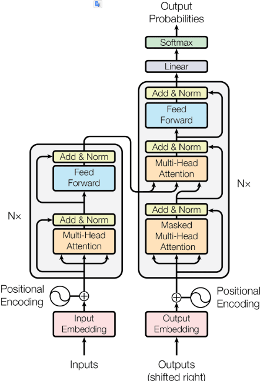
```

:::

::::

## Models & Applications

- **Models:** BERT, GPT, T5, Transformer-XL.
- **Applications:**
  - Chatbots (ChatGPT, Bard, Bing AI).
  - Automated text summarization.
  - Machine translation (Google Translate, DeepL).
  - Code generation and AI-assisted programming.

## Autoencoders & Variational AEs

::: font80

- Autoencoders learn to **compress and reconstruct** data by reducing input dimensionality and mapping it to a **latent vector** that represents essential features.

- VAEs introduce **probabilistic modeling**, generating latent representations that allow for controlled data synthesis.

  - Unlike traditional autoencoders, VAEs do not map data to a fixed latent vector but  to a **probability distribution**
  
  - This enables smoother interpolations and diverse outputs.

- Primary use: **Dimensionality reduction, anomaly detection, and generative modeling.**

  - VAEs particularly useful in generative tasks, such as creating synthetic images or text.

:::

## Autoencoder & VAE Architectures

<br>

:::: {.columns}

::: {.column width='50%'}

```{r, out.width="100%", fig.align='center'}
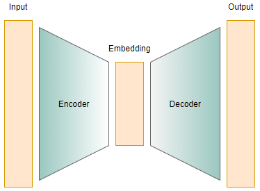
```

:::

::: {.column width='50%'}

```{r, out.width="100%", fig.align='center'}
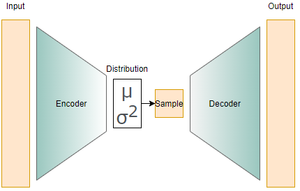
```

:::

::::

_Source: [AE & VE](http://individual.utoronto.ca/xhuang/blog/ae_vae/ae_vae.html)_


## Models & Applications

- **Models:** Denoising Autoencoders, Variational Autoencoders (VAEs).

- **Applications:**
  - Anomaly detection (fraud detection, industrial defect detection).

  - Image denoising and inpainting.

  - Feature extraction and dimensionality reduction.

  - Generating synthetic data.


## Generative Adversarial Networks

- GANs consist of two networks: a generator and a discriminator.

- The generator tries to create realistic data, while the discriminator evaluates authenticity.

- Primary use: **Data generation (images, videos, text, and music).**

## GAN Architecture

<br>

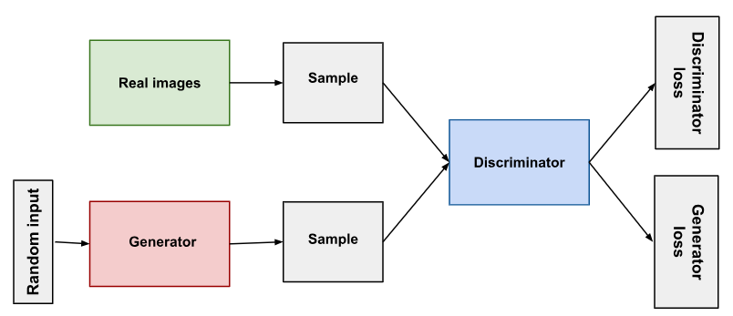

::: font80

_Source: [Overview of GAN Structure (Google ML Course)](https://developers.google.com/machine-learning/gan/gan_structure)_

:::

## GAN Models & Applications

- **Models:** DCGAN, CycleGAN, StyleGAN, BigGAN.

- **Applications:**

  - Deepfake generation.

  - Super-resolution (enhancing image quality).

  - Data augmentation for training AI models.

  - Synthetic image and text generation.


# A short mathematical digression: *Tensors*

## Tensors {.smaller}

- Deep learning is filled with the word "tensor",

- What are Tensors any way?

  - R users: familiar with  vectors (1-d arrays) and matrices (2-d arrays). 
  - Tensors extend this concept to higher dimensions.
  - Can be seen as multi-dimensional arrays that generalize matrices. 
  
- See the Wikipedia for a [nice article on tensors](https://en.wikipedia.org/wiki/Tensor)


## Why tensors?

- Working with tensors has many benefits:

  - **Generalization**: Tensors generalize vectors and matrices to an arbitary number of dimensions,
  - **Flexibility**: can hold a wide range of data types.
  - **Speed**: Use of tensors facilitates fast, parallel processing computations.
  
## One and two dimensional tensors

:::: {.columns}

::: {.column width='50%'}

Vectors:rank-1 tensors.

<br>

```{r, out.width="100%"}

```

:::

::: {.column width='50%'}

Matrices: rank-2 tensors.

<br>

```{r, out.width="100%"}
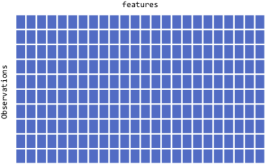
```

:::

::::

## Rank three tensors{.smaller}

:::: {.columns}

::: {.column width='50%'}

- Arrays in layers.

- Typic use: Sequence data
  - time series, text
  - dim = (observations, seq steps, features)

Examples

:::{.font90}
  - 250 days of high, low, and current stock price for 390 minutes of trading in a day; 
    - dim = c(250, 390, 3)
  - 1M tweets that can be 140 characters long and include 128 unique characters; 
    - dim = c(1M, 140, 128)

:::

:::

::: {.column width='50%'}

<br>

```{r, out.width="100%"}
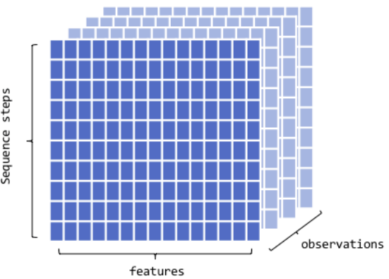
```

:::

::::


## Rank four tensors{.smaller}

:::: {.columns}

::: {.column width='50%'}
- Layers of groups of arrays

- Typic use: Image data

  - RGB channels
  - dim = (observations, height, width, color_depth)
  - MNIST data could be seen as a 4D tensor where color_depth = 1


:::

::: {.column width='50%'}

```{r, out.width="100%"}
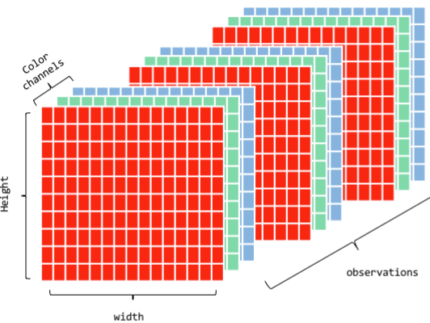
```

:::

::::


## Rank five tensors {.smaller}

:::: {.columns}

::: {.column width='50%'}

- Typic use: Video data

  - samples: 4 (each video is 1 minute long)
  - frames: 240 (4 frames/second)
  - width: 256 (pixels)
  - height: 144 (pixels)
  - channels: 3 (red, green, blue)

- Tensor shape (4, 240, 256, 144, 3)

:::

::: {.column width='50%'}

```{r, out.width="100%"}
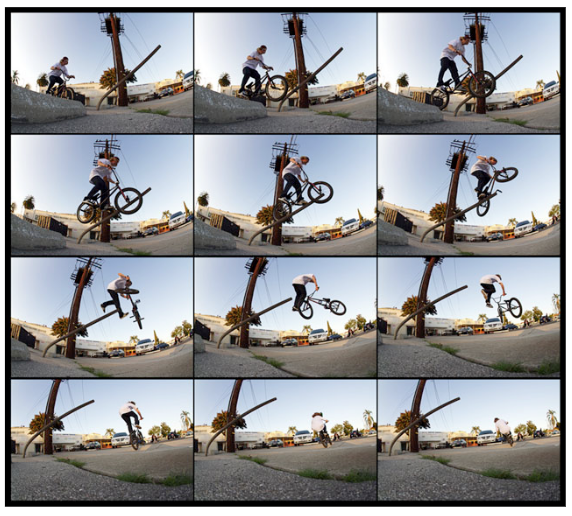
```

:::

::::

## One can always *reshape*

- Each DNN model has a given architecture which usually requires 2D/3D tensors.

- If data is not in the expected form it can be *reshaped*.

```{r}
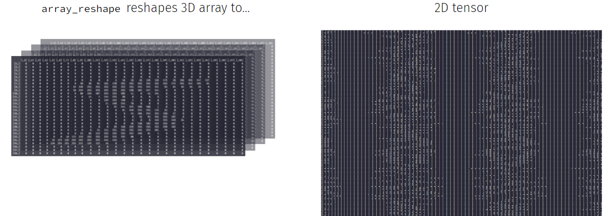
```

See [Deep learning with R](https://livebook.manning.com/book/deep-learning-with-r-second-edition) for more.


# Deep Learning Software

## Which programs for DL?

1. [TensorFlow](https://www.tensorflow.org/)
2. [PyTorch](https://pytorch.org/)
3. [Keras](https://keras.io/)
4. [MXNet](https://mxnet.apache.org/)
5. [Caffe](https://caffe.berkeleyvision.org/)
6. [Theano](https://github.com/Theano/Theano)
7. [Microsoft Cognitive Toolkit (CNTK)](https://docs.microsoft.com/en-us/cognitive-toolkit/)

## [TensorFlow](https://www.tensorflow.org/)

:::: {.columns}

::: {.column width='60%'}

- Open-source DL framework developed by Google. 
- Flexible model development
- Optimized for distributed computing and performance
- High level APIS like Keras, in Python and R.

:::

::: {.column width='40%'}

```{r, out.width="100%"}
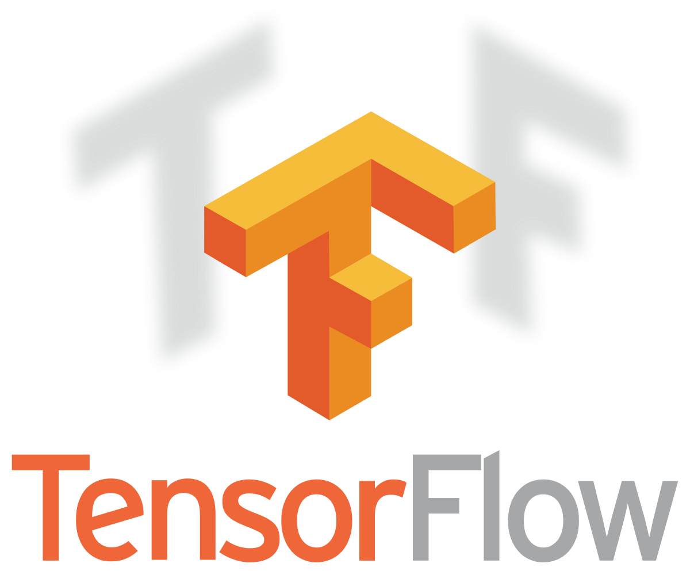
```

:::

::::

## [PyTorch](https://pytorch.org/)

:::: {.columns}

::: {.column width='60%'}

- Open-source DL framework developed by facebook.
- User-friendly interface and dynamic computational graph features with intuitive debugging and experimentation. 
- Highly integrated with Numpy

:::

::: {.column width='40%'}

```{r, out.width="100%"}

```

:::

::::

## [Keras](https://keras.io/)

:::: {.columns}

::: {.column width='60%'}

- High-level neural networks API 
running on top of TensorFlow, CNTK, or Theano,
- Emphasizes simplicity and ease of use.
- AVailable in Python and R

:::

::: {.column width='40%'}

```{r, out.width="100%"}

```

:::

::::


## The Keras pipeline

- Training and using a model in keras is intended to be done through the usual steps of a ML worfflow


```{r}
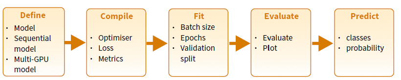
```

<!-- ## Example 1 - A Simple NN -->

<!-- :::: {.columns} -->

<!-- ::: {.column width='55%'} -->

<!-- ```{r, fig.align='center', out.width="100%"} -->
<!-- 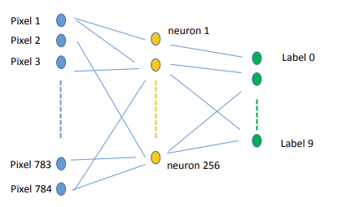 -->
<!-- ``` -->

<!-- ::: -->

<!-- ::: {.column width='45%'} -->

<!-- ```{r, fig.align='center', out.width="80%"} -->
<!-- 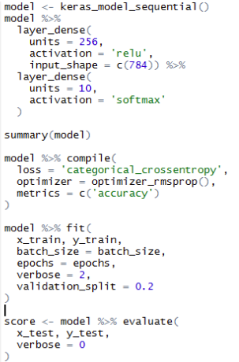 -->
<!-- ``` -->

<!-- ::: -->

<!-- :::: -->

## A keras cheat sheet

```{r, fig.align='left', out.width="100%"}
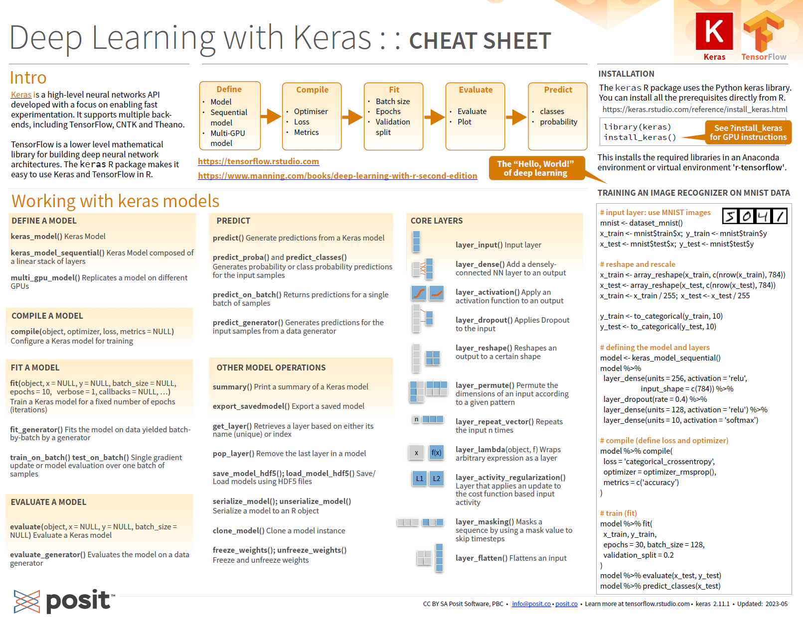
```
[Available at rstudio github repo](https://github.com/rstudio/cheatsheets/blob/main/keras.pdf)


# References and Resources

## Resources (1) {.smaller}

### Courses

- [An introduction to Deep Learning. Alex Amini. MIT](http://introtodeeplearning.com/)
- [Coursera: Deep Learning Specialization. Andrew Ng](https://www.coursera.org/specializations/deep-learning)

### Books

- [Neural networks and Deep Learning](http://neuralnetworksanddeeplearning.com/)
- [Deep learning with R, 2nd edition. F. Chollet](https://livebook.manning.com/book/deep-learning-with-r-second-edition)

## Resources (2) {.smaller}

### Workshops

- [Deep learning with R *Summer course*](https://bios691-deep-learning-r.netlify.app/)
- [Deep learning with keras and Tensorflow in R (Rstudio conf. 2020)](https://github.com/rstudio-conf-2020/dl-keras-tf)


### Documents

- [Introduction to Convolutional Neural Networks (CNN)](https://www.analyticsvidhya.com/blog/2021/05/convolutional-neural-networks-cnn/)
- [Convolutional Neural Networks in R](https://www.r-bloggers.com/2018/07/convolutional-neural-networks-in-r/)


