## Outline

- Computer Vision and Deep Learning

- Convolutions and Feature Selection

- Convolutional Neural Networks

- A toy example

# I. Computer vision and Deep Learning

## We want computers that can *see*  {.smaller}

Goal: Computer systems able to see what is present in the world, **but also** to predict and anticipate events.

```{r, echo=FALSE, fig.align='center', out.width="100%",fig.cap="source: MIT Course, http://introtodeeplearning.com/, L3 "}
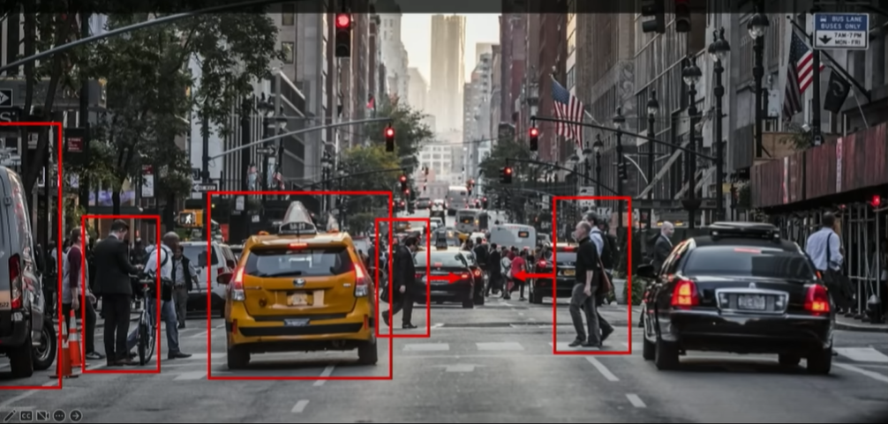
```

## DNN in computer vision systems  {.smaller}

Deep Learning enables many systems to undertake a variety of computer vision related tasks.

```{r, echo=FALSE, fig.align='center', out.width="100%",fig.cap="source: MIT Course, http://introtodeeplearning.com/, L3 "}
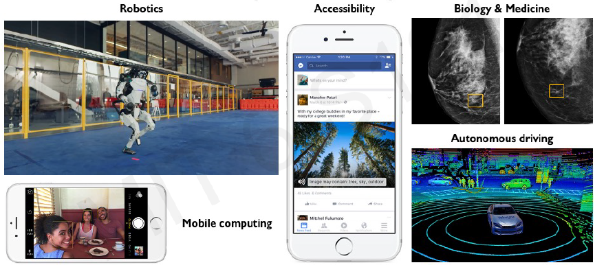
```

## Facial detection and recognition {.smaller}

In particular it enables *automatic* feature extraction.

```{r, echo=FALSE, fig.align='center', out.width="100%",fig.cap="source: MIT Course, http://introtodeeplearning.com/, L3 "}
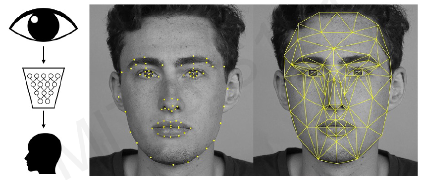
```

## Autonomous driving {.smaller}

Autonomus Driving would not be possible without the possibility of performing Automatic Feature Extraction


```{r, echo=FALSE, fig.align='center', out.width="100%",fig.cap="source: MIT Course, http://introtodeeplearning.com/, L3 "}
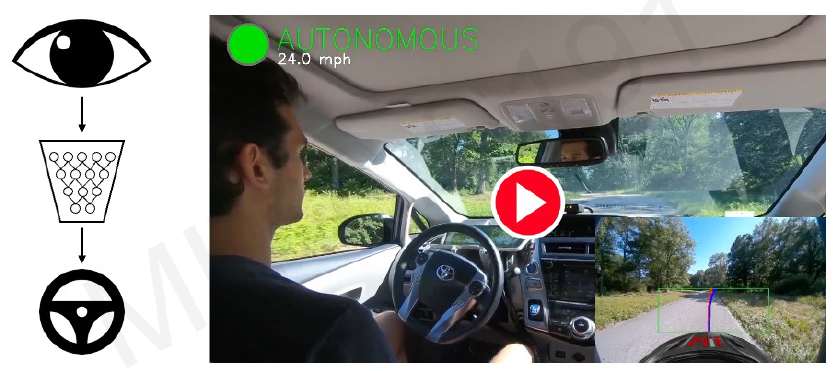
```

## Medicine, biology, self care  {.smaller}

Neither would systems for automatic disease detection be able to distinguish healthy from affected people though images.

```{r, echo=FALSE, fig.align='center', out.width="100%",fig.cap="source: MIT Course, http://introtodeeplearning.com/, L3 "}
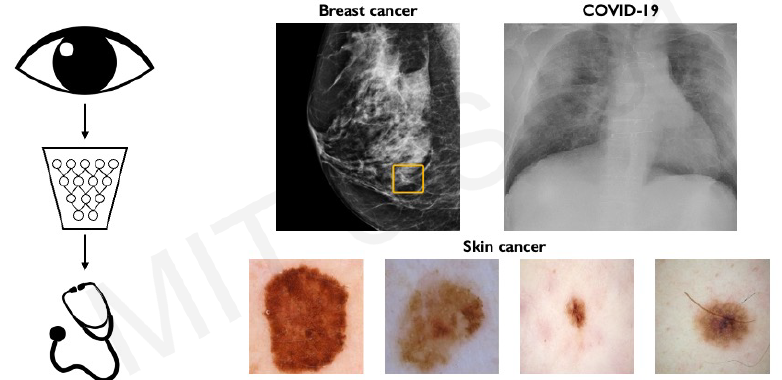
```

## Main tasks in Computer Vision:

- **Regression**: Output variable takes continuous value. E.g. *Distance to target*
- **Classification**: Output variable takes class labels. E.g. *Probability of belonging to a class*

```{r, echo=FALSE, fig.align='center', out.width="100%",fig.cap="source: MIT Course, http://introtodeeplearning.com/, L3 "}
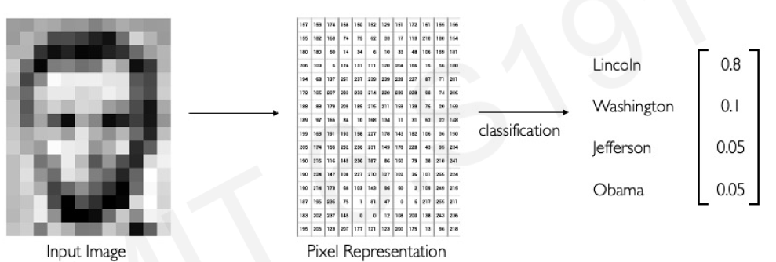
```

# II. Convolutions and Feature Selection

## What (how) do computers see?

- To a computer images, of course, are numbers.

- A greyscale image is a N x M array of numbers.


```{r, echo=FALSE, fig.align='center', out.width="100%",fig.cap="source: MIT Course, http://introtodeeplearning.com/, L3 "}
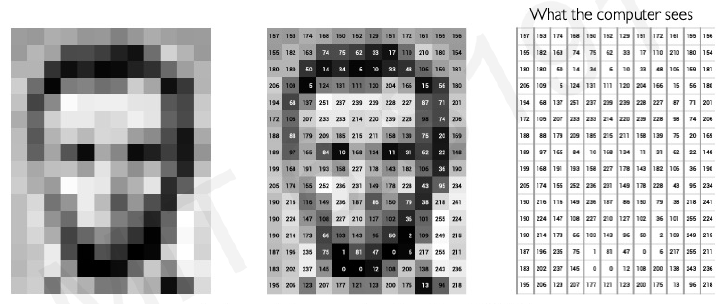
```

## What (how) do computers see?

- An RGB (for Red, Green, Blue) color image is an N x M x 3 array of numbers


```{r, echo=FALSE, fig.align='center', out.width="100%",fig.cap="source:  Bhupendra Pratap Singh"}
knitr::include_graphics("images/RGBimage.png")
```


## High level feature detection {.smaller}

- Each image is characterized by a different set of features.

- Before attempting to build a computer vision system, we need to be aware of *what feature keys are in our data that need to be __identified__ and __detected__*.


```{r, echo=FALSE, fig.align='center', out.width="100%",fig.cap="source: MIT Course, http://introtodeeplearning.com/, L3 "}
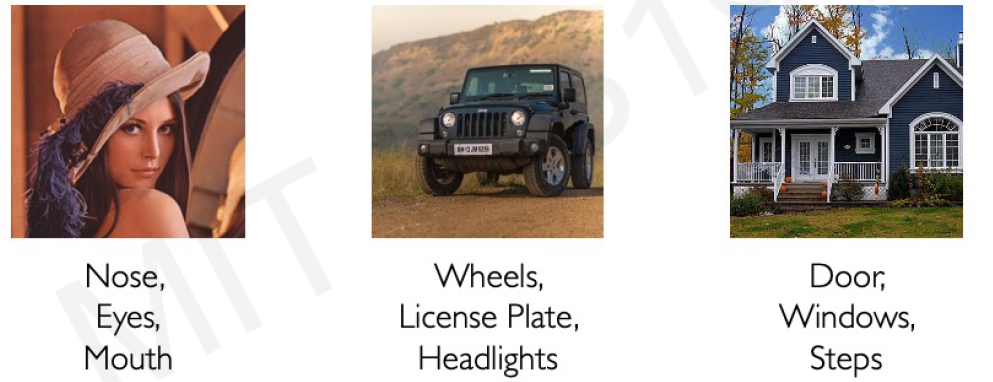
```


## How to do feature extraction {.smaller}

- Manual feature extraction is hard!

- Feature characterization needs to define a hierarchy of features allowing an increasing level of detail.

- Deep Neural networks can do this automatically!

```{r, echo=FALSE, fig.align='center', out.width="100%",fig.cap="source: MIT Course, http://introtodeeplearning.com/, L3 "}
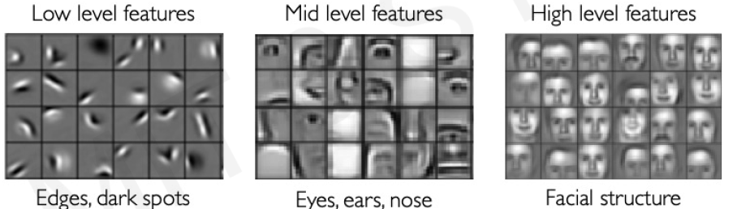
```


## Feature extraction with dense NN

- Fully connected NN could, in principle, be used to learn visual features

```{r, echo=FALSE, fig.align='center', out.width="100%",fig.cap="source: MIT Course, http://introtodeeplearning.com/, L3 "}
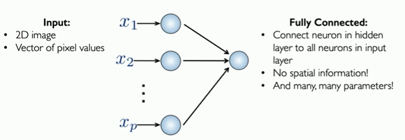
```

## Accounting for spatial structure {.smaller}

- Images have a **spatial structure**.
- How can this be used to inform the architecture of the Network?

```{r, echo=FALSE, fig.align='center', out.width="100%",fig.cap="source: MIT Course, http://introtodeeplearning.com/, L3 "}
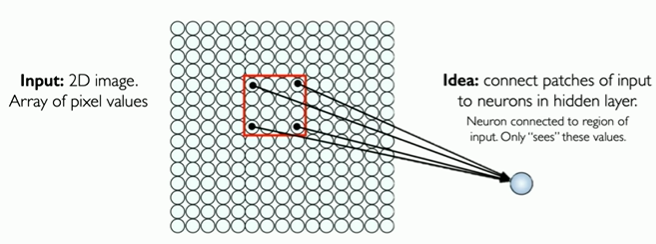
```

## Extending the idea with *patches*

```{r, echo=FALSE, fig.align='center', out.width="100%",fig.cap="source: MIT Course, http://introtodeeplearning.com/, L3 "}
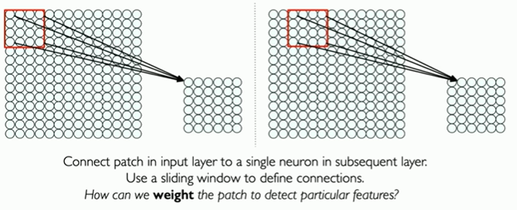
```

## Use filters to extract features

- Filters can be used to extract *local* features
  - A filter is a set of weights

- Different filters can extract different characteristics.
  
  - Combining the filters is an efficient way to caracterize an image.

- Filters that matter in one part of the input should matter elsewhere so:
  - Parameters of each filter are *spatially shared*.
  
## A filter for each pattern?

:::{.font90}
- By applying different filters, i.e. changing the weights,
- We can achieve completely different results
:::

```{r  , fig.align ='center', out.width="100%"}
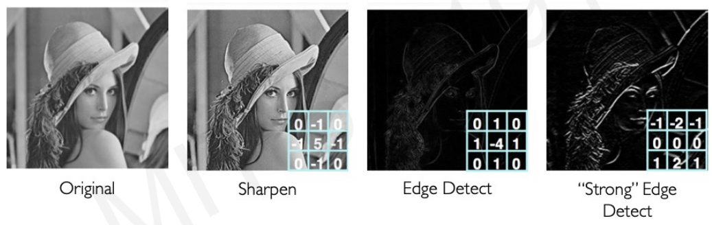
```

- In practice filters are combined to completely characterize the images.

<!-- ## Shifting filters for Extraction -->

<!-- :::: {.columns} -->

<!-- ::: {.column width='50%'} -->
<!-- ```{r, echo=FALSE, fig.align='center', out.width="100%",fig.cap="source: MIT Course, http://introtodeeplearning.com/, L3 "} -->
<!-- 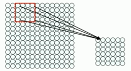 -->
<!-- ``` -->
<!-- ::: -->

<!-- ::: {.column width='50%'} -->
<!-- :::{.font80} -->
<!-- - A 4x4: 16 distinct weights filter is applied to *define the state of the neuron* in the next layer. -->
<!-- - Same filter applied to 4x4 patches in input -->
<!-- - Shift by 2 pixels for next patch. -->
<!-- ::: -->

<!-- ::: -->

<!-- :::: -->

## Example: "X or X"?


```{r, echo=FALSE, fig.align='center', out.width="100%",fig.cap="source: MIT Course, http://introtodeeplearning.com/, L3 "}
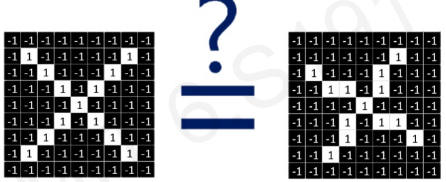
```

- Images are represented by matrices of pixels, so
- Literally speaking these images are different.

## What are the *features* of X

:::{.font90}
- Look for a set of features that:
  - characterize the images, and
  - and are the same in both cases.
:::

```{r, echo=FALSE, fig.align='center', out.width="100%",fig.cap="source: MIT Course, http://introtodeeplearning.com/, L3 "}
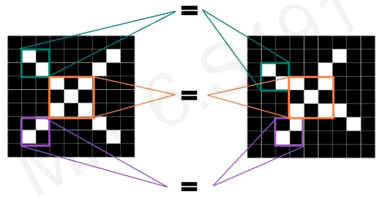
```

## Filters can detect X features

```{r, echo=FALSE, fig.align='center', out.width="100%",fig.cap="source: MIT Course, http://introtodeeplearning.com/, L3 "}
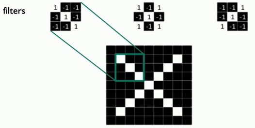
```

## Is a given pattern in the image?

- Imagine we want to check if a (small) pattern is contained in an (larger) image.

- A slow option is to do a pixel to pixel comparison.

- A better option is to scan the image using an operation known as *convolution* of the image and the pattern (here called *patch*, *filter* or *kernel*).

- It is faster and allows detecting how well the patch matches different regions in the image.


## The Convolution Operation

::: font80

- Given an input image $I$ and a filter (kernel) $K$, the **convolution operation** is defined as:

  $$ (I * K)(i,j) = \sum_m \sum_n I(i-m, j-n) K(m,n) $$

- Here:
  - $I(i,j)$ represents the pixel value at position $(i,j)$ in the image.
  - $K(m,n)$ represents the kernel values.
  - The summation runs over the dimensions of the kernel.
  - The result $(I * K)(i,j)$ gives a new pixel value after applying the filter at that location.

:::


## The Convolution Operation

```{r, echo=FALSE, fig.align='center', out.width="100%",fig.cap="source: MIT Course, http://introtodeeplearning.com/, L3 "}
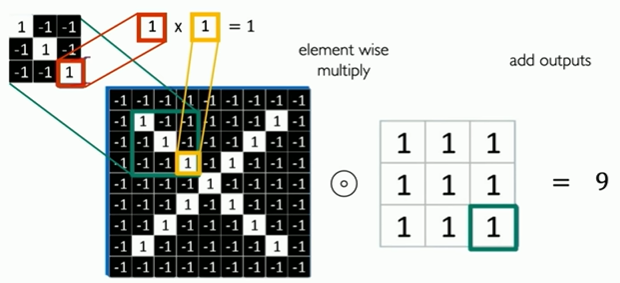
```

::: {.notes}
- Convolution *matches* the patch and the image by elementwise multiplication, followed by a sum.
- Given the filters used (+1/-1) if there is absolute coincidence, as in the example, all multiplications will yield 1, and the sum will be 9.
- Two completely different patches would add -9.
:::

## Visualizing Convolution

::: font80

- Consider a **3×3 kernel** applied to a 5x5 image:

  $$
  I = \begin{bmatrix} x_{11} & x_{12} & \dots & x_{15} \\ 
  x_{21} & x_{22} & \dots & x_{25} \\
  \dots & \dots & \dots & \dots \\
  x_{51} & x_{52} & \dots & x_{55} \end{bmatrix}, \quad K = \begin{bmatrix} 1 & 0 & 0 \\ 0 & 1 & 0 \\ 1 & 0 & 1 \end{bmatrix}
  $$

- The kernel slides across the image, performing the weighted sum:
  - Multiply corresponding elements.
  - Sum the results.
  - Store in a new matrix (feature map).

:::

## Visualizing Convolution

- Suppose we want to compute the convolution of a 5x5 image and a 3x3 filter.

```{r, echo=FALSE, fig.align='center', out.width="100%",fig.cap="source: MIT Course, http://introtodeeplearning.com/, L3 "}
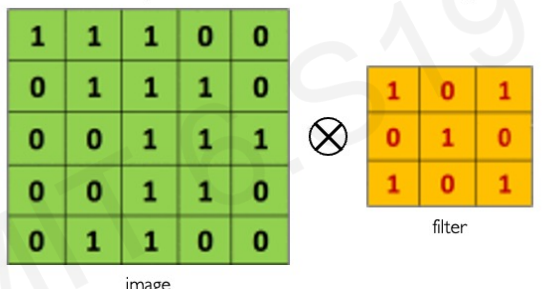
```

<!-- - We will slide the 3x3 filter over the input image, elementwise multiply and add the outputs -->

## The Convolution Operation 

:::{.font70}
(i) Slide the 3x3 filter over the input image,
(ii) Elementwise multiply and
(iii) Add the outputs
:::

```{r, echo=FALSE, fig.align='center', out.width="100%",fig.cap="source: MIT Course, http://introtodeeplearning.com/, L3 "}

```

## The Convolution Operation

::: {.r-stack}
::: {.fragment .fade-in-then-out}
```{r , fig.align ='center',   out.width="100%"}
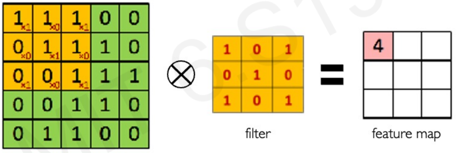
```
:::
::: {.fragment .fade-in-then-out}
```{r  , fig.align ='center', out.width="100%"}
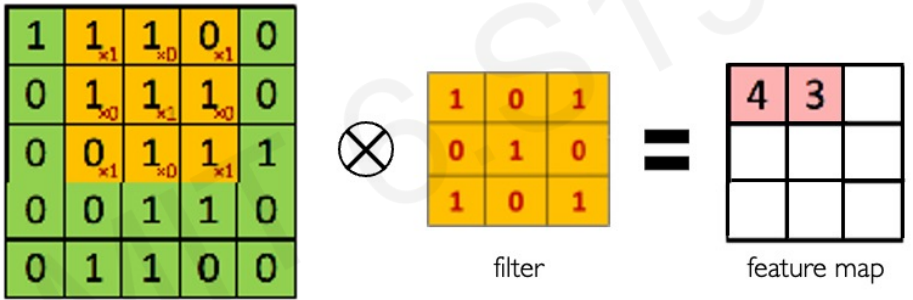
```
:::
::: {.fragment .fade-in-then-out}
```{r  , fig.align ='center', out.width="100%"}
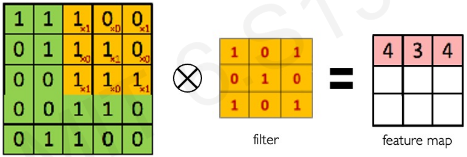
```
:::

::: {.fragment .fade-in-then-out}
```{r  , fig.align ='center', out.width="100%"}
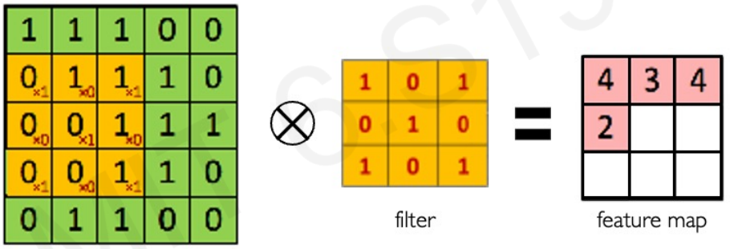
```
:::

::: {.fragment .fade-in-then-out}
```{r  , fig.align ='center', out.width="100%"}
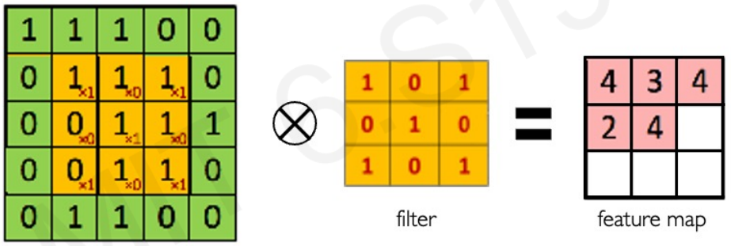
```
:::
::: {.fragment .fade-in-then-out}
```{r  , fig.align ='center', out.width="100%"}
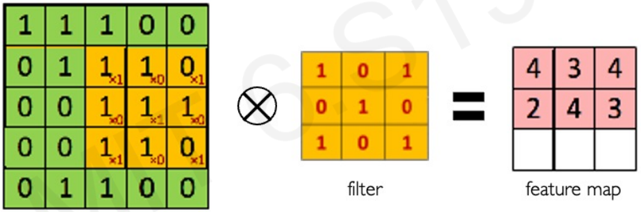
```
:::
::: {.fragment .fade-in-then-out}
```{r  , fig.align ='center', out.width="100%"}
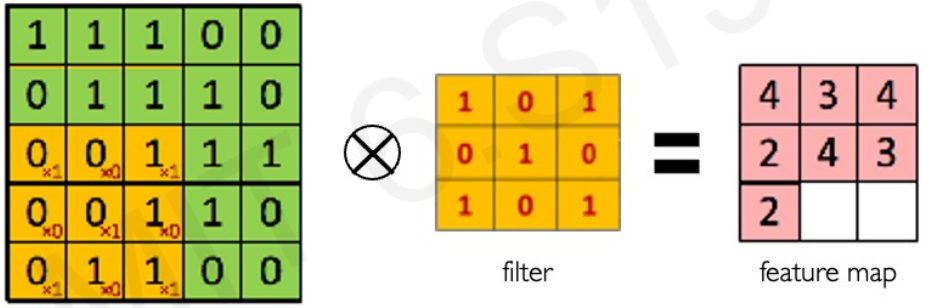
```
:::
::: {.fragment .fade-in-then-out}
```{r  , fig.align ='center', out.width="100%"}
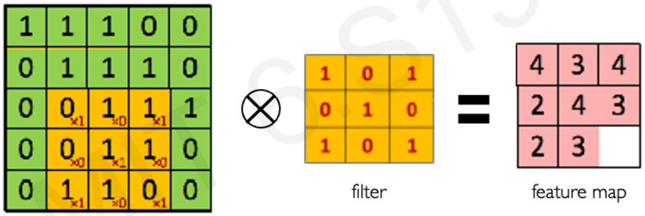
```
:::

::: {.fragment .fade-in}
```{r  , fig.align ='center', out.width="100%"}
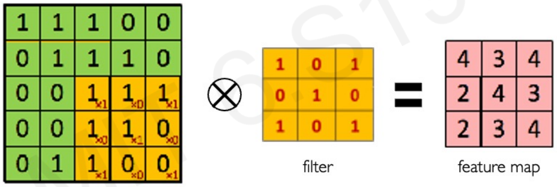
```
:::

:::


## Can filters be learned?

- Different filters can be used to extract different characteristics from the image.
  - Building filters by trial-and-error can be slow.
  
- If a NN can *learn these filters from the data*, then
  -  They can be used to classify new images.

- This is what *Convolutional Neural Networks* is about.
  

# III. Convolutional Neural Networks

## Convolutional Neural Networks

:::{.font90}

- **CNNs** are a type of Deep Neural Network (DNN) that implement the ideas previously introduced.
  
  - They **use convolutions** to learn spatial features from input data, such as images or 3D volumes.
  - CNNs are designed to **identify increasingly complex traits** by concatenating multiple *convolutional layers*, where each layer learns higher-level features.
  - **Convolutional layers** are combined with **dense layers** that perform the final **classification** using features extracted by the convolutional layers.

:::


## Core Concepts for CNNs

::: font80

- Before diving into CNNs, it is essential to understand  key concepts that enable these models to process data effectively.

- Operations that control:

  - How data is fed into the network, 
  - How itis processed, and 
  - How important features are extracted. 
  
- We’ll cover
  - **Padding**, 
  - **Stride**, 
  - **Convolutions over volumes**, 
  - **Pooling** 

:::

## Padding {.smaller}

- Recall the convolution operation

```{r  , fig.align ='center', out.width="100%", fig.cap="source: [DeepLearning.ai](DeepLearning.ai)"}
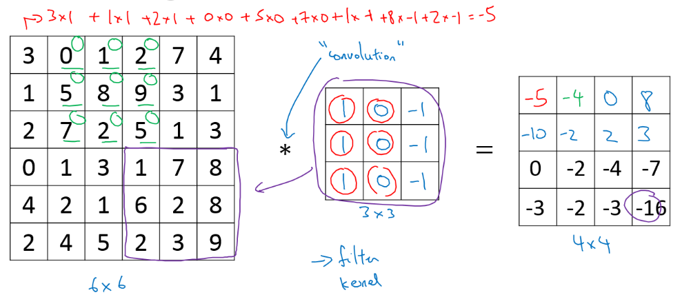
```

## Padding

::: font90

- In general, a matrix $n\times n$ convolved with a $f\times f$ filter  $\longrightarrow n-f+1,n-f+1$ matrix.

- The convolution operation shrinks the matrix if $f>1$.

- Applying convolution multiple times  

  - Shrinks the imaging., loosing data
  - Uses edges pixels less than other pixels in an image.

- To solve these problems we can **pad** the input image before convolution by *adding some rows and columns to it*. 

:::

## Padding 

::: font80

```{r  , fig.align ='center', out.width="80%", fig.cap="source: [Students Notes on CNN](https://indoml.com/2018/03/07/student-notes-convolutional-neural-networks-cnn-introduction/)"}
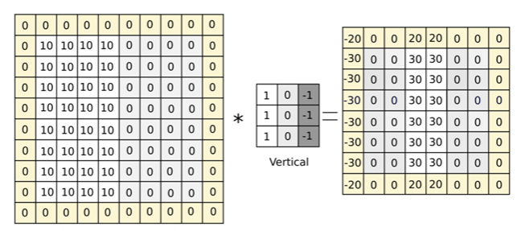
```

- An appropriate padding, $p$ avoids the image to shrik.

- Size after convolution:  $n+2p-f+1, n+2p-f+1$.

:::


## Strided  convolutions

::: font90

- The cost of convolution can be decreased by increasing *step size*, $S$ when moving the filter over the image.
  - In previous examples $S=1$
  - See next slide for an example with $S=2$.

- A matrix nxn  convolved with fxf filter and padding p and stride s yields a matrix of size:
$$\frac{(n+2p-f)}{s}+1$$

- If (n+2p-f)/s + 1 is fractionary, take floor of this value.

:::

## Stride

```{r  , fig.align ='center', out.width="80%", fig.cap="source: [DeepLearning.ai](DeepLearning.ai)"}
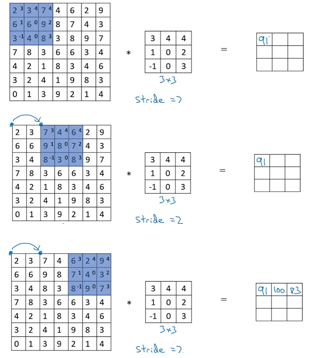
```


## Convolution over volumes

::: font90

- On RGB images the filter is a 3-dimensional object.

- We will convolve an image of height $H_I$,  width $W_I$ and # of channels $C$, with a filter of height $H_f$,  width $W_f$ and with same number of channels, $C$.

- Applying convolution is similar, but at each step,
  - we do $W_f\times H_f \times C$ multiplications and
  - we sum all the numbers to get 1 output value. 

- Sizing formulas above apply because *# of channels, $C$, is not taken into account to determine size of the output*.

:::

## Convolution over volumes

```{r  , fig.align ='center', out.width="80%", fig.cap="A convolution with several channels does not increase output dimensions. Source: [Students Notes on CNN](https://indoml.com/2018/03/07/student-notes-convolutional-neural-networks-cnn-introduction/)"}
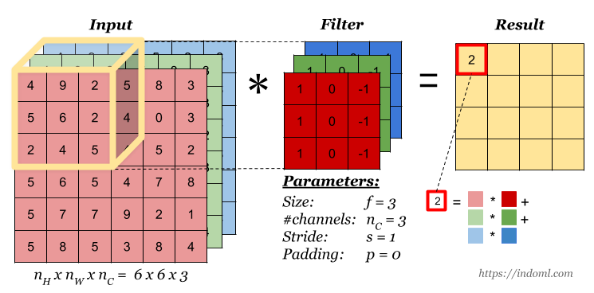
```

## Convolution with 2 filters

```{r  , fig.align ='center', out.width="80%", fig.cap="Multiple filters can be used in a convolution layer to detect multiple features. The output of the layer then will have the same number of channels as the number of filters in the layer.. <br> Source: [Students Notes on CNN](https://indoml.com/2018/03/07/student-notes-convolutional-neural-networks-cnn-introduction/)"}
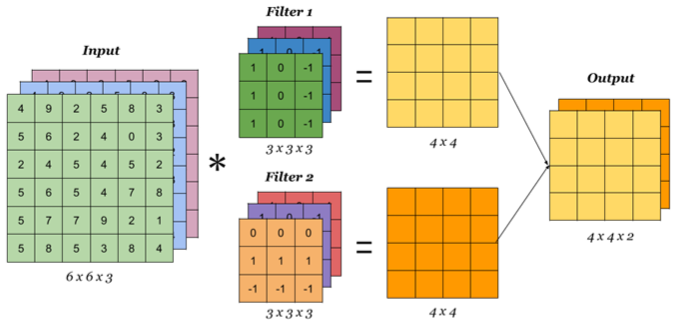
```


## One convolutio Layer

- Combining the elements seen above we can build a *one layer convolutional network*

- It performs the convolution of the input image across all channels nC, uses multiple lters, and therefore originates multiple convolution outputs. 

- A bias term b is then added to the output of the convolution of each lter W and we get the equivalent of the term Z in a normal neural network.

- We then apply an activation function such as ReLU Z (on all channels), and we finally stack the channels to create a cube that becomes the network layers output. 

## One Convolution Layer

```{r  , fig.align ='center', out.width="80%", fig.cap="Source: [Students Notes on CNN](https://indoml.com/2018/03/07/student-notes-convolutional-neural-networks-cnn-introduction/)"}
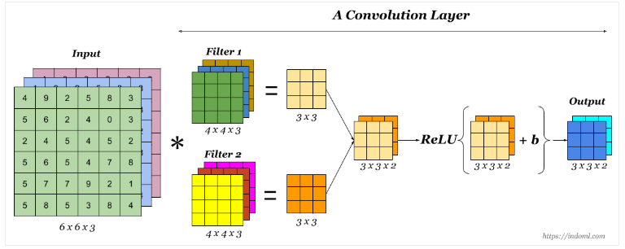
```

## Pooling to decrease dimension

:::{.font90}

- Additional layers can be added to reduce the size of the representations and so to speed up calculations.

- These are called *Pooling Layers*

- They have *hyper-parameters* such as filter size, stride or pooling type.

- But they **do not increase the number of parameters**: nothing for the gradient descent to learn

:::

## Pooling to decrease dimension

```{r, echo=FALSE, fig.align='center', out.width="100%",fig.cap="source: MIT Course, http://introtodeeplearning.com/, L3 "}
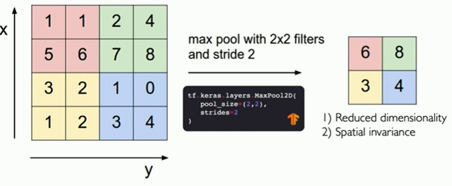
```


## Other benefits of Pooling

Key objectives of pooling in CNNs:

1. Dimensionality Reduction:

2. Translation Invariance:

3. Robustness to Variations:

4. Extraction of Salient Features:

5. Spatial Hierarchy:

## Common types of pooling 

```{r  , fig.align ='center', out.width="80%", fig.cap="Source: [Students Notes on CNN](https://indoml.com/2018/03/07/student-notes-convolutional-neural-networks-cnn-introduction/)"}
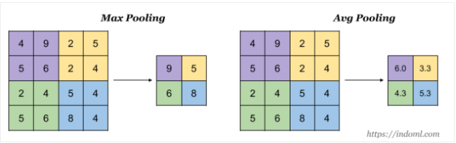
```

::: font70

- **Max pooling**: selects the maximum value within each pooling region, 
- **Average pooling**: calculates the average value within each pooling region

:::


## A CNN Example: LeNet-5

```{r  fig.align='center', out.width='100%', fig.cap='Source: [Students Notes on CNN](https://indoml.com/2018/03/07/student-notes-convolutional-neural-networks-cnn-introduction/)'}
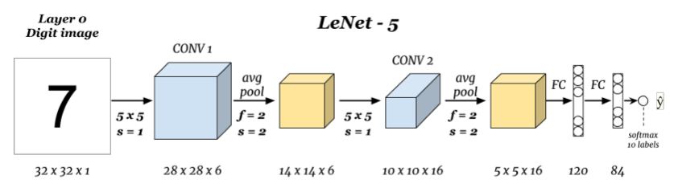
```

::: font70

- Uses Sigmoid/tanh instead of ReLU
- Average pooling (not max pooling)
- Includes not-linearity after the pooling 
- Paper: [Gradient-based learning applied to document recognition](https://ieeexplore.ieee.org/document/726791)

:::

## Summary: CNNs

- Option of choice for image classification.

- Usually: one or + layers of [convolution + pooling], ended by one or more fully connected layers.
  - Features learned by convolutions
  - Pooling decreases size with spatial invariance

- Usually, input size decreases over layers while the number of filters increases.

- Fully connected layers has the most parameters in the network.

## Summary: Why convolutions

CNNs show two main advantages:

- **Parameter sharing**: A feature detector (e.g. a vertical edge detector) useful in one part of the image is probably useful in another part of the image.

- **Sparsity of connections** In each layer, each output value depends only on a small number of inputs.


# A toy example

## The MNIST dataset

- A popular dataset or handwritten numbers.

```{r eval=FALSE, echo=TRUE}
library(keras)
mnist <- dataset_mnist()
```

- Made of features (images) and target values (labels)
- Divided into a *training* and *test* set.

```{r eval=FALSE,echo=TRUE}
x_train <- mnist$train$x; y_train <- mnist$train$y
x_test <- mnist$test$x; y_test <- mnist$test$y
```


```{r eval=FALSE,echo=TRUE}
(mnistDims <- dim(x_train))
img_rows <- mnistDims[2];  img_cols <- mnistDims[3]
```


## Data pre-processing (1): Reshaping

- These images are not in the the requires shape, as the number of channels is missing. 
- This can be corrected using the `array_reshape()` function. 

```{r eval=FALSE,echo=TRUE}
x_train <- array_reshape(x_train, c(nrow(x_train), img_rows, img_cols, 1))
x_test <- array_reshape(x_test, c(nrow(x_test), img_rows, img_cols, 1)) 

input_shape <- c(img_rows, img_cols, 1)

dim(x_train)
```

## Data pre-processing (2): Other transforms

- Data is first normalized (to values in [0,1])

```{r eval=FALSE,echo=TRUE}
x_train <- x_train / 255
x_test <- x_test / 255
```

- Labels are one-hot-encoded using the `to_categorical()` function.

```{r eval=FALSE,echo=TRUE}
num_classes = 10
y_train <- to_categorical(y_train, num_classes)
y_test <- to_categorical(y_test, num_classes)
```

## Modeling (1): Definition

```{r eval=FALSE,echo=TRUE, highlight=c(2,3,4)}
model <- keras_model_sequential() %>%
  layer_conv_2d(filters = 16,
                kernel_size = c(3,3),
                activation = 'relu',
                input_shape = input_shape) %>% 
  layer_max_pooling_2d(pool_size = c(2, 2)) %>% 
  layer_dropout(rate = 0.25) %>% 
  layer_flatten() %>% 
  layer_dense(units = 10,
              activation = 'relu') %>% 
  layer_dropout(rate = 0.5) %>% 
  layer_dense(units = num_classes,
              activation = 'softmax')

```

## Modeling (1): Model Summary

```{r eval=FALSE,echo=TRUE}
model %>% summary()
```

## Modeling (2): Compilation

- **Categorical cross-entropy** as loss function. 
- **Adadelta** optimizes the gradient descent.
- **Accuracy** serves as metric.

```{r eval=FALSE,echo=TRUE}
model %>% compile(
  loss = loss_categorical_crossentropy,
  optimizer = optimizer_adadelta(),
  metrics = c('accuracy')
)
```

## Model training{.smaller}

- A mini-batch[^1] size of 128  should allow the tensors to fit into the memory of most "normal" machines. 
- The model will run over 12  epochs, 
- With a validation split set at 0.2


```{r eval=FALSE,echo=TRUE}
batch_size <- 128
epochs <- 12

model %>% fit(
  x_train, y_train,
  batch_size = batch_size,
  epochs = epochs,
  validation_split = 0.2
)
```

[^1]:
- A **batch** is a collection of training examples processed together, 
- A **minibatch** is a smaller subset of a batch used for memory efficiency
- An **epoch** is a complete pass of the entire training dataset during model training. 

## Model evaluation

- Use test data to evaluate the model.


```{r eval=FALSE,evaluateModel, echo=TRUE}
model %>% evaluate(x_test, y_test)
predictions <- model %>% predict(x_test) # Not shown
```

# References and Resources

## Resources (1) {.smaller}

### Courses

- [An introduction to Deep Learning. Alex Amini. MIT](http://introtodeeplearning.com/)
- [Coursera: Deep Learning Specialization. Andrew Ng](https://www.coursera.org/specializations/deep-learning)

### Books

- [Neural networks and Deep Learning](http://neuralnetworksanddeeplearning.com/)
- [Deep learning with R, 2nd edition. F. Chollet](https://livebook.manning.com/book/deep-learning-with-r-second-edition)

## Resources (2) {.smaller}

### Workshops

- [Deep learning with R *Summer course*](https://bios691-deep-learning-r.netlify.app/)
- [Deep learning with keras and Tensorflow in R (Rstudio conf. 2020)](https://github.com/rstudio-conf-2020/dl-keras-tf)


### Documents

- [Introduction to Convolutional Neural Networks (CNN)](https://www.analyticsvidhya.com/blog/2021/05/convolutional-neural-networks-cnn/)
- [Convolutional Neural Networks in R](https://www.r-bloggers.com/2018/07/convolutional-neural-networks-in-r/)


